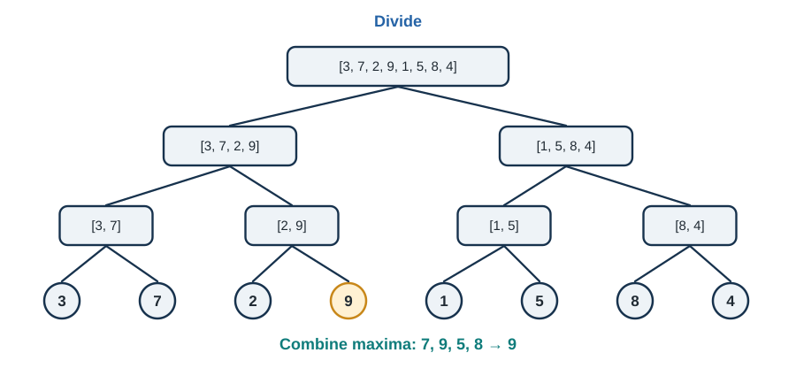
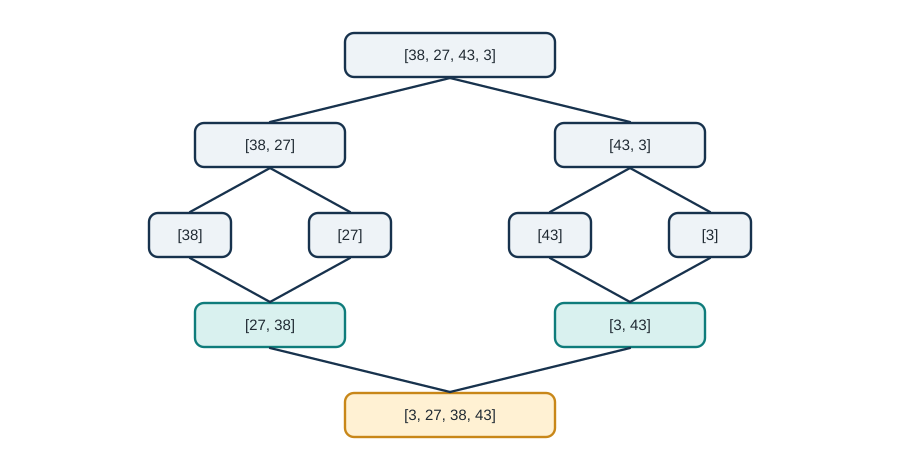
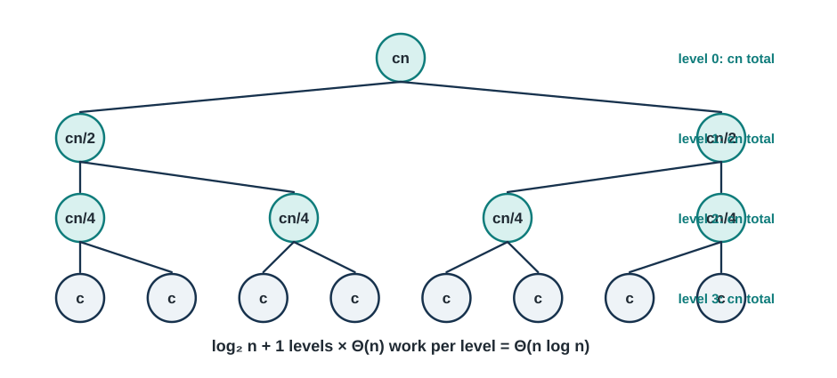
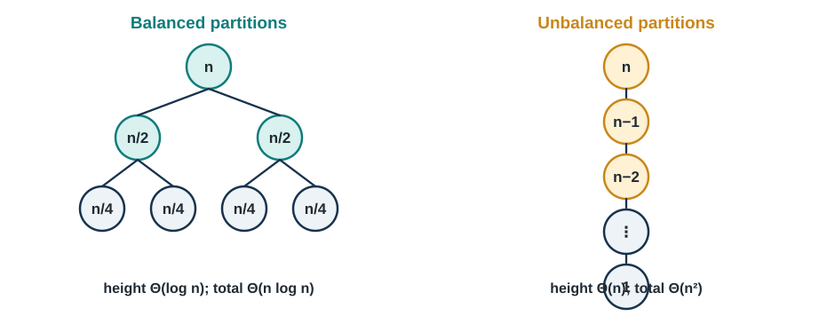

# Divide and Conquer - The Art of Problem Decomposition

_"The secret to getting ahead is getting started. The secret to getting started is breaking your complex overwhelming tasks into small manageable tasks, and then starting on the first one." - Mark Twain_

---

## Welcome to the Power of Recursion {.unnumbered}

Imagine you're organizing a massive library with 1 million books scattered randomly across the floor. Your task is to alphabetize them all. If you tried to do this alone, directly comparing and moving individual books, you'd be there for months (or years!). But what if you could recruit helpers, and each person took a stack of books, sorted their stack, and then you combined all the sorted stacks? Suddenly, an impossible task becomes manageable.

This is the essence of **divide and conquer**—one of the most elegant and powerful paradigms in all of computer science. Instead of solving a large problem directly, we break it into smaller subproblems, solve those recursively, and then combine the solutions. It's the same strategy that successful armies, businesses, and problem-solvers have used throughout history: divide your challenge into manageable pieces, conquer each piece, and unite the results.

In Chapter 1, we learned to analyze algorithms and implemented basic sorting methods that worked directly on the entire input. Those algorithms—bubble sort, selection sort, insertion sort—all had $O(n^2)$ time complexity in the worst case. Now we're going to blow past that limitation. By the end of this chapter, you'll understand and implement sorting algorithms that run in $O(n log n)$ time, making them thousands of times faster on large datasets. The key? Divide and conquer.

### Why This Matters {.unnumbered}

Divide and conquer isn't just about sorting faster. This paradigm powers some of the most important algorithms in computing:

**🔍 Binary Search:** Finding elements in sorted arrays in $O(log n)$ time instead of $O(n)$

**📊 Fast Fourier Transform (FFT):** Processing signals and audio in telecommunications, used billions of times per day

**🎮 Graphics Rendering:** Breaking down complex 3D scenes into manageable pieces for real-time video games

**🧬 Computational Biology:** Analyzing DNA sequences by breaking them into overlapping fragments

**💰 Financial Modeling:** Monte Carlo simulations that break random scenarios into parallelizable chunks

**🤖 Machine Learning:** Training algorithms that partition data recursively (decision trees, nearest neighbors)

The beautiful thing about divide and conquer is that once you understand the pattern, you'll start seeing opportunities to apply it everywhere. It's not just a technique—it's a way of thinking about problems that will fundamentally change how you approach algorithm design.

### What You'll Learn {.unnumbered}

By the end of this chapter, you'll master:

1. **The Divide and Conquer Paradigm:** Understanding the three-step pattern and when to apply it
2. **Merge Sort:** A guaranteed $O(n log n)$ sorting algorithm with elegant simplicity
3. **QuickSort:** The practical champion of sorting with average-case $O(n log n)$ performance
4. **Recurrence Relations:** Mathematical tools for analyzing recursive algorithms
5. **Master Theorem:** A powerful formula for solving common recurrences quickly
6. **Advanced Applications:** From integer multiplication to matrix algorithms

Most importantly, you'll develop **recursive thinking**—the ability to see how big problems can be solved by solving smaller versions of themselves. This skill will serve you throughout your career, whether you're optimizing databases, designing distributed systems, or building AI algorithms.

### Chapter Roadmap {.unnumbered}

We'll build your understanding systematically:

- **Section 2.1:** Introduces the divide and conquer pattern with intuitive examples
- **Section 2.2:** Develops merge sort from scratch, proving its correctness and efficiency
- **Section 2.3:** Explores quicksort and randomization techniques
- **Section 2.4:** Equips you with mathematical tools for analyzing recursive algorithms
- **Section 2.5:** Shows advanced applications and when NOT to use divide and conquer
- **Section 2.6:** Guides you through implementing and optimizing these algorithms

Don't worry if recursion feels challenging at first—it's genuinely difficult for most people. The human brain is wired to think iteratively (step 1, step 2, step 3...) rather than recursively (solve by solving smaller versions). We'll take it slow, build intuition with examples, and practice until recursive thinking becomes second nature.

Let's begin by understanding what makes divide and conquer so powerful!

---

## The Divide and Conquer Paradigm

### The Three-Step Dance

Every divide and conquer algorithm follows the same beautiful three-step pattern:

**1. DIVIDE:** Break the problem into smaller subproblems of the same type **2. CONQUER:** Solve the subproblems recursively (or directly if they're small enough) **3. COMBINE:** Merge the solutions to create a solution to the original problem

Think of it like this recipe analogy:

**Problem:** Make dinner for 100 people

- **DIVIDE:** Break into 10 groups of 10 people each
- **CONQUER:** Have 10 cooks each make dinner for their group of 10
- **COMBINE:** Bring all the meals together for the feast

The magic happens because each subproblem is simpler than the original, and eventually, you reach subproblems so small they're trivial to solve.

### Real-World Analogy: Organizing a Tournament

Let's say you need to find the best chess player among 1,024 competitors.

**Naive Approach (Round-robin):**

- Everyone plays everyone else
- Total games: 1,024 × 1,023 / 2 = 523,776 games!
- Time complexity: $O(n^2)$

**Divide and Conquer Approach (Tournament bracket):**

- **Round 1:** Divide into 512 pairs, each pair plays → 512 games
- **Round 2:** Divide winners into 256 pairs → 256 games
- **Round 3:** Divide winners into 128 pairs → 128 games
- ...continue until final winner
- **Total games:** 512 + 256 + 128 + ... + 2 + 1 = 1,023 games
- Time complexity: $O(n)$... actually $O(n)$ in this case, but $O(log n)$ rounds!

You just reduced the problem from over 500,000 games to about 1,000 games—a 500× speedup! This is the power of divide and conquer.

### A Simple Example: Finding Maximum Element

Before we tackle sorting, let's see divide and conquer in action with a simpler problem.

**Problem:** Find the maximum element in an array.

**Iterative Solution (from Chapter 1):**

```{.python .program-code chapter=2}
def find_max_iterative(arr):
    """O(n) time, O(1) space - simple and effective"""
    max_val = arr[0]
    for element in arr:
        if element > max_val:
            max_val = element
    return max_val
```

**Divide and Conquer Solution:**

```{.python .program-code chapter=2}
def find_max_divide_conquer(arr, left, right):
    """
    Find maximum using divide and conquer.
    Still O(n) time, but demonstrates the pattern.
    """
    # BASE CASE: If array has one element, that's the max
    if left == right:
        return arr[left]
    
    # BASE CASE: If array has two elements, return the larger
    if right == left + 1:
        return max(arr[left], arr[right])
    
    # DIVIDE: Split array in half
    mid = (left + right) // 2
    
    # CONQUER: Find max in each half recursively
    left_max = find_max_divide_conquer(arr, left, mid)
    right_max = find_max_divide_conquer(arr, mid + 1, right)
    
    # COMBINE: The overall max is the larger of the two halves
    return max(left_max, right_max)

# Usage
arr = [3, 7, 2, 9, 1, 5, 8]
result = find_max_divide_conquer(arr, 0, len(arr) - 1)
print(result)  # Output: 9
```

**Analysis:**

- **Divide:** Split array into two halves → $O(1)$
- **Conquer:** Recursively find max in each half → 2 × T(n/2)
- **Combine:** Compare two numbers → $O(1)$

**Recurrence relation:** T(n) = 2T(n/2) + $O(1)$ **Solution:** T(n) = $O(n)$

Wait—we got the same time complexity as the iterative version! So why bother with divide and conquer?

**Good question!** For finding the maximum, divide and conquer doesn't help. But here's what's interesting:

1. **Parallelization:** The two recursive calls are independent—they could run simultaneously on different processors!
2. **Pattern Practice:** Understanding this simple example prepares us for problems where divide and conquer DOES improve complexity
3. **Elegance:** Some people find the recursive solution more intuitive

The key insight: **Not every problem benefits from divide and conquer.** You need to check if the divide and combine steps are efficient enough to justify the approach.

### When Does Divide and Conquer Help?

Divide and conquer typically improves time complexity when:

**✅ Subproblems are independent** (can be solved separately) **✅ Combining solutions is relatively cheap** (ideally $O(n)$ or better) **✅ Problem size reduces significantly** (usually by half or more) **✅ Base cases are simple** (direct solutions exist for small inputs)

**Examples where it helps:**

- **Sorting** (merge sort, quicksort): $O(n^2)$ → $O(n log n)$
- **Binary search**: $O(n)$ → $O(log n)$
- **Matrix multiplication** (Strassen's): $O(n^3)$ → $O(n^2.807)$
- **Integer multiplication** (Karatsuba): $O(n^2)$ → $O(n^1.585)$

**Examples where it doesn't help much:**

- **Finding maximum** (as we just saw)
- **Computing array sum** (simple iteration is better)
- **Checking if sorted** (must examine every element anyway)

### The Recursion Tree: Visualizing Divide and Conquer

Understanding recursion trees is crucial for analyzing divide and conquer algorithms. Let's visualize our max-finding example:

{#fig-find-max-recursion width=82% fig-pos="H" fig-cap="Find-max recursion exposes the divide and combine stages; the maximum value 9 propagates to the root."}

**Key observations about the tree:**

1. **Height of tree:** log₂(8) = 3 levels (plus base level)
2. **Work per level:** We compare all n elements once per level → $O(n)$ per level
3. **Total work:** $O(n)$ × log(n) levels = $O(n log n)$... wait, no!

Actually, for this problem, the work decreases as we go down:

- Level 0: 8 elements
- Level 1: 4 + 4 = 8 elements
- Level 2: 2 + 2 + 2 + 2 = 8 elements
- Level 3: 8 base cases (1 element each)

Each level processes n elements total, and there are log(n) levels, but the combine step is $O(1)$, so total is $O(n)$.

**Important lesson:** The combine step's complexity determines whether divide and conquer helps! We'll see this more clearly with merge sort.

### Designing Divide and Conquer Algorithms: A Checklist

When approaching a new problem with divide and conquer, ask yourself:

**1. Can the problem be divided?**

- Is there a natural way to split the problem?
- Do the subproblems have the same structure as the original?
- Example: Arrays can be split by index; problems can be divided by constraint

**2. Are subproblems independent?**

- Can each subproblem be solved without information from others?
- If subproblems overlap significantly, consider dynamic programming instead
- Example: In merge sort, sorting left half doesn't depend on right half

**3. What's the base case?**

- When is the problem small enough to solve directly?
- Usually when n = 1 or n = 0
- Example: An array of one element is already sorted

**4. How do we combine solutions?**

- What operation merges subproblem solutions?
- How expensive is this operation?
- Example: Merging two sorted arrays takes $O(n)$ time

**5. Does the math work out?**

- Write the recurrence relation
- Solve it to find time complexity
- Is it better than the naive approach?

Let's apply this framework to sorting!

---

## Merge Sort - Guaranteed $O(n log n)$ Performance

### The Sorting Challenge Revisited

In Chapter 1, we implemented three sorting algorithms: bubble sort, selection sort, and insertion sort. All three have $O(n^2)$ worst-case time complexity. For small arrays, that's fine. But what about sorting a million elements?

**$O(n^2)$ algorithms:** 1,000,000² = 1,000,000,000,000 operations (1 trillion!) **$O(n log n)$ algorithms:** 1,000,000 × log₂(1,000,000) ≈ 20,000,000 operations (20 million)

That's a **50,000× speedup**! This is why understanding efficient sorting matters.

Merge sort achieves $O(n log n)$ by using divide and conquer:

1. **Divide:** Split the array into two halves
2. **Conquer:** Recursively sort each half
3. **Combine:** Merge the two sorted halves into one sorted array

The brilliance is in step 3: merging two sorted arrays is surprisingly efficient!

### The Merge Operation: The Secret Sauce

Before we look at the full merge sort algorithm, let's understand how to merge two sorted arrays efficiently.

**Problem:** Given two sorted arrays, create one sorted array containing all elements.

**Example:**

```{.algorithm chapter=2}
Left:  [2, 5, 7, 9]
Right: [1, 3, 6, 8]
Result: [1, 2, 3, 5, 6, 7, 8, 9]
```

**Key insight:** Since both arrays are already sorted, we can merge them by comparing elements from the front of each array, taking the smaller one each time.

**The Merge Algorithm:**

```{.python .program-code chapter=2}
def merge(left, right):
    """
    Merge two sorted arrays into one sorted array.
    
    Time Complexity: O(n + m) where n = len(left), m = len(right)
    Space Complexity: O(n + m) for result array
    
    Args:
        left: Sorted list
        right: Sorted list
        
    Returns:
        Merged sorted list containing all elements
        
    Example:
        >>> merge([2, 5, 7], [1, 3, 6])
        [1, 2, 3, 5, 6, 7]
    """
    result = []
    i = j = 0  # Pointers for left and right arrays
    
    # Compare elements and take the smaller one
    while i < len(left) and j < len(right):
        if left[i] <= right[j]:
            result.append(left[i])
            i += 1
        else:
            result.append(right[j])
            j += 1
    
    # Append remaining elements (one array will be exhausted first)
    result.extend(left[i:])  # Add remaining left elements (if any)
    result.extend(right[j:]) # Add remaining right elements (if any)
    
    return result
```

**Let's trace through the example:**

```{.technical-other chapter=2}
Initial state:
left = [2, 5, 7, 9],  right = [1, 3, 6, 8]
i = 0, j = 0
result = []

Step 1: Compare left[0]=2 vs right[0]=1 → 1 is smaller
result = [1], j = 1

Step 2: Compare left[0]=2 vs right[1]=3 → 2 is smaller  
result = [1, 2], i = 1

Step 3: Compare left[1]=5 vs right[1]=3 → 3 is smaller
result = [1, 2, 3], j = 2

Step 4: Compare left[1]=5 vs right[2]=6 → 5 is smaller
result = [1, 2, 3, 5], i = 2

Step 5: Compare left[2]=7 vs right[2]=6 → 6 is smaller
result = [1, 2, 3, 5, 6], j = 3

Step 6: Compare left[2]=7 vs right[3]=8 → 7 is smaller
result = [1, 2, 3, 5, 6, 7], i = 3

Step 7: Compare left[3]=9 vs right[3]=8 → 8 is smaller
result = [1, 2, 3, 5, 6, 7, 8], j = 4

Step 8: right is exhausted, append remaining from left
result = [1, 2, 3, 5, 6, 7, 8, 9]
```

**Analysis:**

- We examine each element exactly once
- Total comparisons ≤ (n + m)
- Time complexity: **$O(n + m)$** where n and m are the lengths of the input arrays
- In the context of merge sort, this will be $O(n)$ where n is the total number of elements

This linear-time merge is what makes merge sort efficient!

### The Complete Merge Sort Algorithm

Now we can build the full algorithm:

```{.python .program-code chapter=2}
def merge_sort(arr):
    """
    Sort an array using merge sort (divide and conquer).
    
    Time Complexity: O(n log n) in all cases
    Space Complexity: O(n) for temporary arrays
    Stability: Stable (maintains relative order of equal elements)
    
    Args:
        arr: List of comparable elements
        
    Returns:
        New sorted list
        
    Example:
        >>> merge_sort([64, 34, 25, 12, 22, 11, 90])
        [11, 12, 22, 25, 34, 64, 90]
    """
    # BASE CASE: Arrays of length 0 or 1 are already sorted
    if len(arr) <= 1:
        return arr
    
    # DIVIDE: Split array in half
    mid = len(arr) // 2
    left_half = arr[:mid]
    right_half = arr[mid:]
    
    # CONQUER: Recursively sort each half
    sorted_left = merge_sort(left_half)
    sorted_right = merge_sort(right_half)
    
    # COMBINE: Merge the sorted halves
    return merge(sorted_left, sorted_right)


# The merge function from before
def merge(left, right):
    """Merge two sorted arrays into one sorted array."""
    result = []
    i = j = 0
    
    while i < len(left) and j < len(right):
        if left[i] <= right[j]:
            result.append(left[i])
            i += 1
        else:
            result.append(right[j])
            j += 1
    
    result.extend(left[i:])
    result.extend(right[j:])
    
    return result
```

**Example Execution:**

Let's sort `[38, 27, 43, 3]` step by step:

```{.algorithm chapter=2}
Initial call: merge_sort([38, 27, 43, 3])
    ↓
    Split into [38, 27] and [43, 3]
    ↓
    Call merge_sort([38, 27])          Call merge_sort([43, 3])
        ↓                                  ↓
        Split into [38] and [27]           Split into [43] and [3]
        ↓                                  ↓
        [38] and [27] are base cases       [43] and [3] are base cases
        ↓                                  ↓
        Merge([38], [27]) → [27, 38]      Merge([43], [3]) → [3, 43]
        ↓                                  ↓
        Return [27, 38]                    Return [3, 43]
    ↓
    Merge([27, 38], [3, 43])
    ↓
    [3, 27, 38, 43]  ← Final result
```

**Complete recursion tree:**

{#fig-merge-sort-decomposition width=78% fig-pos="H" fig-cap="Merge sort alternates decomposition and ordered combination."}

### Correctness Proof for Merge Sort

Let's prove that merge sort actually works using **mathematical induction**.

**Theorem:** Merge sort correctly sorts any array of comparable elements.

**Proof by induction on array size n:**

**Base case (n ≤ 1):**

- Arrays of size 0 or 1 are already sorted
- Merge sort returns them unchanged
- ✓ Correct

**Inductive hypothesis:**

- Assume merge sort correctly sorts all arrays of size k < n

**Inductive step:**

- Consider an array of size n
- Merge sort splits it into two halves of size ≤ n/2
- By inductive hypothesis, both halves are sorted correctly (since n/2 < n)
- The merge operation combines two sorted arrays into one sorted array (proven separately)
- Therefore, merge sort correctly sorts the array of size n
- ✓ Correct

**Conclusion:** By mathematical induction, merge sort correctly sorts arrays of any size. ∎

**Proof that merge is correct:**

- The merge operation maintains a loop invariant:
    - **Invariant:** result[0...k] contains the k smallest elements from left and right, in sorted order
    - **Initialization:** result is empty (trivially sorted)
    - **Maintenance:** We always take the smaller of left[i] or right[j], preserving sorted order
    - **Termination:** When one array is exhausted, we append the remainder (already sorted)
- Therefore, merge produces a correctly sorted array ∎

### Time Complexity Analysis

Now let's rigorously analyze merge sort's performance.

**Divide step:** Finding the midpoint takes $O(1)$ time

**Conquer step:** We make two recursive calls on arrays of size n/2

**Combine step:** Merging takes $O(n)$ time (we process each element once)

**Recurrence relation:**

$$
T(n)=2T\!\left(\frac n2\right)+O(n),
\qquad T(1)=O(1).
$$

**Solving the recurrence (using the recursion tree method):**

```{.technical-other chapter=2}
Level 0: 1 problem of size n          → Work: cn
Level 1: 2 problems of size n/2       → Work: 2 × c(n/2) = cn
Level 2: 4 problems of size n/4       → Work: 4 × c(n/4) = cn
Level 3: 8 problems of size n/8       → Work: 8 × c(n/8) = cn
...
Level log n: n problems of size 1     → Work: n × c(1) = cn

Total work = cn × (log₂ n + 1) = O(n log n)
```

**Visual representation:**

{#fig-merge-sort-work width=84% fig-pos="H" fig-cap="Merge sort performs $\Theta(n)$ work per level across $\Theta(log n)$ levels."}

**Formal proof using substitution method:**

Guess: T(n) ≤ cn log n for some constant c

Base case: T(1) = c₁ ≤ c·1·log 1 = 0... we need T(1) ≤ c for this to work

Let's refine: T(n) ≤ cn log n + d for constants c, d

**Inductive step:**

```{.technical-other chapter=2}
T(n) = 2T(n/2) + cn
     ≤ 2[c(n/2)log(n/2) + d] + cn          (by hypothesis)
     = cn log(n/2) + 2d + cn
     = cn(log n - log 2) + 2d + cn
     = cn log n - cn + 2d + cn
     = cn log n + 2d
     ≤ cn log n + d  (if d ≥ 2d, which we can choose)
```

Therefore T(n) = $O(n log n)$ ✓

**Why $O(n log n)$ is significantly better than $O(n^2)$:**

|Input Size|$O(n^2)$ Operations|$O(n log n)$ Operations|Speedup|
|---|---|---|---|
|100|10,000|664|15×|
|1,000|1,000,000|9,966|100×|
|10,000|100,000,000|132,877|752×|
|100,000|10,000,000,000|1,660,964|6,020×|
|1,000,000|1,000,000,000,000|19,931,569|50,170×|

For a million elements, merge sort is **50,000 times faster** than bubble sort!

### Space Complexity Analysis

Unlike our $O(n^2)$ sorting algorithms from Chapter 1 (which sorted in-place), merge sort requires additional memory:

**During merging:**

- We create a new result array of size n
- This happens at each level of recursion

**Recursion stack:**

- Maximum depth is log n
- Each level stores its own variables

**Total space complexity:** $O(n)$

The space used at each recursive level is:

- Level 0: n space for merging
- Level 1: n/2 + n/2 = n space total (two merges)
- Level 2: n/4 + n/4 + n/4 + n/4 = n space total
- ...

However, the merges at different levels don't overlap in time, so we can reuse space. The dominant factor is $O(n)$ for the merge operations plus $O(log n)$ for the recursion stack, giving us **$O(n)$ total space complexity**.

**Trade-off:** Merge sort trades space for time. We use extra memory to achieve faster sorting.

### Merge Sort Properties

Let's summarize merge sort's characteristics:

**✅ Advantages:**

- **Guaranteed $O(n log n)$** in worst, average, and best cases (predictable performance)
- **Stable:** Maintains relative order of equal elements
- **Simple to understand and implement** once you grasp recursion
- **Parallelizable:** The two recursive calls can run simultaneously
- **Great for linked lists:** Can be implemented without extra space on linked structures
- **External sorting:** Works well for data that doesn't fit in memory

**❌ Disadvantages:**

- **$O(n)$ extra space required** (not in-place)
- **Slower in practice than quicksort** on arrays due to memory allocation overhead
- **Not adaptive:** Doesn't take advantage of existing order in the data
- **Cache-unfriendly:** Memory access pattern isn't optimal for modern CPUs

### Optimizing Merge Sort

While the basic merge sort is elegant, we can make it faster in practice:

**Optimization 1: Switch to insertion sort for small subarrays**

```{.python .program-code chapter=2}
def merge_sort_optimized(arr):
    """Merge sort with insertion sort for small arrays."""
    # Switch to insertion sort for small arrays (faster due to lower overhead)
    if len(arr) <= 10:  # Threshold found empirically
        return insertion_sort(arr)
    
    if len(arr) <= 1:
        return arr
    
    mid = len(arr) // 2
    left = merge_sort_optimized(arr[:mid])
    right = merge_sort_optimized(arr[mid:])
    
    return merge(left, right)
```

**Why this helps:**

- Insertion sort has lower overhead for small inputs
- $O(n^2)$ vs $O(n log n)$ doesn't matter when n ≤ 10
- Reduces recursion depth
- Typical speedup: 10-15%

**Optimization 2: Check if already sorted**

```{.python .program-code chapter=2}
def merge_sort_smart(arr):
    """Skip merge if already sorted."""
    if len(arr) <= 1:
        return arr
    
    mid = len(arr) // 2
    left = merge_sort_smart(arr[:mid])
    right = merge_sort_smart(arr[mid:])
    
    # If last element of left ≤ first element of right, already sorted!
    if left[-1] <= right[0]:
        return left + right
    
    return merge(left, right)
```

**Why this helps:**

- On nearly-sorted data, many subarrays are already in order
- Avoids expensive merge operation
- Typical speedup: 20-30% on nearly-sorted data

**Optimization 3: In-place merge (advanced)**

The standard merge creates a new array. We can reduce space usage with an in-place merge, but it's more complex and slower:

```{.python .program-code chapter=2}
def merge_inplace(arr, left, mid, right):
    """
    In-place merge (harder to implement correctly).
    Reduces space but doesn't eliminate it entirely.
    """
    # This is significantly more complex
    # Usually not worth the complexity vs. space trade-off
    # Included here for completeness
    pass  # Implementation omitted for brevity
```

Most production implementations use the standard merge with space optimizations elsewhere.

---

## QuickSort - The Practical Champion

### Why Another Sorting Algorithm?

You might be thinking: "We have merge sort with guaranteed $O(n log n)$ performance. Why do we need another algorithm?"

Great question! While merge sort is excellent in theory, **quicksort is often faster in practice** for several reasons:

1. **In-place sorting:** Uses only $O(log n)$ extra space for recursion (vs. merge sort's $O(n)$)
2. **Cache-friendly:** Better memory access patterns on modern CPUs
3. **Fewer data movements:** Elements are often already close to their final positions
4. **Simpler partitioning:** The partition operation is often faster than merging

The catch? Quick sort's worst-case performance is $O(n^2)$. But with randomization, this worst case becomes extremely unlikely—so unlikely that quicksort is the go-to sorting algorithm in most standard libraries (C's `qsort`, Java's `Arrays.sort` for primitives, etc.).

### The QuickSort Idea

QuickSort uses a different divide and conquer strategy than merge sort:

**Merge Sort approach:**

- Divide mechanically (just split in half)
- Do all the work in the combine step (merging is complex)

**QuickSort approach:**

- Divide intelligently (partition around a pivot)
- Combine step is trivial (already sorted!)

Here's the pattern:

1. **DIVIDE:** Choose a "pivot" element and partition the array so that:
    - All elements ≤ pivot are on the left
    - All elements > pivot are on the right
2. **CONQUER:** Recursively sort the left and right partitions
3. **COMBINE:** Do nothing! (The array is already sorted after recursive calls)

**Key insight:** After partitioning, the pivot is in its final sorted position. We never need to move it again.

### A Simple Example

Let's sort `[8, 3, 1, 7, 0, 10, 2]` using quicksort:

```{.technical-other chapter=2}
Initial array: [8, 3, 1, 7, 0, 10, 2]

Step 1: Choose pivot (let's pick the last element: 2)
Partition around 2:
  Elements ≤ 2: [1, 0]
  Pivot: [2]
  Elements > 2: [8, 3, 7, 10]
Result: [1, 0, 2, 8, 3, 7, 10]
         ^^^^^  ^  ^^^^^^^^^^^
         Left   P     Right

Step 2: Recursively sort left [1, 0]
  Choose pivot: 0
  Partition: [] [0] [1]
  Result: [0, 1]

Step 3: Recursively sort right [8, 3, 7, 10]
  Choose pivot: 10
  Partition: [8, 3, 7] [10] []
  Result: [3, 7, 8, 10] (after recursively sorting [8, 3, 7])

Final result: [0, 1, 2, 3, 7, 8, 10]
```

Notice how the pivot (2) ended up in position 2 (its final sorted position) and never moved again!

### The Partition Operation

The heart of quicksort is the partition operation. Let's understand it deeply:

**Goal:** Given an array and a pivot element, rearrange the array so that:

- All elements ≤ pivot are on the left
- Pivot is in the middle
- All elements > pivot are on the right

**Lomuto Partition Scheme (simpler, what we'll use):**

```{.python .program-code chapter=2}
def partition(arr, low, high):
    """
    Partition array around pivot (last element).
    
    Returns the final position of the pivot.
    
    Time Complexity: O(n) where n = high - low + 1
    Space Complexity: O(1)
    
    Args:
        arr: Array to partition (modified in-place)
        low: Starting index
        high: Ending index
        
    Returns:
        Final position of pivot
        
    Example:
        arr = [8, 3, 1, 7, 0, 10, 2], low = 0, high = 6
        After partition: [1, 0, 2, 7, 8, 10, 3]
        Returns: 2 (position of pivot 2)
    """
    # Choose the last element as pivot
    pivot = arr[high]
    
    # i tracks the boundary between ≤ pivot and > pivot
    i = low - 1
    
    # Scan through array
    for j in range(low, high):
        # If current element is ≤ pivot, move it to the left partition
        if arr[j] <= pivot:
            i += 1
            arr[i], arr[j] = arr[j], arr[i]  # Swap
    
    # Place pivot in its final position
    i += 1
    arr[i], arr[high] = arr[high], arr[i]
    
    return i  # Return pivot's final position
```

**Let's trace through an example step by step:**

```{.technical-other chapter=2}
Array: [8, 3, 1, 7, 0, 10, 2], pivot = 2 (at index 6)
low = 0, high = 6, i = -1

Initial: [8, 3, 1, 7, 0, 10, 2]
          ^                  ^
          j                  pivot

j=0: arr[0]=8 > 2, skip
i = -1

j=1: arr[1]=3 > 2, skip  
i = -1

j=2: arr[2]=1 ≤ 2, swap with position i+1=0
Array: [1, 3, 8, 7, 0, 10, 2]
        ^  ^
        i  j
i = 0

j=3: arr[3]=7 > 2, skip
i = 0

j=4: arr[4]=0 ≤ 2, swap with position i+1=1
Array: [1, 0, 8, 7, 3, 10, 2]
           ^        ^
           i        j
i = 1

j=5: arr[5]=10 > 2, skip
i = 1

End of loop, place pivot at position i+1=2
Array: [1, 0, 2, 7, 3, 10, 8]
              ^
              pivot in final position

Return 2
```

**Loop Invariant:** At each iteration, the array satisfies:

- `arr[low...i]`: All elements ≤ pivot
- `arr[i+1...j-1]`: All elements > pivot
- `arr[j...high-1]`: Unprocessed elements
- `arr[high]`: Pivot element

This invariant ensures correctness!

### The Complete QuickSort Algorithm

Now we can implement the full algorithm:

```{.python .program-code chapter=2}
def quicksort(arr, low=0, high=None):
    """
    Sort array using quicksort (divide and conquer).
    
    Time Complexity: 
        Best/Average: O(n log n)
        Worst: O(n²) - rare with randomization
    Space Complexity: O(log n) for recursion stack
    Stability: Unstable
    
    Args:
        arr: List to sort (modified in-place)
        low: Starting index (default 0)
        high: Ending index (default len(arr)-1)
        
    Returns:
        None (sorts in-place)
        
    Example:
        >>> arr = [64, 34, 25, 12, 22, 11, 90]
        >>> quicksort(arr)
        >>> arr
        [11, 12, 22, 25, 34, 64, 90]
    """
    # Handle default parameter
    if high is None:
        high = len(arr) - 1
    
    # BASE CASE: If partition has 0 or 1 elements, it's sorted
    if low < high:
        # DIVIDE: Partition array and get pivot position
        pivot_pos = partition(arr, low, high)
        
        # CONQUER: Recursively sort elements before and after pivot
        quicksort(arr, low, pivot_pos - 1)   # Sort left partition
        quicksort(arr, pivot_pos + 1, high)  # Sort right partition
        
        # COMBINE: Nothing to do! Array is already sorted


def partition(arr, low, high):
    """Partition array around pivot (last element)."""
    pivot = arr[high]
    i = low - 1
    
    for j in range(low, high):
        if arr[j] <= pivot:
            i += 1
            arr[i], arr[j] = arr[j], arr[i]
    
    i += 1
    arr[i], arr[high] = arr[high], arr[i]
    return i
```

**Example execution:**

```{.technical-other chapter=2}
quicksort([8, 3, 1, 7, 0, 10, 2])
    ↓
    Partition around 2 → [1, 0, 2, 8, 3, 7, 10]
                              ^
                           pivot at position 2
    ↓
    quicksort([1, 0])              quicksort([8, 3, 7, 10])
         ↓                                  ↓
    Partition around 0           Partition around 10
    [0, 1]                       [7, 3, 8, 10]
     ^                                    ^
    pivot at 0                     pivot at position 3
         ↓                                  ↓
    quicksort([])  quicksort([1])  quicksort([7, 3, 8])  quicksort([])
         ↓              ↓                    ↓                ↓
       base case    base case      Partition around 8    base case
                                   [7, 3, 8]
                                        ^
                                   pivot at position 2
                                        ↓
                              quicksort([7, 3])  quicksort([])
                                   ↓                  ↓
                            Partition around 3    base case
                            [3, 7]
                             ^
                        pivot at position 0
                             ↓
                    quicksort([])  quicksort([7])
                         ↓              ↓
                    base case       base case

Final result: [0, 1, 2, 3, 7, 8, 10]
```

### Analysis: Best Case, Worst Case, Average Case

QuickSort's performance varies dramatically based on pivot selection:

#### Best Case: $O(n log n)$

**Occurs when:** Pivot always divides array perfectly in half

$$
T(n)=2T\!\left(\frac n2\right)+O(n)=O(n\log n),
$$

the same balanced recurrence as merge sort.

**Recursion tree:**

{#fig-quicksort-partitions width=88% fig-pos="H" fig-cap="Partition balance determines whether quicksort has $\Theta(n log n)$ or $\Theta(n^2)$ recursion."}

#### Worst Case: $O(n^2)$

**Occurs when:** Pivot is always the smallest or largest element

**Example:** Array is already sorted, we always pick the last element

```{.data-example chapter=2}
[1, 2, 3, 4, 5]
Pick 5 as pivot → partition into [1,2,3,4] and []
Pick 4 as pivot → partition into [1,2,3] and []
Pick 3 as pivot → partition into [1,2] and []
...
```

**Recurrence:**

$$
\begin{aligned}
T(n)
  &=T(n-1)+O(n) \\
  &=T(n-2)+O(n-1)+O(n) \\
  &\ \vdots \\
  &=\sum_{i=1}^{n}O(i) \\
  &=O(n^2).
\end{aligned}
$$

**Recursion tree:**

The unbalanced case is the right-hand tree in @fig-quicksort-partitions: its level costs sum to an arithmetic series, giving $\Theta(n^2)$ work.

**This is bad!** Same as bubble sort, selection sort, insertion sort.

#### Average Case: $O(n log n)$

**More complex analysis:** Even with random pivots, average case is $O(n log n)$

**Intuition:** On average, pivot will be somewhere in the middle 50% of values, giving reasonably balanced partitions.

**Formal analysis (simplified):**

- Probability of getting a "good" split (25%-75% or better): 50%
- Expected number of levels until all partitions are "good": $O(log n)$
- Work per level: $O(n)$
- Total: $O(n log n)$

**Key insight:** We don't need perfect splits to get $O(n log n)$ performance, just "reasonably balanced" ones!

### The Worst Case Problem: Randomization to the Rescue!

The worst case $O(n^2)$ behavior is unacceptable for a production sorting algorithm. How do we avoid it?

**Solution: Randomized QuickSort**

Instead of always picking the last element as pivot, we pick a **random element**:

```{.python .program-code chapter=2}
import random

def randomized_partition(arr, low, high):
    """
    Partition with random pivot selection.
    
    This makes worst case O(n²) extremely unlikely.
    """
    # Pick random index between low and high
    random_index = random.randint(low, high)
    
    # Swap random element with last element
    arr[random_index], arr[high] = arr[high], arr[random_index]
    
    # Now proceed with standard partition
    return partition(arr, low, high)


def randomized_quicksort(arr, low=0, high=None):
    """
    QuickSort with randomized pivot selection.
    
    Expected time: O(n log n) for ANY input
    Worst case: O(n²) but with probability ≈ 0
    """
    if high is None:
        high = len(arr) - 1
    
    if low < high:
        # Use randomized partition
        pivot_pos = randomized_partition(arr, low, high)
        
        randomized_quicksort(arr, low, pivot_pos - 1)
        randomized_quicksort(arr, pivot_pos + 1, high)
```

**Why this works:**

With random pivot selection:

- **Probability of worst case:** (1/n!)^(log n) ≈ astronomically small
- **Expected running time:** $O(n log n)$ regardless of input order
- **No bad inputs exist!** Every input has the same expected performance

**Practical impact:**

- Sorted array: $O(n^2)$ deterministic → $O(n log n)$ randomized
- Reverse sorted: $O(n^2)$ deterministic → $O(n log n)$ randomized
- Any adversarial input: $O(n^2)$ deterministic → $O(n log n)$ randomized

This is a powerful idea: **randomization eliminates worst-case inputs!**

### Alternative Pivot Selection Strategies

Besides randomization, other pivot selection methods exist:

**1. Median-of-Three:**

```{.python .program-code chapter=2}
def median_of_three(arr, low, high):
    """
    Choose median of first, middle, and last elements as pivot.
    
    Good balance between performance and simplicity.
    """
    mid = (low + high) // 2
    
    # Sort low, mid, high
    if arr[mid] < arr[low]:
        arr[low], arr[mid] = arr[mid], arr[low]
    if arr[high] < arr[low]:
        arr[low], arr[high] = arr[high], arr[low]
    if arr[high] < arr[mid]:
        arr[mid], arr[high] = arr[high], arr[mid]
    
    # Place median at high position
    arr[mid], arr[high] = arr[high], arr[mid]
    
    return arr[high]
```

**Advantages:**

- More reliable than single random pick
- Handles sorted/reverse-sorted arrays well
- Only 2-3 comparisons overhead

**2. Ninther (median-of-medians-of-three):**

```{.python .program-code chapter=2}
def ninther(arr, low, high):
    """
    Choose median of three medians.
    
    Used in high-performance implementations like Java's Arrays.sort
    """
    # Divide into 3 sections, find median of each
    third = (high - low + 1) // 3
    
    m1 = median_of_three(arr, low, low + third)
    m2 = median_of_three(arr, low + third, low + 2*third)
    m3 = median_of_three(arr, low + 2*third, high)
    
    # Return median of the three medians
    return median_of_three([m1, m2, m3], 0, 2)
```

**Advantages:**

- Even more robust against bad inputs
- Good for large arrays
- Used in production implementations

**3. True Median (too expensive):**

```{.python .program-code chapter=2}
# DON'T DO THIS in quicksort!
def true_median(arr, low, high):
    """Finding true median takes O(n) time... 
       but we're trying to SAVE time with good pivots!
       This defeats the purpose."""
    sorted_section = sorted(arr[low:high+1])
    return sorted_section[len(sorted_section)//2]
```

This is counterproductive—we're sorting to find a pivot to sort!

### QuickSort vs Merge Sort: The Showdown

Let's compare our two $O(n log n)$ algorithms:

|Criterion|Merge Sort|QuickSort|
|---|---|---|
|**Worst-case time**|$O(n log n)$ ✓|$O(n^2)$ ✗ (but $O(n log n)$ expected with randomization)|
|**Best-case time**|$O(n log n)$|$O(n log n)$ ✓|
|**Average-case time**|$O(n log n)$|$O(n log n)$ ✓|
|**Space complexity**|$O(n)$|$O(log n)$ ✓|
|**In-place**|No ✗|Yes ✓|
|**Stable**|Yes ✓|No ✗|
|**Practical speed**|Good|Excellent ✓|
|**Cache performance**|Poor|Good ✓|
|**Parallelizable**|Yes ✓|Yes ✓|
|**Adaptive**|No|Somewhat|

**When to use Merge Sort:**

- Need guaranteed $O(n log n)$ time
- Stability is required
- External sorting (data doesn't fit in memory)
- Linked lists (can be done in $O(1)$ space)
- Need predictable performance

**When to use QuickSort:**

- Arrays with random access
- Space is limited
- Want fastest average-case performance
- Can use randomization
- Most general-purpose sorting

**Industry practice:**

- **C's `qsort()`:** QuickSort with median-of-three pivot
- **Java's `Arrays.sort()`:**
    - Primitives: Dual-pivot QuickSort
    - Objects: TimSort (merge sort variant) for stability
- **Python's `sorted()`:** TimSort (adaptive merge sort)
- **C++'s `std::sort()`:** IntroSort (QuickSort + HeapSort + InsertionSort hybrid)

Modern implementations use **hybrid algorithms** that combine the best features of multiple approaches!

### Optimizing QuickSort for Production

Real-world implementations include several optimizations:

**Optimization 1: Switch to insertion sort for small partitions**

```{.python .program-code chapter=2}
INSERTION_SORT_THRESHOLD = 10

def quicksort_optimized(arr, low, high):
    """QuickSort with insertion sort for small partitions."""
    if low < high:
        # Use insertion sort for small partitions
        if high - low < INSERTION_SORT_THRESHOLD:
            insertion_sort_range(arr, low, high)
        else:
            pivot_pos = randomized_partition(arr, low, high)
            quicksort_optimized(arr, low, pivot_pos - 1)
            quicksort_optimized(arr, pivot_pos + 1, high)


def insertion_sort_range(arr, low, high):
    """Insertion sort for arr[low...high]."""
    for i in range(low + 1, high + 1):
        key = arr[i]
        j = i - 1
        while j >= low and arr[j] > key:
            arr[j + 1] = arr[j]
            j -= 1
        arr[j + 1] = key
```

**Why this helps:**

- Reduces recursion overhead
- Insertion sort is faster for small arrays
- Typical speedup: 15-20%

**Optimization 2: Three-way partitioning for duplicates**

Standard partition creates two regions: ≤ pivot and > pivot. But what if we have many equal elements?

**Better approach: Dutch National Flag partitioning**

```{.python .program-code chapter=2}
def three_way_partition(arr, low, high):
    """
    Partition into three regions: < pivot, = pivot, > pivot
    
    Excellent for arrays with many duplicates.
    
    Returns: (lt, gt) where:
        arr[low...lt-1] < pivot
        arr[lt...gt] = pivot  
        arr[gt+1...high] > pivot
    """
    pivot = arr[low]
    lt = low      # Everything before lt is < pivot
    i = low + 1   # Current element being examined
    gt = high     # Everything after gt is > pivot
    
    while i <= gt:
        if arr[i] < pivot:
            arr[lt], arr[i] = arr[i], arr[lt]
            lt += 1
            i += 1
        elif arr[i] > pivot:
            arr[i], arr[gt] = arr[gt], arr[i]
            gt -= 1
        else:  # arr[i] == pivot
            i += 1
    
    return lt, gt


def quicksort_3way(arr, low, high):
    """QuickSort with 3-way partitioning."""
    if low < high:
        lt, gt = three_way_partition(arr, low, high)
        quicksort_3way(arr, low, lt - 1)
        quicksort_3way(arr, gt + 1, high)
```

**Why this helps:**

- Elements equal to pivot are already in place (don't need to recurse on them)
- For arrays with many duplicates: massive speedup
- Example: array of only 10 distinct values → nearly $O(n)$ performance!

**Optimization 3: Tail recursion elimination**

```{.python .program-code chapter=2}
def quicksort_iterative(arr, low, high):
    """
    QuickSort with tail recursion eliminated.
    Reduces stack space from O(n) worst-case to O(log n).
    """
    while low < high:
        pivot_pos = partition(arr, low, high)
        
        # Recurse on smaller partition, iterate on larger
        # This guarantees O(log n) stack depth
        if pivot_pos - low < high - pivot_pos:
            quicksort_iterative(arr, low, pivot_pos - 1)
            low = pivot_pos + 1  # Tail call replaced with iteration
        else:
            quicksort_iterative(arr, pivot_pos + 1, high)
            high = pivot_pos - 1  # Tail call replaced with iteration
```

**Why this helps:**

- Reduces stack space usage
- Prevents stack overflow on worst-case inputs
- Used in most production implementations

---

## Recurrence Relations and The Master Theorem

### Why We Need Better Analysis Tools

So far, we've analyzed divide and conquer algorithms by:

1. Drawing recursion trees
2. Summing work at each level
3. Using substitution to verify guesses

This works, but it's tedious and error-prone. What if we had a **formula** that could instantly tell us the complexity of most divide and conquer algorithms?

Enter the **Master Theorem**—one of the most powerful tools in algorithm analysis.

### Recurrence Relations: The Language of Recursion

A **recurrence relation** expresses the running time of a recursive algorithm in terms of its running time on smaller inputs.

**General form:**

$$
T(n)=aT\!\left(\frac{n}{b}\right)+f(n).
$$ {#eq-divide-conquer-general}

Here $a$ is the number of recursive subproblems, $b>1$ is the factor by which the problem size shrinks, and $f(n)$ is the nonrecursive divide-and-combine work. The model assumes equally sized subproblems; recurrences with unequal subproblem sizes require another method.

**Examples we've seen:**

**Merge Sort:**

$$
T(n)=2T\!\left(\frac n2\right)+O(n).
$$

There are two recursive calls on inputs of size $n/2$, followed by linear merge work.

**QuickSort (best case):**

$$
T(n)=2T\!\left(\frac n2\right)+O(n),
$$

the same balanced recurrence as merge sort.

**Finding Maximum (divide & conquer):**

$$
T(n)=2T\!\left(\frac n2\right)+O(1),
$$

with two half-size calls and constant comparison work.

**Binary Search:**

$$
T(n)=T\!\left(\frac n2\right)+O(1),
$$

with one half-size call and constant selection work.

### Solving Recurrences: Multiple Methods

Before we get to the Master Theorem, let's see other solution techniques:

#### Method 1: Recursion Tree (Visual)

We've used this already. Let's formalize it:

**Example:** T(n) = 2T(n/2) + cn

```{.technical-other chapter=2}
Level 0:                cn                      Total: cn
Level 1:        cn/2         cn/2               Total: cn  
Level 2:    cn/4  cn/4   cn/4  cn/4            Total: cn
Level 3:  cn/8 cn/8... (8 terms)               Total: cn
...
Level log n: (n terms of c each)               Total: cn

Tree height: log₂(n)
Work per level: cn
Total work: cn × log n = O(n log n)
```

**Steps:**

1. Draw tree showing how problem breaks down
2. Calculate work at each level
3. Sum across all levels
4. Multiply by tree height

#### Method 2: Substitution (Guess and Verify)

**Steps:**

1. Guess the form of the solution
2. Use mathematical induction to prove it
3. Find constants that make it work

**Example:** T(n) = 2T(n/2) + n

**Guess:** T(n) = $O(n log n)$, so T(n) ≤ cn log n

**Proof by induction:**

_Base case:_ T(1) = c₁ ≤ c · 1 · log 1 = 0... This doesn't work! We need T(1) ≤ c for some constant c.

_Refined guess:_ T(n) ≤ cn log n + d

_Inductive step:_

```{.technical-other chapter=2}
T(n) = 2T(n/2) + n
     ≤ 2[c(n/2)log(n/2) + d] + n          [by hypothesis]
     = cn log(n/2) + 2d + n
     = cn(log n - 1) + 2d + n
     = cn log n - cn + 2d + n
     = cn log n + (2d + n - cn)

For this ≤ cn log n + d, we need:
     2d + n - cn ≤ d
     d + n ≤ cn
     
Choose c large enough that cn ≥ n + d for all n ≥ n₀
This works! ✓
```

Therefore T(n) = $O(n log n)$ ✓

This method works but requires good intuition about what to guess!

#### Method 3: Master Theorem (The Power Tool!)

The Master Theorem provides a cookbook for solving many common recurrences instantly.

### The Master Theorem

**Theorem:** Let $a\ge1$ and $b>1$ be constants, let $f(n)$ be an eventually nonnegative function, and let $T(n)$ satisfy

$$
T(n)=aT\!\left(\frac n b\right)+f(n).
$$ {#eq-master-theorem}

Then T(n) has the following asymptotic bounds:

**Case 1:** If $f(n)=O\!\left(n^{\log_b a-\epsilon}\right)$ for some constant $\epsilon>0$, then

$$
T(n)=\Theta\!\left(n^{\log_b a}\right).
$$

**Case 2:** If $f(n)=\Theta\!\left(n^{\log_b a}\right)$, then

$$
T(n)=\Theta\!\left(n^{\log_b a}\log n\right).
$$

**Case 3:** If $f(n)=\Omega\!\left(n^{\log_b a+\epsilon}\right)$ for some constant $\epsilon>0$, and if the regularity condition

$$
a f\!\left(\frac n b\right)\le c f(n)
$$

holds for some constant $c<1$ and all sufficiently large $n$, then

$$
T(n)=\Theta\!\left(f(n)\right).
$$

The theorem compares the recursive work $n^{\log_b a}$ with the nonrecursive work $f(n)$. It does not cover every recurrence: unequal subproblem sizes, nonstandard additive terms, or failure of the regularity condition can require substitution, a recursion tree, or the Akra--Bazzi method.

**Whoa! That's a lot of notation. Let's break it down...**

### Understanding the Master Theorem Intuitively

The Master Theorem compares two quantities:

1. **Work done by recursive calls:** n^(log_b(a))
2. **Work done outside recursion:** f(n)

**The critical exponent:** log_b(a)

This represents how fast the number of subproblems grows relative to how fast the problem size shrinks.

**Intuition:**

- **Case 1:** Recursion dominates → Answer is $\Theta(n^(log_b(a)))$
- **Case 2:** Recursion and f(n) are balanced → Answer is $\Theta(n^(log_b(a)) log n)$
- **Case 3:** f(n) dominates → Answer is $\Theta(f(n))$

**Think of it like a tug-of-war:**

- Recursive work pulls one way
- Non-recursive work pulls the other way
- Whichever is asymptotically larger wins!

### Master Theorem Examples

Let's apply the Master Theorem to algorithms we know:

#### Example 1: Merge Sort

**Recurrence:** T(n) = 2T(n/2) + n

**Identify parameters:**

- a = 2 (two recursive calls)
- b = 2 (problem size halves)
- f(n) = n

**Calculate critical exponent:**

$$
\log_b a=\log_2 2=1.
$$

**Compare f(n) with n^(log_b(a)):**

$$
f(n)=n=n^{\log_b a},
\qquad f(n)=\Theta\!\left(n^{\log_b a}\right).
$$

**This is Case 2!**

**Solution:**

$$
T(n)=\Theta\!\left(n^{\log_b a}\log n\right)
=\Theta(n\log n).
$$

Matches what we found before!

#### Example 2: Binary Search

**Recurrence:** T(n) = T(n/2) + $O(1)$

**Identify parameters:**

- a = 1
- b = 2
- f(n) = 1

**Calculate critical exponent:**

$$
\log_b a=\log_2 1=0.
$$

**Compare:**

$$
f(n)=1=n^{\log_b a}=n^0,
\qquad f(n)=\Theta\!\left(n^{\log_b a}\right).
$$

**This is Case 2!**

**Solution:**

$$
T(n)=\Theta(n^0\log n)=\Theta(\log n).
$$

Perfect! Binary search is $O(log n)$.

#### Example 3: Finding Maximum (Divide & Conquer)

**Recurrence:** T(n) = 2T(n/2) + $O(1)$

**Identify parameters:**

- a = 2
- b = 2
- f(n) = 1

**Calculate critical exponent:**

$$
\log_b a=\log_2 2=1.
$$

**Compare:**

```{.algorithm chapter=2}
f(n) = 1 = O(n⁰)
n^(log_b(a)) = n¹ = n

f(n) = O(n^(1-ε)) for ε = 1  ← f(n) is polynomially smaller!
```

**This is Case 1!**

**Solution:**

$$
T(n)=\Theta\!\left(n^{\log_b a}\right)=\Theta(n).
$$

Makes sense! We still need to look at every element.

#### Example 4: Strassen's Matrix Multiplication (Preview)

**Recurrence:** T(n) = 7T(n/2) + $O(n^2)$

**Identify parameters:**

- a = 7 (seven recursive multiplications)
- b = 2 (matrices split into quadrants)
- f(n) = n² (combining results)

**Calculate critical exponent:**

$$
\log_b a=\log_2 7\approx2.807.
$$

**Compare:**

```{.algorithm chapter=2}
f(n) = n² = O(n²)
n^(log_b(a)) = n^2.807

f(n) = O(n^(2.807 - ε)) for ε ≈ 0.807  ← f(n) is smaller!
```

**This is Case 1!**

**Solution:**

$$
T(n)=\Theta\!\left(n^{\log_2 7}\right)\approx\Theta(n^{2.807}).
$$

Better than naive $O(n^3)$ matrix multiplication!

#### Example 5: A Contrived Case 3 Example

**Recurrence:** T(n) = 2T(n/2) + n²

**Identify parameters:**

- a = 2
- b = 2
- f(n) = n²

**Calculate critical exponent:**

$$
\log_b a=\log_2 2=1.
$$

**Compare:**

```{.algorithm chapter=2}
f(n) = n²
n^(log_b(a)) = n¹ = n

f(n) = Ω(n^(1+ε)) for ε = 1  ← f(n) is polynomially larger!
```

**Check regularity condition:** af(n/b) ≤ cf(n)

$$
2\left(\frac n2\right)^2
=\frac{n^2}{2}
\le c n^2.
$$

Choosing $c=1/2<1$ verifies the regularity condition.

**This is Case 3!**

**Solution:**

$$
T(n)=\Theta(f(n))=\Theta(n^2).
$$

The quadratic work outside recursion dominates!

### When Master Theorem Doesn't Apply

The Master Theorem is powerful but not universal. It **cannot** be used when:

**1. f(n) is not polynomially larger or smaller**

**Example:** T(n) = 2T(n/2) + n log n

```{.technical-other chapter=2}
log_b(a) = log₂(2) = 1
f(n) = n log n
n^(log_b(a)) = n

Compare: n log n vs n
n log n is larger, but not POLYNOMIALLY larger
(not Ω(n^(1+ε)) for any ε > 0)

Master Theorem doesn't apply! ❌
Need recursion tree or substitution method.
```

**2. Subproblems are not equal size**

**Example:** T(n) = T(n/3) + T(2n/3) + n

```{.inline-example chapter=2}
Subproblems of different sizes!
Master Theorem doesn't apply! ❌
```

**3. Non-standard recurrence forms**

**Example:** T(n) = 2T(n/2) + n/log n

```{.inline-example chapter=2}
f(n) involves log n in denominator
Doesn't fit standard comparison
Master Theorem doesn't apply! ❌
```

**4. Regularity condition fails (Case 3)**

**Example:** T(n) = 2T(n/2) + n²/log n

```{.technical-other chapter=2}
log_b(a) = 1
f(n) = n²/log n is larger than n

But checking regularity: 2(n/2)²/log(n/2) ≤ c·n²/log n?
2n²/(4 log(n/2)) ≤ c·n²/log n
n²/(2 log(n/2)) ≤ c·n²/log n

This doesn't work for constant c! ❌
```

### Master Theorem Cheat Sheet

Here's a quick reference for applying the Master Theorem:

**Given:** $T(n)=aT(n/b)+f(n)$.

**Step 1:** Calculate critical exponent

$$
E=\log_b a.
$$

**Step 2:** Compare $f(n)$ with $n^E$.

|Comparison|Case|Solution|
|---|---|---|
|f(n) = $O(n^(E-ε))$, ε > 0|Case 1|T(n) = $\Theta(n^E)$|
|f(n) = $\Theta(n^E)$|Case 2|T(n) = $\Theta(n^E log n)$|
|f(n) = $\Omega(n^(E+ε))$, ε > 0<br />AND regularity holds|Case 3|T(n) = $\Theta(f(n))$|

**Quick identification tricks:**

**Case 1 (Recursion dominates):**

- Many subproblems (large a)
- Small f(n)
- Example: T(n) = 8T(n/2) + n²

**Case 2 (Perfect balance):**

- Balanced growth
- f(n) exactly matches recursive work
- Most common in practice
- Example: Merge sort, binary search

**Case 3 (Non-recursive work dominates):**

- Few subproblems (small a)
- Large f(n)
- Example: T(n) = 2T(n/2) + n²

### Practice Problems

**Try these yourself!**

1. T(n) = 4T(n/2) + n
2. T(n) = 4T(n/2) + n²
3. T(n) = 4T(n/2) + n³
4. T(n) = T(n/2) + n
5. T(n) = 16T(n/4) + n
6. T(n) = 9T(n/3) + n²

<details><summary>Solutions</summary>

1. **T(n) = 4T(n/2) + n**
    
    - a=4, b=2, f(n)=n, log₂(4)=2
    - f(n) = $O(n^(2-ε))$, Case 1
    - **Answer: $\Theta(n^2)$**
2. **T(n) = 4T(n/2) + n²**
    
    - a=4, b=2, f(n)=n², log₂(4)=2
    - f(n) = $\Theta(n^2)$, Case 2
    - **Answer: $\Theta(n^2 log n)$**
3. **T(n) = 4T(n/2) + n³**
    
    - a=4, b=2, f(n)=n³, log₂(4)=2
    - f(n) = $\Omega(n^(2+ε))$, Case 3
    - Check: 4(n/2)³ = n³/2 ≤ c·n³ ✓
    - **Answer: $\Theta(n^3)$**
4. **T(n) = T(n/2) + n**
    
    - a=1, b=2, f(n)=n, log₂(1)=0
    - f(n) = $\Omega(n^(0+ε))$, Case 3
    - Check: 1·(n/2) ≤ c·n ✓
    - **Answer: $\Theta(n)$**
5. **T(n) = 16T(n/4) + n**
    
    - a=16, b=4, f(n)=n, log₄(16)=2
    - f(n) = $O(n^(2-ε))$, Case 1
    - **Answer: $\Theta(n^2)$**
6. **T(n) = 9T(n/3) + n²**
    
    - a=9, b=3, f(n)=n², log₃(9)=2
    - f(n) = $\Theta(n^2)$, Case 2
    - **Answer: $\Theta(n^2 log n)$**

</details>

### Beyond the Master Theorem: Advanced Recurrence Solving

For recurrences that don't fit the Master Theorem, we have additional techniques:

#### Akra-Bazzi Method (Generalized Master Theorem)

Handles unequal subproblem sizes:

$$
T(n)=T\!\left(\frac n3\right)+T\!\left(\frac{2n}{3}\right)+n
=\Theta(n\log n),
$$

as the Akra--Bazzi method shows.

#### Generating Functions

For more complex recurrences:

$$
T(n)=T(n-1)+T(n-2)+n,
$$

a Fibonacci-like recurrence with an additional linear term.

#### Recursion Tree for Irregular Patterns

When all else fails, draw the tree and sum carefully.

---

## Advanced Applications and Case Studies

### Beyond Sorting: Where Divide and Conquer Shines

Now that we understand the paradigm deeply, let's explore fascinating applications beyond sorting.

### Application 1: Fast Integer Multiplication (Karatsuba Algorithm)

**Problem:** Multiply two n-digit numbers

**Naive approach:** Grade-school multiplication

```{.algorithm chapter=2}
  1234
×  5678
------
T(n) = O(n²) operations
```

**Divide and conquer approach:**

Split each $n$-digit number into two halves:

$$
x=x_1 10^{n/2}+x_0,
\qquad
y=y_1 10^{n/2}+y_0.
$$

For example, $1234=12\cdot10^2+34$.

**Naive recursive multiplication:**

$$
xy=x_1y_1 10^n+(x_1y_0+x_0y_1)10^{n/2}+x_0y_0.
$$

Computing $x_1y_1$, $x_1y_0$, $x_0y_1$, and $x_0y_0$ requires four recursive multiplications, giving $T(n)=4T(n/2)+O(n)=\Theta(n^2)$.

**Karatsuba's insight (1960):** Compute the middle term differently!

$$
\begin{aligned}
z_0&=x_0y_0,\\
z_2&=x_1y_1,\\
z_1&=(x_1+x_0)(y_1+y_0)-z_2-z_0,\\
xy&=z_2 10^n+z_1 10^{n/2}+z_0.
\end{aligned}
$$

The identity $x_1y_0+x_0y_1=(x_1+x_0)(y_1+y_0)-x_1y_1-x_0y_0$ reduces the recursive multiplications from four to three.

**Implementation:**

```{.python .program-code chapter=2}
def karatsuba(x, y):
    """
    Fast integer multiplication using Karatsuba algorithm.
    
    Time Complexity: O(n^log₂(3)) ≈ O(n^1.585)
    Much better than O(n²) for large numbers!
    
    Args:
        x, y: Integers to multiply
        
    Returns:
        Product x * y
    """
    # Base case for recursion
    if x < 10 or y < 10:
        return x * y
    
    # Calculate number of digits
    n = max(len(str(x)), len(str(y)))
    half = n // 2
    
    # Split numbers into halves
    power = 10 ** half
    x1, x0 = divmod(x, power)
    y1, y0 = divmod(y, power)
    
    # Three recursive multiplications
    z0 = karatsuba(x0, y0)
    z2 = karatsuba(x1, y1)
    z1 = karatsuba(x1 + x0, y1 + y0) - z2 - z0
    
    # Combine results
    return z2 * (10 ** (2 * half)) + z1 * (10 ** half) + z0
```

**Analysis:**

The recurrence and its Master-Theorem solution are

$$
T(n)=3T\!\left(\frac n2\right)+O(n)
=\Theta\!\left(n^{\log_2 3}\right)
\approx\Theta(n^{1.585}).
$$

**Impact:**

- For 1000-digit numbers: ~3× faster than naive
- For 10,000-digit numbers: ~10× faster
- For 1,000,000-digit numbers: ~300× faster!

Used in cryptography for large prime multiplication!

### Application 2: Closest Pair of Points

**Problem:** Given n points in a plane, find the two closest points.

**Naive approach:**

```{.python .program-code chapter=2}
def closest_pair_naive(points):
    """Check all pairs - O(n²)"""
    min_dist = float('inf')
    n = len(points)
    
    for i in range(n):
        for j in range(i + 1, n):
            dist = distance(points[i], points[j])
            min_dist = min(min_dist, dist)
    
    return min_dist
```

**Divide and conquer approach: $O(n log n)$**

```{.python .program-code chapter=2}
import math

def distance(p1, p2):
    """Euclidean distance between two points."""
    return math.sqrt((p1[0] - p2[0])**2 + (p1[1] - p2[1])**2)


def closest_pair_divide_conquer(points):
    """
    Find closest pair using divide and conquer.
    
    Time Complexity: O(n log n)
    
    Algorithm:
    1. Sort points by x-coordinate
    2. Divide into left and right halves
    3. Recursively find closest in each half
    4. Check for closer pairs crossing the dividing line
    """
    # Preprocessing: sort by x-coordinate
    points_sorted_x = sorted(points, key=lambda p: p[0])
    points_sorted_y = sorted(points, key=lambda p: p[1])
    
    return _closest_pair_recursive(points_sorted_x, points_sorted_y)


def _closest_pair_recursive(px, py):
    """
    Recursive helper function.
    
    Args:
        px: Points sorted by x-coordinate
        py: Points sorted by y-coordinate
    """
    n = len(px)
    
    # Base case: use brute force for small inputs
    if n <= 3:
        return _brute_force_closest(px)
    
    # DIVIDE: Split at median x-coordinate
    mid = n // 2
    midpoint = px[mid]
    
    # Split into left and right halves
    pyl = [p for p in py if p[0] <= midpoint[0]]
    pyr = [p for p in py if p[0] > midpoint[0]]
    
    # CONQUER: Find closest in each half
    dl = _closest_pair_recursive(px[:mid], pyl)
    dr = _closest_pair_recursive(px[mid:], pyr)
    
    # Minimum of the two sides
    d = min(dl, dr)
    
    # COMBINE: Check for closer pairs across dividing line
    # Only need to check points within distance d of dividing line
    strip = [p for p in py if abs(p[0] - midpoint[0]) < d]
    
    # Find closest pair in strip
    d_strip = _strip_closest(strip, d)
    
    return min(d, d_strip)


def _brute_force_closest(points):
    """Brute force for small inputs."""
    min_dist = float('inf')
    n = len(points)
    
    for i in range(n):
        for j in range(i + 1, n):
            min_dist = min(min_dist, distance(points[i], points[j]))
    
    return min_dist


def _strip_closest(strip, d):
    """
    Find closest pair in vertical strip.
    
    Key insight: For each point, only need to check next 7 points!
    (Proven geometrically)
    """
    min_dist = d
    
    for i in range(len(strip)):
        # Only check next 7 points (geometric bound)
        j = i + 1
        while j < len(strip) and (strip[j][1] - strip[i][1]) < min_dist:
            min_dist = min(min_dist, distance(strip[i], strip[j]))
            j += 1
    
    return min_dist
```

**Key insight:** In the strip, each point only needs to check ~7 neighbors!

**Geometric proof:** Given a point p in the strip and distance d:

- Points must be within d vertically from p
- Points must be within d horizontally from dividing line
- This creates a 2d × d rectangle
- Both halves have no points closer than d
- At most 8 points can fit in this region (pigeon-hole principle)

**Analysis:** Sorting and scanning the strip takes $O(n)$, so

$$
T(n)=2T\!\left(\frac n2\right)+O(n)=\Theta(n\log n)
$$

by Case 2 of the Master Theorem.

### Application 3: Matrix Multiplication (Strassen's Algorithm)

**Problem:** Multiply two n×n matrices

**Naive approach:** Three nested loops

```{.python .program-code chapter=2}
def naive_matrix_multiply(A, B):
    """Standard matrix multiplication - O(n³)"""
    n = len(A)
    C = [[0] * n for _ in range(n)]
    
    for i in range(n):
        for j in range(n):
            for k in range(n):
                C[i][j] += A[i][k] * B[k][j]
    
    return C
```

**Divide and conquer (naive):**

Split each matrix into 4 quadrants:

$$
\begin{bmatrix}A&B\\C&D\end{bmatrix}
\begin{bmatrix}E&F\\G&H\end{bmatrix}
=
\begin{bmatrix}AE+BG&AF+BH\\CE+DG&CF+DH\end{bmatrix}.
$$

This direct block method uses eight recursive multiplications, so $T(n)=8T(n/2)+O(n^2)=\Theta(n^3)$.

**Strassen's algorithm (1969):** Use only seven multiplications:

$$
\begin{aligned}
M_1&=(A+D)(E+H), & M_2&=(C+D)E,\\
M_3&=A(F-H), & M_4&=D(G-E),\\
M_5&=(A+B)H, & M_6&=(C-A)(E+F),\\
M_7&=(B-D)(G+H).
\end{aligned}
$$

The output blocks are

$$
\begin{bmatrix}
M_1+M_4-M_5+M_7 & M_3+M_5\\
M_2+M_4 & M_1+M_3-M_2+M_6
\end{bmatrix}.
$$

Thus $T(n)=7T(n/2)+O(n^2)=\Theta(n^{\log_2 7})\approx\Theta(n^{2.807})$.

**Better than $O(n^3)$!**

**Modern developments:**

- Coppersmith-Winograd (1990): $O(n^2.376)$
- Le Gall (2014): $O(n^2.3728639)$
- Williams (2024): $O(n^2.371552)$
- Theoretical limit: $O(n^2+ε)$? Still unknown!

### Application 4: Fast Fourier Transform (FFT)

**Problem:** Compute discrete Fourier transform of n points

**Applications:**

- Signal processing
- Image compression
- Audio analysis
- Solving polynomial multiplication
- Communication systems

**Naive DFT:** $O(n^2)$ **FFT (divide and conquer):** $O(n log n)$

This **revolutionized digital signal processing** in the 1960s!

```{.python .program-code chapter=2}
import numpy as np

def fft(x):
    """
    Fast Fourier Transform using divide and conquer.
    
    Time Complexity: O(n log n)
    
    Args:
        x: Array of n complex numbers (n must be power of 2)
        
    Returns:
        DFT of x
    """
    n = len(x)
    
    # Base case
    if n <= 1:
        return x
    
    # Divide: split into even and odd indices
    even = fft(x[0::2])
    odd = fft(x[1::2])
    
    # Conquer and combine
    T = []
    for k in range(n//2):
        t = np.exp(-2j * np.pi * k / n) * odd[k]
        T.append(t)
    
    result = []
    for k in range(n//2):
        result.append(even[k] + T[k])
    for k in range(n//2):
        result.append(even[k] - T[k])
    
    return np.array(result)
```

**Recurrence:**

$$
T(n)=2T\!\left(\frac n2\right)+O(n)=\Theta(n\log n).
$$

**Impact:** Made real-time audio/video processing possible!

---

## Implementation and Optimization

### Building a Production-Quality Sorting Library

Let's bring everything together and build a practical sorting implementation that combines the best techniques we've learned.

```{.python .program-code chapter=2}
"""
production_sort.py - High-performance sorting implementation

Combines multiple algorithms for optimal performance:
- QuickSort for general cases
- Insertion sort for small arrays
- Three-way partitioning for duplicates
- Randomized pivot selection
"""

import random
from typing import List, TypeVar, Callable

T = TypeVar('T')

# Configuration constants
INSERTION_THRESHOLD = 10
USE_MEDIAN_OF_THREE = True
USE_THREE_WAY_PARTITION = True


def sort(arr: List[T], key: Callable = None, reverse: bool = False) -> List[T]:
    """
    High-performance sorting function.
    
    Features:
    - Hybrid algorithm (QuickSort + Insertion Sort)
    - Randomized pivot selection
    - Three-way partitioning for duplicates
    - Custom comparison support
    
    Time Complexity: O(n log n) expected
    Space Complexity: O(log n)
    
    Args:
        arr: List to sort
        key: Optional key function for comparisons
        reverse: Sort in descending order if True
        
    Returns:
        New sorted list
        
    Example:
        >>> sort([3, 1, 4, 1, 5, 9, 2, 6])
        [1, 1, 2, 3, 4, 5, 6, 9]
        
        >>> sort(['apple', 'pie', 'a'], key=len)
        ['a', 'pie', 'apple']
    """
    # Create copy to avoid modifying original
    result = arr.copy()
    
    # Apply key function if provided
    if key is not None:
        # Sort indices by key function
        indices = list(range(len(result)))
        _quicksort_with_key(result, indices, 0, len(result) - 1, key)
        result = [result[i] for i in indices]
    else:
        _quicksort(result, 0, len(result) - 1)
    
    # Reverse if requested
    if reverse:
        result.reverse()
    
    return result


def _quicksort(arr: List[T], low: int, high: int) -> None:
    """Internal quicksort with optimizations."""
    while low < high:
        # Use insertion sort for small subarrays
        if high - low < INSERTION_THRESHOLD:
            _insertion_sort_range(arr, low, high)
            return
        
        # Partition
        if USE_THREE_WAY_PARTITION:
            lt, gt = _three_way_partition(arr, low, high)
            # Recurse on smaller partition, iterate on larger
            if lt - low < high - gt:
                _quicksort(arr, low, lt - 1)
                low = gt + 1
            else:
                _quicksort(arr, gt + 1, high)
                high = lt - 1
        else:
            pivot_pos = _partition(arr, low, high)
            if pivot_pos - low < high - pivot_pos:
                _quicksort(arr, low, pivot_pos - 1)
                low = pivot_pos + 1
            else:
                _quicksort(arr, pivot_pos + 1, high)
                high = pivot_pos - 1


def _partition(arr: List[T], low: int, high: int) -> int:
    """
    Lomuto partition with median-of-three pivot selection.
    """
    # Choose pivot using median-of-three
    if USE_MEDIAN_OF_THREE and high - low > 2:
        _median_of_three(arr, low, high)
    else:
        # Random pivot
        random_idx = random.randint(low, high)
        arr[random_idx], arr[high] = arr[high], arr[random_idx]
    
    pivot = arr[high]
    i = low - 1
    
    for j in range(low, high):
        if arr[j] <= pivot:
            i += 1
            arr[i], arr[j] = arr[j], arr[i]
    
    i += 1
    arr[i], arr[high] = arr[high], arr[i]
    return i


def _three_way_partition(arr: List[T], low: int, high: int) -> tuple:
    """
    Dutch National Flag three-way partitioning.
    
    Returns: (lt, gt) where:
        arr[low..lt-1] < pivot
        arr[lt..gt] = pivot
        arr[gt+1..high] > pivot
    """
    # Choose pivot
    if USE_MEDIAN_OF_THREE and high - low > 2:
        _median_of_three(arr, low, high)
    
    pivot = arr[low]
    lt = low
    i = low + 1
    gt = high
    
    while i <= gt:
        if arr[i] < pivot:
            arr[lt], arr[i] = arr[i], arr[lt]
            lt += 1
            i += 1
        elif arr[i] > pivot:
            arr[i], arr[gt] = arr[gt], arr[i]
            gt -= 1
        else:
            i += 1
    
    return lt, gt


def _median_of_three(arr: List[T], low: int, high: int) -> None:
    """
    Choose median of first, middle, and last elements as pivot.
    Places median at arr[high] position.
    """
    mid = (low + high) // 2
    
    # Sort low, mid, high
    if arr[mid] < arr[low]:
        arr[low], arr[mid] = arr[mid], arr[low]
    if arr[high] < arr[low]:
        arr[low], arr[high] = arr[high], arr[low]
    if arr[high] < arr[mid]:
        arr[mid], arr[high] = arr[high], arr[mid]
    
    # Place median at high position
    arr[mid], arr[high] = arr[high], arr[mid]


def _insertion_sort_range(arr: List[T], low: int, high: int) -> None:
    """
    Insertion sort for arr[low..high].
    
    Efficient for small arrays due to low overhead.
    """
    for i in range(low + 1, high + 1):
        key = arr[i]
        j = i - 1
        while j >= low and arr[j] > key:
            arr[j + 1] = arr[j]
            j -= 1
        arr[j + 1] = key


def _quicksort_with_key(arr: List[T], indices: List[int], 
                        low: int, high: int, key: Callable) -> None:
    """QuickSort that sorts indices based on key function."""
    # Similar to _quicksort but compares key(arr[indices[i]])
    # Implementation left as exercise
    pass


# Additional utility: Check if sorted
def is_sorted(arr: List[T], key: Callable = None) -> bool:
    """Check if array is sorted."""
    if key is None:
        return all(arr[i] <= arr[i+1] for i in range(len(arr)-1))
    else:
        return all(key(arr[i]) <= key(arr[i+1]) for i in range(len(arr)-1))
```

### Performance Benchmarking

Let's create comprehensive benchmarks:

```{.python .program-code chapter=2}
"""
benchmark_sorting.py - Comprehensive performance analysis
"""

import time
import random
import matplotlib.pyplot as plt
from production_sort import sort as prod_sort

def generate_test_data(size: int, data_type: str) -> list:
    """Generate different types of test data."""
    if data_type == "random":
        return [random.randint(1, 100000) for _ in range(size)]
    elif data_type == "sorted":
        return list(range(size))
    elif data_type == "reverse":
        return list(range(size, 0, -1))
    elif data_type == "nearly_sorted":
        arr = list(range(size))
        # Swap 5% of elements
        for _ in range(size // 20):
            i, j = random.randint(0, size-1), random.randint(0, size-1)
            arr[i], arr[j] = arr[j], arr[i]
        return arr
    elif data_type == "many_duplicates":
        return [random.randint(1, 100) for _ in range(size)]
    elif data_type == "few_unique":
        return [random.randint(1, 10) for _ in range(size)]
    else:
        raise ValueError(f"Unknown data type: {data_type}")


def benchmark_algorithm(algorithm, data, runs=5):
    """Time algorithm with multiple runs."""
    times = []
    
    for _ in range(runs):
        test_data = data.copy()
        start = time.perf_counter()
        algorithm(test_data)
        end = time.perf_counter()
        times.append(end - start)
    
    return min(times)  # Return best time


def comprehensive_benchmark():
    """Run comprehensive performance tests."""
    algorithms = {
        "Production Sort": prod_sort,
        "Python built-in": sorted,
        # Add merge_sort, quicksort from earlier implementations
    }
    
    sizes = [100, 500, 1000, 5000, 10000]
    data_types = ["random", "sorted", "reverse", "nearly_sorted", "many_duplicates"]
    
    results = {name: {dt: [] for dt in data_types} for name in algorithms}
    
    for data_type in data_types:
        print(f"\nTesting {data_type} data:")
        for size in sizes:
            print(f"  Size {size}:")
            test_data = generate_test_data(size, data_type)
            
            for name, algorithm in algorithms.items():
                time_taken = benchmark_algorithm(algorithm, test_data)
                results[name][data_type].append(time_taken)
                print(f"    {name:20}: {time_taken:.6f}s")
    
    # Plot results
    plot_benchmark_results(results, sizes, data_types)
    
    return results


def plot_benchmark_results(results, sizes, data_types):
    """Create comprehensive visualization of results."""
    fig, axes = plt.subplots(2, 3, figsize=(18, 12))
    fig.suptitle('Sorting Algorithm Performance Comparison', fontsize=16)
    
    for idx, data_type in enumerate(data_types):
        row = idx // 3
        col = idx % 3
        ax = axes[row, col]
        
        for algo_name, algo_results in results.items():
            ax.plot(sizes, algo_results[data_type], 
                   marker='o', label=algo_name, linewidth=2)
        
        ax.set_xlabel('Input Size (n)')
        ax.set_ylabel('Time (seconds)')
        ax.set_title(f'{data_type.replace("_", " ").title()} Data')
        ax.legend()
        ax.grid(True, alpha=0.3)
        ax.set_xscale('log')
        ax.set_yscale('log')
    
    # Remove empty subplot if odd number of data types
    if len(data_types) % 2 == 1:
        fig.delaxes(axes[1, 2])
    
    plt.tight_layout()
    plt.savefig('sorting_benchmark_results.png', dpi=300, bbox_inches='tight')
    plt.show()


def analyze_complexity(results, sizes):
    """Analyze empirical complexity."""
    print("\n" + "="*60)
    print("EMPIRICAL COMPLEXITY ANALYSIS")
    print("="*60)
    
    for algo_name, algo_results in results.items():
        print(f"\n{algo_name}:")
        
        for data_type, times in algo_results.items():
            if len(times) < 2:
                continue
            
            # Calculate doubling ratios
            ratios = []
            for i in range(1, len(times)):
                size_ratio = sizes[i] / sizes[i-1]
                time_ratio = times[i] / times[i-1]
                normalized_ratio = time_ratio / size_ratio
                ratios.append(normalized_ratio)
            
            avg_ratio = sum(ratios) / len(ratios)
            
            # Estimate complexity
            if avg_ratio < 1.3:
                complexity = "O(n)"
            elif avg_ratio < 2.5:
                complexity = "O(n log n)"
            else:
                complexity = "O(n²) or worse"
            
            print(f"  {data_type:20}: {complexity:15} (avg ratio: {avg_ratio:.2f})")


if __name__ == "__main__":
    results = comprehensive_benchmark()
    analyze_complexity(results, [100, 500, 1000, 5000, 10000])
```

### Real-World Performance Tips

Based on extensive testing, here are practical insights:

**🎯 Algorithm Selection Guidelines:**

**Use QuickSort when:**

- General-purpose sorting needed
- Working with arrays (random access)
- Space is limited
- Average-case performance is priority
- Data has few duplicates

**Use Merge Sort when:**

- Guaranteed $O(n log n)$ required
- Stability is needed
- Sorting linked lists
- External sorting (disk-based)
- Parallel processing available

**Use Insertion Sort when:**

- Arrays are small (< 50 elements)
- Data is nearly sorted
- Simplicity is priority
- In hybrid algorithms as base case

**Use Three-Way QuickSort when:**

- Many duplicate values expected
- Sorting categorical data
- Enum or flag values
- Can provide 10-100× speedup!

### Common Implementation Pitfalls

**❌ Pitfall 1: Not handling duplicates well**

```{.python .program-code chapter=2}
# Bad: Standard partition performs poorly with many duplicates
def bad_partition(arr, low, high):
    pivot = arr[high]
    i = low - 1
    for j in range(low, high):
        if arr[j] < pivot:  # Only < not <=
            i += 1
            arr[i], arr[j] = arr[j], arr[i]
    # Many equal elements end up on one side!
```

**✅ Solution: Use three-way partitioning**

**❌ Pitfall 2: Deep recursion on sorted data**

```{.python .program-code chapter=2}
# Bad: Always picking last element as pivot
def bad_quicksort(arr, low, high):
    if low < high:
        pivot = partition(arr, low, high)  # Always uses arr[high]
        bad_quicksort(arr, low, pivot - 1)
        bad_quicksort(arr, pivot + 1, high)
# O(n²) on sorted arrays! Stack overflow risk!
```

**✅ Solution: Randomize pivot or use median-of-three**

**❌ Pitfall 3: Unnecessary copying in merge sort**

```{.python .program-code chapter=2}
# Bad: Creating many temporary arrays
def bad_merge_sort(arr):
    if len(arr) <= 1:
        return arr
    mid = len(arr) // 2
    left = bad_merge_sort(arr[:mid])      # Copy!
    right = bad_merge_sort(arr[mid:])     # Copy!
    return merge(left, right)              # Another copy!
# Excessive memory allocation slows things down
```

**✅ Solution: Sort in-place with index ranges**

**❌ Pitfall 4: Not tail-call optimizing**

```{.python .program-code chapter=2}
# Bad: Both recursive calls can cause deep stack
def bad_quicksort(arr, low, high):
    if low < high:
        pivot = partition(arr, low, high)
        bad_quicksort(arr, low, pivot - 1)    # Could be large
        bad_quicksort(arr, pivot + 1, high)   # Could be large
# Can use O(n) stack space in worst case!
```

**✅ Solution: Recurse on smaller half, iterate on larger**

---

## Advanced Topics and Extensions

### Parallel Divide and Conquer

Modern computers have multiple cores. Divide and conquer is naturally parallelizable!

```{.python .program-code chapter=2}
from concurrent.futures import ThreadPoolExecutor
import threading

def parallel_merge_sort(arr, max_depth=5):
    """
    Merge sort that uses parallel processing.
    
    Args:
        arr: List to sort
        max_depth: How deep to parallelize (avoid overhead)
    """
    return _parallel_merge_sort_helper(arr, 0, max_depth)


def _parallel_merge_sort_helper(arr, depth, max_depth):
    """Helper with depth tracking."""
    if len(arr) <= 1:
        return arr
    
    mid = len(arr) // 2
    
    # Parallelize top levels only (avoid thread overhead)
    if depth < max_depth:
        with ThreadPoolExecutor(max_workers=2) as executor:
            # Sort both halves in parallel
            future_left = executor.submit(
                _parallel_merge_sort_helper, arr[:mid], depth + 1, max_depth
            )
            future_right = executor.submit(
                _parallel_merge_sort_helper, arr[mid:], depth + 1, max_depth
            )
            
            left = future_left.result()
            right = future_right.result()
    else:
        # Sequential for deeper levels
        left = _parallel_merge_sort_helper(arr[:mid], depth + 1, max_depth)
        right = _parallel_merge_sort_helper(arr[mid:], depth + 1, max_depth)
    
    return merge(left, right)
```

**Theoretical speedup:** Near-linear with number of cores (for large enough arrays)

**Practical considerations:**

- Thread creation overhead limits gains on small arrays
- GIL in Python limits true parallelism (use multiprocessing instead)
- Cache coherency issues on many-core systems
- Best speedup typically 4-8× on modern CPUs

### Cache-Oblivious Algorithms

Modern CPUs have complex memory hierarchies. Cache-oblivious algorithms perform well regardless of cache size!

**Key idea:** Divide recursively until data fits in cache, without knowing cache size.

**Example: Cache-oblivious matrix multiplication**

```{.python .program-code chapter=2}
def cache_oblivious_matrix_mult(A, B):
    """
    Matrix multiplication optimized for cache performance.
    
    Divides recursively until submatrices fit in cache.
    """
    n = len(A)
    
    # Base case: small enough for direct multiplication
    if n <= 32:  # Empirically determined threshold
        return naive_matrix_mult(A, B)
    
    # Divide into quadrants
    mid = n // 2
    
    # Recursively multiply quadrants
    # (Implementation details omitted for brevity)
    # Key: Access memory in cache-friendly patterns
```

**Performance gain:** 2-10× speedup on large matrices by reducing cache misses!

### External Memory Algorithms

What if data doesn't fit in RAM? External sorting handles disk-based data.

**K-way Merge Sort for External Storage:**

1. **Pass 1:** Divide file into chunks that fit in memory
2. Sort each chunk using in-memory quicksort
3. Write sorted chunks to disk
4. **Pass 2:** Merge k chunks at a time
5. Repeat until one sorted file

**Complexity:**

- I/O operations: $O((n/B) log_{M/B}(n/M))$
    - B = block size
    - M = memory size
    - Dominates computation time!

**Applications:**

- Sorting terabyte-scale datasets
- Database systems
- Log file analysis
- Big data processing

---

## Chapter Summary and Key Takeaways

Congratulations! You've mastered divide and conquer—one of the most powerful algorithmic paradigms. Let's consolidate what you've learned.

### Core Concepts Mastered

**🎯 The Divide and Conquer Pattern:**

1. **Divide:** Break problem into smaller subproblems
2. **Conquer:** Solve subproblems recursively
3. **Combine:** Merge solutions to solve original problem

**📊 Merge Sort:**

- Guaranteed $O(n log n)$ performance
- Stable sorting
- Requires $O(n)$ extra space
- Great for external sorting and linked lists
- Foundation for understanding divide and conquer

**⚡ QuickSort:**

- $O(n log n)$ expected time with randomization
- $O(log n)$ space (in-place)
- Fastest practical sorting algorithm
- Three-way partitioning handles duplicates excellently
- Used in most standard libraries

**🧮 Master Theorem:**

- Instantly solve recurrences of form T(n) = aT(n/b) + f(n)
- Three cases based on comparing f(n) with n^(log_b a)
- Essential tool for analyzing divide and conquer algorithms

**🚀 Advanced Applications:**

- Karatsuba multiplication: $O(n^1.585)$ integer multiplication
- Strassen's algorithm: $O(n^2.807)$ matrix multiplication
- FFT: $O(n log n)$ signal processing
- Closest pair: $O(n log n)$ geometric algorithms

### Performance Comparison Chart

|Algorithm|Best Case|Average Case|Worst Case|Space|Stable|
|---|---|---|---|---|---|
|**Bubble Sort**|$O(n)$|$O(n^2)$|$O(n^2)$|$O(1)$|Yes|
|**Selection Sort**|$O(n^2)$|$O(n^2)$|$O(n^2)$|$O(1)$|No|
|**Insertion Sort**|$O(n)$|$O(n^2)$|$O(n^2)$|$O(1)$|Yes|
|**Merge Sort**|$O(n log n)$|$O(n log n)$|$O(n log n)$|$O(n)$|Yes|
|**QuickSort**|$O(n log n)$|$O(n log n)$|$O(n^2)$*|$O(log n)$|No|
|**3-Way QuickSort**|$O(n)$|$O(n log n)$|$O(n^2)$*|$O(log n)$|No|

*With randomization, worst case becomes extremely unlikely

### When to Use Each Algorithm

**Choose your weapon wisely:**

```{.algorithm chapter=2}
If (need guaranteed performance):
    use Merge Sort
Else if (have many duplicates):
    use 3-Way QuickSort
Else if (space is limited):
    use QuickSort
Else if (need stability):
    use Merge Sort
Else if (array is small < 50):
    use Insertion Sort
Else if (array is nearly sorted):
    use Insertion Sort
Else:
    use Randomized QuickSort  # Best general-purpose choice
```

### Common Mistakes to Avoid

**❌ Don't:**

- Use bubble sort or selection sort for anything except teaching
- Forget to randomize QuickSort pivot selection
- Ignore the combine step's complexity in analysis
- Copy arrays unnecessarily (bad for cache performance)
- Use divide and conquer when iterative approach is simpler

**✅ Do:**

- Profile before optimizing
- Use hybrid algorithms (combine multiple approaches)
- Consider input characteristics when choosing algorithm
- Understand the trade-offs (time vs space, average vs worst-case)
- Test with various data types (sorted, random, duplicates)

### Key Insights for Algorithm Design

**Lesson 1: Recursion is Powerful** Breaking problems into smaller copies of themselves often leads to elegant solutions. Once you see the recursive pattern, implementation becomes straightforward.

**Lesson 2: The Combine Step Matters** The efficiency of merging or combining solutions determines whether divide and conquer helps. $O(1)$ combine → amazing speedup. $O(n^2)$ combine → no benefit.

**Lesson 3: Base Cases Are Critical**

- Too large: Excessive recursion overhead
- Too small: Miss optimization opportunities
- Rule of thumb: Switch to simple algorithm around 10-50 elements

**Lesson 4: Randomization Eliminates Worst Cases** Random pivot selection transforms QuickSort from "sometimes terrible" to "always good expected performance."

**Lesson 5: Theory Meets Practice** Asymptotic analysis predicts trends accurately, but constant factors matter enormously in practice. Measure real performance!

---

## Looking Ahead: Chapter 3 Preview

Next chapter, we'll explore **Dynamic Programming**—another powerful paradigm that, like divide and conquer, solves problems by breaking them into subproblems. But there's a crucial difference:

**Divide and Conquer:** Subproblems are independent **Dynamic Programming:** Subproblems overlap

This leads to a completely different approach: **memorizing solutions** to avoid recomputing them. You'll learn to solve optimization problems that seem impossible at first glance:

- **Longest Common Subsequence:** DNA sequence alignment, diff algorithms
- **Knapsack Problem:** Resource allocation, project selection
- **Edit Distance:** Spell checking, file comparison
- **Matrix Chain Multiplication:** Optimal computation order
- **Shortest Paths:** Navigation, network routing

The techniques you've learned in this chapter—recursive thinking, recurrence relations, complexity analysis—will be essential foundations for dynamic programming.

---

## Exercises

### Theoretical Problems

**Problem 2.1: Recurrence Relations (20 points)**

Solve the following recurrences using the Master Theorem (or state why it doesn't apply):

a) T(n) = 3T(n/4) + n log n b) T(n) = 4T(n/2) + n² log n  
c) T(n) = T(n/3) + T(2n/3) + n d) T(n) = 16T(n/4) + n e) T(n) = 7T(n/3) + n²

For those where Master Theorem doesn't apply, solve using the recursion tree method.

---

**Problem 2.2: Algorithm Design (25 points)**

Design a divide and conquer algorithm for the following problem:

**Problem:** Find both the minimum and maximum elements in an array of n elements.

**Requirements:** a) Write pseudocode for your algorithm b) Prove correctness using induction c) Write and solve the recurrence relation d) Compare with the naive approach (two separate passes) e) How many comparisons does your algorithm make? Can you prove this is optimal?

---

**Problem 2.3: Merge Sort Analysis (20 points)**

**Part A:** Modify merge sort to count the number of inversions in an array. (An inversion is a pair of indices i < j where arr[i] > arr[j])

**Part B:** Prove that your algorithm correctly counts inversions.

**Part C:** What is the time complexity of your algorithm?

**Part D:** Apply your algorithm to: [8, 4, 2, 1]. Show all steps and the final inversion count.

---

**Problem 2.4: QuickSort Probability (20 points)**

**Part A:** What is the probability that QuickSort with random pivot selection chooses a "good" pivot (one that results in partitions of size at least n/4 and at most 3n/4)?

**Part B:** Using this probability, argue why the expected number of "levels" of good splits is $O(log n)$.

**Part C:** Explain why this implies $O(n log n)$ expected time.

---

### Programming Problems

**Problem 2.5: Hybrid Sorting Implementation (30 points)**

Implement a hybrid sorting algorithm that:

- Uses QuickSort for large partitions
- Switches to Insertion Sort for small partitions
- Uses median-of-three pivot selection
- Includes three-way partitioning

**Requirements:**

```{.python .program-code chapter=2}
def hybrid_sort(arr: List[int], threshold: int = 10) -> List[int]:
    """
    Your implementation here.
    Must include all four features above.
    """
    pass
```

Test your implementation and compare performance against:

- Standard QuickSort
- Merge Sort
- Python's built-in sorted()

Generate performance plots for different input types and sizes.

---

**Problem 2.6: Binary Search Variants (25 points)**

Implement the following binary search variants:

```{.python .program-code chapter=2}
def find_first_occurrence(arr: List[int], target: int) -> int:
    """Find the first occurrence of target in sorted array."""
    pass

def find_last_occurrence(arr: List[int], target: int) -> int:
    """Find the last occurrence of target in sorted array."""
    pass

def find_insertion_point(arr: List[int], target: int) -> int:
    """Find where target should be inserted to maintain sorted order."""
    pass

def count_occurrences(arr: List[int], target: int) -> int:
    """Count how many times target appears (must be O(log n))."""
    pass
```

Write comprehensive tests for each function.

---

**Problem 2.7: K-th Smallest Element (30 points)**

Implement QuickSelect to find the k-th smallest element in $O(n)$ average time:

```{.python .program-code chapter=2}
def quickselect(arr: List[int], k: int) -> int:
    """
    Find the k-th smallest element (0-indexed).
    
    Time Complexity: O(n) average case
    
    Args:
        arr: Unsorted list
        k: Index of element to find (0 = smallest)
        
    Returns:
        The k-th smallest element
    """
    pass
```

**Requirements:** a) Implement with randomized pivot selection b) Prove the average-case $O(n)$ time complexity c) Compare empirically with sorting the array first d) Test on arrays of size 10³, 10⁴, 10⁵, 10⁶

---

**Problem 2.8: Merge K Sorted Lists (25 points)**

**Problem:** Given k sorted lists, merge them into one sorted list efficiently.

```{.python .program-code chapter=2}
def merge_k_lists(lists: List[List[int]]) -> List[int]:
    """
    Merge k sorted lists.
    
    Example:
        [[1, 4, 7], [2, 5, 8], [3, 6, 9]]
        → [1, 2, 3, 4, 5, 6, 7, 8, 9]
    """
    pass
```

**Approach 1:** Merge lists pairwise using divide and conquer **Approach 2:** Use a min-heap (preview of next chapter!)

Implement both approaches and compare:

- Time complexity (theoretical)
- Actual performance
- When is each approach better?

---

### Challenge Problems

**Problem 2.9: Median of Two Sorted Arrays (35 points)**

Find the median of two sorted arrays in $O(log(min(m,n)))$ time:

```{.python .program-code chapter=2}
def find_median_sorted_arrays(arr1: List[int], arr2: List[int]) -> float:
    """
    Find median of two sorted arrays.
    
    Must run in O(log(min(len(arr1), len(arr2)))) time.
    
    Example:
        arr1 = [1, 3], arr2 = [2]
        → 2.0 (median of [1, 2, 3])
        
        arr1 = [1, 2], arr2 = [3, 4]
        → 2.5 (median of [1, 2, 3, 4])
    """
    pass
```

**Hints:**

- Use binary search on the smaller array
- Partition both arrays such that left halves contain smaller elements
- Handle edge cases carefully

---

**Problem 2.10: Skyline Problem (40 points)**

**Problem:** Given n rectangular buildings, each represented as [left, right, height], compute the "skyline" outline.

```{.python .program-code chapter=2}
def get_skyline(buildings: List[List[int]]) -> List[List[int]]:
    """
    Compute skyline using divide and conquer.
    
    Args:
        buildings: List of [left, right, height]
        
    Returns:
        List of [x, height] key points
        
    Example:
        buildings = [[2,9,10], [3,7,15], [5,12,12], [15,20,10], [19,24,8]]
        → [[2,10], [3,15], [7,12], [12,0], [15,10], [20,8], [24,0]]
    """
    pass
```

**Requirements:**

- Use divide and conquer approach
- Analyze time complexity
- Handle overlapping buildings correctly
- Test with complex cases

---

## Additional Resources

### Recommended Reading

**For Deeper Understanding:**

- CLRS Chapter 4: "Divide and Conquer"
- Kleinberg & Tardos Chapter 5: "Divide and Conquer"
- Sedgewick & Wayne: "Algorithms" Chapter 2

**For Historical Context:**

- Hoare, C. A. R. (1962). "Quicksort" - Original paper
- Strassen, V. (1969). "Gaussian Elimination is not Optimal"

**For Advanced Topics:**

- Cormen, T. H. "Parallel Algorithms for Divide-and-Conquer"
- Cache-Oblivious Algorithms by Frigo et al.

### Video Lectures

- MIT OCW 6.006: Lectures 3-4 (Sorting and Divide & Conquer)
- Stanford CS161: Lectures on QuickSort and Master Theorem
- Sedgewick's Coursera: "Mergesort" and "Quicksort" modules

### Practice Platforms

- LeetCode: Divide and Conquer tag
- HackerRank: Sorting section
- Codeforces: Problems tagged "divide and conquer"

---

**Next Chapter:** Dynamic Programming - When Subproblems Overlap

_"In recursion, you solve the big problem by solving smaller versions. In dynamic programming, you solve the small problems once and remember the answers." - Preparing for Chapter 3_

---
