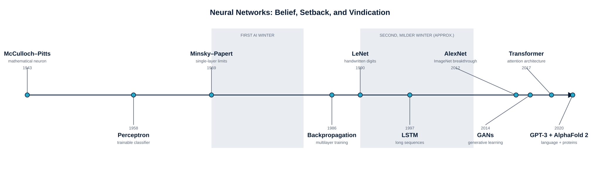
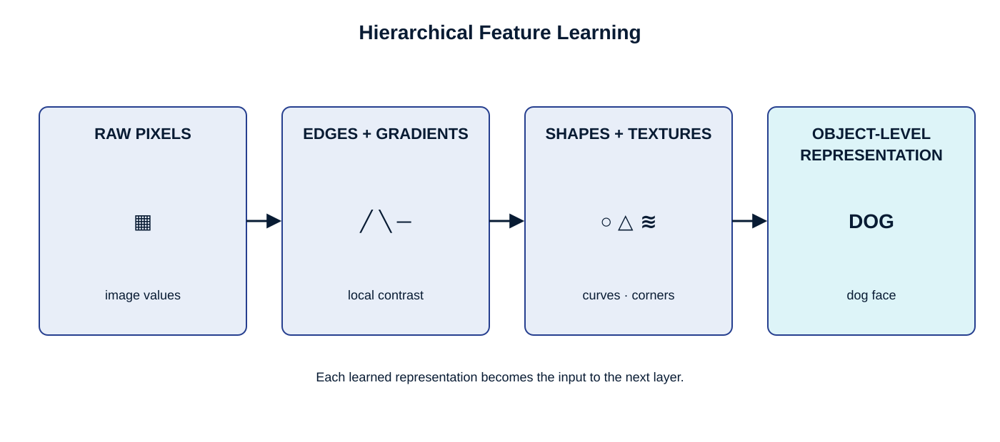

Part I · Foundations of Deep Learning

## Opening Narrative

### A Radiologist, a Chest X-Ray, and a Question That Changed Everything

In 2009, a radiologist named Dr. Chen spent forty-five minutes studying a chest X-ray. He moved his eyes across the film with practiced precision, searching for the subtle asymmetries, the faint shadows, the almost-imperceptible densities that distinguish a healthy lung from a diseased one. He had spent twelve years learning to see this way. He found nothing unusual and sent the patient home.

Ten years later, a research team at Stanford fed that same X-ray into a neural network called CheXNet. The network had never attended medical school. It had never looked at a single anatomy textbook. Instead, it had studied over 100,000 chest X-rays and quietly learned, layer by layer, what patterns distinguished dozens of conditions from healthy tissue. It returned its analysis in 1.4 seconds. It flagged a subtle early-stage pneumonia that the 2009 radiologist had missed.

This is not a story about a machine being smarter than a doctor. It is a story about a fundamentally different way of building intelligent systems --- one that does not start with rules, but with examples; not with instructions, but with data; not with explicit programming, but with learning.

That difference is what this book is about.

> *Deep learning does not ask us to write the rules of intelligence. It asks us to show enough examples of intelligent behavior, and then it finds the rules itself.*

In the chapters that follow, you will discover how systems like CheXNet work --- not as magic, not as science fiction, but as mathematics and statistics operating at a scale and depth that produces something genuinely surprising: machines that perceive, recognize, generate, and decide in ways that were considered uniquely human just a decade ago.

But before we can understand how deep learning works, we need to understand why it exists. What problem does it solve that could not be solved before? Why did it take until 2012 for the field to ignite? What ideas, stretching back to a hand-drawn diagram of a brain cell in 1943, converged into the moment that changed everything?

That is where we begin.

## Learning Objectives

### What You Will Be Able to Do

After completing this chapter, you will be able to:

1.  Explain the relationship between artificial intelligence, machine learning, and deep learning --- and why each level matters distinctly.

2.  Trace the key historical milestones of neural networks, including what caused the AI Winters and what ended them.

3.  Explain the two core principles that give deep learning its power: hierarchical feature learning and representation learning.

4.  Compare deep learning with traditional machine learning across six meaningful dimensions --- and know when each approach is the right tool.

5.  Recognize deep learning applications in healthcare, agriculture, transportation, creative arts, and other domains, and connect each to the principles that make it possible.

6.  Identify the ethical tensions embedded in real-world deep learning systems and reason about them constructively.

7.  Set up a working deep learning development environment and begin exploring pre-trained models.

8.  Articulate the design philosophy for the semester-long capstone project you will build: a Multimodal Intelligent Perception and Decision System (MIPDS).

## Key Terms and Concepts

### The Language of Deep Learning

Every field has its vocabulary, and deep learning is no exception. What follows is not a list to memorize before reading --- it is a reference to return to as you encounter these ideas in context. Think of this table as a map key: the terrain makes more sense once you have walked it, but having the key in hand helps you know what you are looking at.

  ------------------------------------------------------------------------------------------------------------------------------------------------------------------------------------------------------------------------------------------------------------------------------------------------------------------------------------------------------------------------------
  **Term**                               **Plain-Language Definition**
  -------------------------------------- ---------------------------------------------------------------------------------------------------------------------------------------------------------------------------------------------------------------------------------------------------------------------------------------------------------------------------------------
  Artificial Neuron                      The basic building block of neural networks. It receives one or more input signals, multiplies each by a weight (a measure of importance), adds them up, and passes the result through an activation function to produce an output. Think of it as a tiny, adjustable decision-maker.

  Neural Network                         A collection of artificial neurons arranged in layers and connected to one another. Information flows from an input layer, through one or more hidden layers, to an output layer. The network learns by adjusting the strengths of those connections.

  Deep Neural Network                    A neural network with many hidden layers --- typically more than two. The word \"deep\" refers to this depth. More layers allow the network to learn increasingly abstract representations of its input data.

  Layer                                  A group of neurons that operate at the same level of abstraction. The input layer receives raw data; hidden layers transform it step by step; the output layer produces the final prediction.

  Hidden Layer                           Any layer between input and output. This is where the interesting work happens --- where raw pixels become edges, edges become shapes, and shapes become recognizable objects.

  Weights                                Numerical values that determine how strongly one neuron influences another. Training a neural network is, at its core, the process of finding the right weights. Weights encode everything the network has learned.

  Bias                                   An extra adjustable parameter in each neuron that allows it to shift its output up or down, independent of its inputs. Without bias, all neurons would be constrained to pass through zero --- a significant limitation.

  Activation Function                    A mathematical function applied to a neuron\'s weighted inputs to produce its output. Without activation functions, a deep network would behave no differently from a shallow one. Common examples include ReLU (which simply removes negative values) and sigmoid (which squashes output between 0 and 1).

  Forward Propagation                    The process of passing data through the network from input to output to generate a prediction. When a trained network sees a new image and identifies it as a cat, it is performing forward propagation.

  Loss Function                          A mathematical measure of how wrong the network\'s predictions are. If the network says an image is 90% dog and it is actually a cat, the loss is high. If it says 95% cat and it is a cat, the loss is low. Training is the process of minimizing loss.

  Backpropagation                        The algorithm that figures out how much each weight in the network contributed to the total prediction error --- and therefore how much each weight should be adjusted. It works by flowing the error signal backward through the network, layer by layer. This is the mechanism that makes learning possible.

  Gradient Descent                       The optimization strategy used to adjust weights during training. Imagine the loss function as a hilly landscape; gradient descent is the process of always taking a small step downhill, iteratively moving toward the lowest point (minimum loss).

  Learning Rate                          A number that controls how large each step is during gradient descent. Too large and the network overshoots the minimum; too small and training takes forever. Choosing a good learning rate is one of the most important practical decisions in deep learning.

  Epoch                                  One complete pass through the entire training dataset. Networks typically require many epochs --- sometimes hundreds --- to converge on a good solution.

  Batch                                  A subset of training examples processed together before updating weights. Processing in batches is more computationally efficient than processing one example at a time.

  Overfitting                            When a model learns the training data so well that it memorizes noise and quirks rather than underlying patterns. The result is impressive performance on training data and poor performance on new data --- like a student who memorizes answers without understanding the concepts.

  Underfitting                           The opposite problem: when a model is too simple to capture the important patterns in the data. Underfitting produces poor performance everywhere --- on training data and new data alike.

  Regularization                         A family of techniques designed to prevent overfitting by discouraging the model from becoming overly specialized. Examples include dropout (randomly deactivating neurons during training) and L2 regularization (penalizing very large weights).

  Feature Learning                       The ability of deep networks to automatically discover the relevant patterns in raw data, without being told what to look for. This eliminates the need for manual feature engineering --- historically one of the most time-consuming parts of building intelligent systems.

  Transfer Learning                      Reusing knowledge gained from one task to accelerate learning on a different but related task. A model trained on millions of photographs of everyday objects can be quickly adapted to detect tumors in medical scans, because the low-level visual features it learned --- edges, textures, shapes --- are useful in both contexts.

  Convolutional Neural Network (CNN)     A neural network architecture designed for data with spatial structure, especially images. It uses a mathematical operation called convolution to efficiently detect visual patterns regardless of where they appear in an image.

  Recurrent Neural Network (RNN)         A neural network architecture designed for sequential data --- text, speech, time series. Recurrent networks maintain a kind of memory that allows information from earlier in a sequence to influence what happens later.

  Long Short-Term Memory (LSTM)          A sophisticated type of recurrent network that can remember information over long time spans, solving a fundamental weakness of earlier RNNs that caused them to \"forget\" distant context.

  Transformer                            A neural network architecture based on a mechanism called attention, which allows the model to consider the relationship between any two parts of its input simultaneously. Transformers now power most state-of-the-art systems in natural language processing, computer vision, and beyond.

  Generative Adversarial Network (GAN)   A system of two competing neural networks: a generator that creates synthetic data and a discriminator that tries to distinguish real data from fake. Their competition drives the generator to produce increasingly realistic output.

  Reinforcement Learning                 A learning paradigm in which an agent learns by taking actions in an environment and receiving rewards or penalties based on the outcomes. Unlike supervised learning, no labeled examples are provided --- the agent must discover effective behavior through trial and error.

  Supervised Learning                    Training a model on labeled examples: pairs of input data and correct output labels. The model learns to map inputs to outputs by minimizing prediction error across many examples.

  Unsupervised Learning                  Training a model on data without labels, allowing it to discover hidden structure on its own. Useful for finding clusters, learning compact representations, and detecting anomalies.

  Hyperparameter                         A setting that controls the learning process itself rather than being learned from data. Examples include learning rate, number of layers, and batch size. Choosing good hyperparameters is part science, part art.

  Inference                              Using a trained model to make predictions on new, unseen data. The deployment phase --- what happens after training is complete.

  Embedding                              A dense numerical representation of a discrete object (like a word, an image, or a user) in a continuous vector space. Embeddings capture semantic relationships: words with similar meanings will have similar embeddings; images of the same category will cluster together.
  ------------------------------------------------------------------------------------------------------------------------------------------------------------------------------------------------------------------------------------------------------------------------------------------------------------------------------------------------------------------------------

## What Is Deep Learning --- And Why Does It Matter?

Let us start with a thought experiment. Imagine you need to write a computer program that can tell whether a photograph contains a cat.

Your first instinct might be to describe a cat in rules: four legs, pointed ears, whiskers, a tail, fur in a range of colors, eyes that reflect light in a certain way. Reasonable enough. But the moment you start writing those rules, the cracks appear. What about a cat photographed from above, where the legs are invisible? What about a black cat photographed against a dark background? What about a kitten whose ears have not fully developed? What about a drawing of a cat, a shadow of a cat, or a cat wearing a Halloween costume?

The rules multiply. Exceptions compound. Edge cases cascade. After months of work, your rule-based program might handle the easy cases reasonably well --- but it will fail on precisely the kinds of varied, messy, real-world images that actually matter.

Now imagine a different approach. Instead of writing rules, you collect one million photographs labeled \"cat\" and one million labeled \"not cat.\" You hand them to a system that learns what distinguishes the two, entirely on its own. After training, you test it on photographs it has never seen. It gets nearly all of them right --- including the cat in the Halloween costume.

The second approach is deep learning. And the difference between these two approaches is not merely technical. It represents a fundamental shift in how we think about building intelligent systems.

### The AI Family: Nested Circles, Not a Family Tree

You will often hear deep learning described as a subset of machine learning, which is itself a subset of artificial intelligence. This is accurate, but the \"family tree\" metaphor --- grandparent, parent, child --- suggests replacement, as if each generation superseded the last. A better image is nested circles.

The outermost circle is Artificial Intelligence: the broad aspiration to build systems that exhibit intelligent behavior. This circle encompasses everything from chess-playing programs to expert systems that diagnose diseases using hand-coded rules. AI has been a field of inquiry since the 1950s, and many approaches within it do not involve learning at all --- they involve carefully designed logic, search algorithms, and knowledge bases.

Inside that circle is Machine Learning: the specific idea that intelligent systems should learn from data rather than following explicit rules. Instead of programming a spam filter with a list of suspicious words, you show it thousands of examples of spam and legitimate email and let it figure out the distinguishing patterns. ML includes a rich ecosystem of techniques --- decision trees, random forests, support vector machines, gradient boosting --- each with its own strengths and appropriate uses.

Inside the ML circle is Deep Learning: learning from data using neural networks with many layers. What makes the innermost circle special is not just that it learns, but how it learns --- by building representations of increasing complexity, layer by layer, in a way that allows it to tackle problems that defeated every other approach.

Moving inward through these circles, each approach is more powerful and more data-hungry than the last. Deep learning does not replace machine learning or artificial intelligence. It expands what is possible within them.

> *Every deep learning system is also a machine learning system. Every machine learning system is also an AI system. The circles do not replace each other --- they contain each other.*

### Real-World Impact: Where Deep Learning Lives Today

It is easy to talk about deep learning abstractly. It is more useful to see it in the world. The following examples are not a comprehensive survey --- they are chosen to illustrate the range and depth of the field\'s impact. Crucially, each example also carries an ethical dimension that deserves to be considered alongside the technical achievement.

### Healthcare and Medical Imaging

The transformation of medical imaging by deep learning is one of the most consequential stories in modern technology. When Rizwan I. Haque and Neubert reviewed the field in 2020, they found deep learning systems capable of detecting patterns in medical images that are effectively invisible to the human eye --- not because doctors are inadequate, but because the human visual system was not optimized for the statistical patterns hidden in high-dimensional image data.

Consider diabetic retinopathy, a leading cause of blindness worldwide. A trained ophthalmologist can detect it from retinal photographs, but there are nowhere near enough ophthalmologists in the world to screen the hundreds of millions of diabetics at risk. A deep learning system developed by Google Health can detect diabetic retinopathy from retinal images with accuracy matching board-certified specialists --- and it can run on a smartphone. In low-resource settings, this is not a convenience; it is the difference between early treatment and preventable blindness.

The ethical dimension here is real and cannot be separated from the technical achievement. When a deep learning system recommends or rejects a diagnosis, who bears responsibility if it is wrong? If the system was trained predominantly on images from well-resourced hospitals with certain demographic profiles, will it perform equally well across all patient populations? These are not hypothetical concerns --- documented disparities in AI system performance across demographic groups have already emerged in dermatology, radiology, and emergency medicine. Technical capability and equitable deployment are separate problems, and solving the first does not automatically solve the second.

### Agricultural Innovation

Farming is one of humanity\'s oldest practices, and it is undergoing a profound technological transformation. When Kamilaris and Prenafeta-Boldú analyzed dozens of deep learning studies in agriculture in 2018, they found a consistent pattern: deep learning approaches outperformed traditional image-processing methods on tasks like crop disease detection, weed identification, and yield prediction.

The reason follows directly from the principles we will study in this book. The visual differences between a healthy soybean leaf and one infected with sudden death syndrome are subtle, varied, and resist clean rule-based description. But they are real patterns --- and deep learning systems trained on thousands of labeled leaf images can learn those patterns and detect them at scale.

The implications are significant. A farmer monitoring hundreds of acres cannot personally inspect every plant for early signs of disease. A drone equipped with a deep learning system can. Earlier detection means earlier treatment, less pesticide use, and higher yields. For a world that needs to feed eight billion people while adapting to climate change, these are not trivial gains.

### Cybersecurity

The same deep learning capability that allows a network to recognize a face in a photograph can be applied to network traffic to recognize the signature of an intrusion. Yin and colleagues demonstrated in 2017 that recurrent neural networks --- architectures designed to process sequential data --- were particularly effective at detecting network intrusions because they could recognize anomalous sequences of activity rather than just anomalous individual packets.

The ethical dimension here is sobering. Deep learning-based cybersecurity tools are not inherently defensive. The same capability that helps organizations detect intrusions can help adversaries evade detection. Researchers studying AI-powered attacks have demonstrated that deep learning systems can be used to generate adversarial inputs that systematically fool defensive classifiers, to craft more convincing phishing emails, and to automate the discovery of software vulnerabilities. The dual-use nature of deep learning in security is a permanent feature of the landscape, not a temporary problem to be solved.

### Creative Arts and Language

Perhaps the most philosophically interesting applications of deep learning are in domains we once considered exclusively human: art, music, storytelling, and language. The transformer architecture, introduced in 2017, enabled systems like GPT that can write coherent prose, summarize documents, translate between languages with remarkable fluency, and answer questions with apparent comprehension.

Generative image models can now create photorealistic images from text descriptions. Music generation systems can compose in the style of any artist whose work appeared in their training data. These capabilities raise genuinely difficult questions about authorship, authenticity, and the nature of creativity --- questions that do not have tidy answers and that will occupy philosophers, lawyers, and artists for decades.

The question of what gets used to train these systems --- and whether the creators of that training data consented to its use --- is one of the defining ethical debates of the current moment in AI development. We will return to this theme throughout the course.

## A History of Belief, Setback, and Vindication

The story of neural networks is not a straight line from insight to triumph. It is a story of dramatic oscillation --- of brilliant ideas dismissed, careers derailed, fields abandoned, and then, against all expectation, vindicated. Understanding this history is not merely useful context. It is a lesson in how great ideas actually travel through the world.

### Early Days: Baby Steps and Big Dreams (1943--1958)

The intellectual lineage of deep learning begins in 1943, in the unlikely collaboration between a neurologist and a mathematician. Warren McCulloch and Walter Pitts published a paper describing a mathematical model of a neuron --- a simple unit that could take binary inputs, combine them with weights, and produce a binary output. Their model was far too simple to learn anything useful on its own, but it planted a seed: perhaps the abstract structure of thought could be captured in mathematics.

The seed grew into something more tangible in 1958, when Frank Rosenblatt at Cornell introduced the perceptron --- an early form of artificial neural network that could actually be trained to recognize patterns. The perceptron learned by adjusting its weights based on its mistakes, and it could genuinely classify simple patterns that it had never seen before. The press coverage was extraordinary. The New York Times reported that the Navy had built a machine that could \"learn, make decisions, and translate languages.\" A wave of excitement swept through the research community.

In retrospect, the excitement was premature. But the intuition was right. The perceptron\'s limitations were real, but they were the limitations of a first attempt --- not a fundamental ceiling.

### The First Winter: Dreams on Hold (1969--1982)

The crash, when it came, was swift and influential. In 1969, two eminent computer scientists at MIT --- Marvin Minsky and Seymour Papert --- published a rigorous mathematical analysis of the perceptron\'s limitations. Their central finding: a single-layer perceptron could not solve problems that required it to capture nonlinear relationships in the data. The famous example was the XOR function --- a simple logical operation that the perceptron could not learn.

The Minsky-Papert critique was technically correct. But it was interpreted by the research community and funding agencies as a verdict on neural networks broadly --- not just on the single-layer variety. Funding evaporated. Talented researchers pivoted to other approaches. The period that followed is known as the first \"AI Winter\" --- a chilly term for a genuine contraction in ambition and resources.

What is remarkable about this period is not that smart people gave up on a hard problem. It is that some did not. A small community of researchers kept working through the winter, driven by a conviction that the limitations of the perceptron were architectural, not fundamental --- that deeper networks, properly trained, could learn what single layers could not. They were right.

### The Revival: Spring Returns (1982--2006)

The thaw came from multiple directions at once. In 1986, David Rumelhart, Geoffrey Hinton, and Ronald Williams published a paper that effectively solved the training problem for multi-layer networks: the backpropagation algorithm. Backpropagation had been independently discovered earlier by others, but Rumelhart et al. made it clear, rigorous, and practically useful. For the first time, researchers had a principled method for training networks with multiple layers.

One of the first and most dramatic demonstrations of what backpropagation could do came from Yann LeCun. Working at Bell Labs in the late 1980s, LeCun developed LeNet, a convolutional neural network trained to read handwritten digits from checks. LeNet learned to handle the enormous variability in human handwriting --- different sizes, slants, thicknesses --- in a way that no rule-based system had managed. By the early 1990s, LeNet was processing a significant fraction of all checks deposited in the United States.

The 1990s brought another breakthrough, this time in the handling of sequential data. Sepp Hochreiter and Jürgen Schmidhuber introduced Long Short-Term Memory networks in 1997 --- a specialized recurrent architecture capable of maintaining information over long sequences. Earlier recurrent networks suffered from a problem called the vanishing gradient: as sequences grew longer, the training signal faded before it could propagate backward through all the time steps. LSTMs solved this through a clever gating mechanism that allowed the network to learn what to remember and what to forget.

Despite these genuine advances, the field remained on the margins of mainstream machine learning. Deep networks were difficult to train reliably, required substantial computation, and still frequently lost to well-engineered traditional methods on standard benchmarks. A second, milder AI Winter had set in.

### The Modern Revolution: The 2010s and Beyond

The moment that everything changed can be dated with unusual precision: September 30, 2012.

On that day, the results of the ImageNet Large Scale Visual Recognition Challenge were announced. Teams from around the world had spent the year training systems to classify 1.2 million photographs into 1,000 categories. The leading traditional approaches achieved error rates in the range of 25 to 26 percent. Then came AlexNet --- the entry from Alex Krizhevsky, Ilya Sutskever, and Geoffrey Hinton at the University of Toronto. Its top-5 error rate was 15.3 percent.

Eleven percentage points. In a competition where fractions of a percentage point had previously separated competitors, AlexNet\'s margin was not a victory --- it was a demonstration of a different order of capability. The deep learning era had begun.

AlexNet did not win because of a single clever trick. It won because of a convergence of factors that had finally aligned: a sufficiently large and well-labeled dataset (ImageNet, assembled over years by Fei-Fei Li and her colleagues at Stanford), a sufficiently powerful architectural insight (the combination of convolutional layers, ReLU activations, and dropout regularization), and sufficiently fast hardware (two NVIDIA GTX 580 gaming GPUs). None of these ingredients alone was sufficient. Together, they were transformative.

> *AlexNet did not just win a competition. It demonstrated a scaling law: with the right architecture, enough data, and enough compute, deep learning would outperform everything that had come before --- and improve further as any of those three ingredients increased.*

What followed was an extraordinary acceleration. Ian Goodfellow introduced Generative Adversarial Networks in 2014, opening the door to machines that could create --- not just classify. The transformer architecture, introduced in the landmark \"Attention Is All You Need\" paper from Google Brain in 2017, reorganized natural language processing from the ground up, making attention --- the ability to consider relationships between any two elements in a sequence simultaneously --- the central primitive of language modeling.

OpenAI\'s GPT-3, released in 2020 with 175 billion parameters, could write essays, generate code, and hold conversations that surprised even its creators. DeepMind\'s AlphaFold 2, also released in 2020, effectively solved the protein structure prediction problem --- a challenge that had occupied structural biologists for fifty years --- by treating it as a deep learning problem. Scientists who had spent careers on this problem watched their field transform in months.

The story is not over. Each of these milestones has itself become a foundation for what came next. We are living through the middle chapters of one of the most consequential technological transformations in human history.

### The Timeline at a Glance

::: {#figure-1-2 .technical-figure}
{fig-alt="Timeline from the 1943 McCulloch–Pitts neuron through the perceptron, backpropagation, LeNet, LSTM, AlexNet, GANs, the Transformer, GPT-3, and AlphaFold 2, with the two AI Winter periods shaded." width="100%"}

*Figure 1.2 --- Key milestones in neural network development, from McCulloch-Pitts (1943) to modern large language models. The two shaded periods represent the AI Winters. Note that breakthroughs did not stop during these periods --- they accelerated afterward.*
:::

## The Core Principles: Why Deep Learning Works

We now have enough context to ask the fundamental question: what actually makes deep learning powerful? Not the history, not the applications --- the underlying principles that explain why a layered neural network can learn to recognize cancer in a scan, translate between sixty languages, and generate a photorealistic portrait from a sentence description.

Two principles do most of the explanatory work. They are worth understanding deeply before we encounter any equations.

### Principle 1: Hierarchical Feature Learning

Consider again the task of recognizing a face in a photograph. If you were to describe this task to a child who had never seen a photograph, you might say: \"Look for two eyes, a nose, a mouth, and two ears, arranged in roughly this configuration, on a roughly oval surface.\" The child learns to recognize faces by learning what faces are made of.

Deep neural networks learn the same way --- except they learn the components automatically, from scratch, without being told what the components are. This is hierarchical feature learning, and it is the most important conceptual innovation in the field.

### How the Hierarchy Works

Imagine a deep network processing an image of a dog. At the earliest layers, the network learns to detect the most primitive visual elements: edges and gradients --- places where brightness or color changes sharply. These are not dog-specific features. They appear in images of everything.

At the next level of layers, the network combines those primitive edges into something more meaningful: curves, corners, textures, and simple shapes. Still not specific to dogs --- these features appear in images of cars and trees and buildings too.

As we move deeper, the combinations become richer and more specific. Circular shapes combined with certain textures begin to look like eyes. Curved edges in certain configurations begin to look like snouts. By the time we reach the deepest layers --- what some researchers call the \"executive\" layers --- the network has assembled rich, complex representations: \"this combination of features is consistent with a dog\'s face.\"

The crucial insight is that none of these features were specified by a human. No programmer told the network to look for edges, or curves, or snouts. The network discovered these features because they were statistically useful for distinguishing dogs from everything else in the training data. The features are the network\'s own invention.

::: {#figure-1-3 .technical-figure}
{fig-alt="Four-stage hierarchy in which raw image pixels become edges and gradients, then shapes and textures, and finally an object-level representation." width="100%"}

*Figure 1.3 --- Hierarchical feature learning in a convolutional network. The same image passes through four progressive layers: raw pixels, edge detection, shape assembly, and object recognition. Each layer builds on the representations learned by the layer before it.*
:::

### Why This Is Revolutionary

Before deep learning, building a vision system meant feature engineering: a domain expert would spend months or years designing the features --- deciding what to measure, what to extract, what to feed into the classifier. The performance of the system was fundamentally bounded by the quality of the human-designed features. If the expert missed something important, the system missed it too.

Feature learning eliminates this bottleneck. The network discovers features that no human designer thought to specify --- features that, in many cases, turn out to be more predictive than any human-designed alternative. This is not a small optimization. It is a qualitative change in what kinds of problems can be addressed.

It also explains a pattern we will see throughout this course: deep learning tends to outperform traditional approaches most decisively on problems involving rich, unstructured data --- images, audio, natural language --- precisely because these are the domains where manual feature engineering is hardest.

### Principle 2: Representation Learning

Hierarchical feature learning explains how deep networks process raw data. Representation learning explains what they produce: a deep network does not just make a prediction about its input --- it builds a rich internal model of the world it has been trained on.

### The Concept of an Embedding

Here is an experiment that illuminates the idea. Take a state-of-the-art image network and remove the final classification layer. What remains is a function that maps any image to a long list of numbers --- typically 512 or 2,048 numbers. This list is called an embedding, or a representation.

Now take two photographs of the same dog, taken from different angles on different days. Feed both through the network. Their embeddings will be remarkably similar --- not identical, but close. Now take a photograph of a cat and feed it through. Its embedding will be noticeably different from both dog photographs, but will cluster with other cat embeddings.

The network has learned a secret language for images. In this language, similarity of meaning corresponds to similarity in the numerical representation. Two images that depict similar things will be encoded similarly, even if they look nothing alike at the pixel level.

This is a profound capability. It means the network has done something more than classify --- it has learned to understand, in a functional sense, the relationships between the things it has seen.

### Why Representations Matter

The practical implications are substantial. Once a network has learned a good representation of images, that representation can be reused for tasks the network was never explicitly trained for. A network trained to recognize 1,000 categories of everyday objects has built representations that are useful for detecting diseases in medical images, for searching satellite imagery, for identifying plant species, and for dozens of other tasks --- even though its training data contained none of these things.

This is the foundation of transfer learning, one of the most practically important ideas in the field. Rather than training a new network from scratch for every problem --- which requires enormous data and compute --- practitioners can start with a network that already has good representations and fine-tune it for their specific task. The effort required drops from months and millions of dollars to days and thousands of dollars.

> *A network trained on one thing has learned something more general than that thing. Representations are the portable, reusable knowledge of deep learning.*

### Representation Learning and the Curse of Dimensionality

There is a deeper reason why representation learning matters, connected to a fundamental challenge in all of machine learning: the curse of dimensionality. Raw data --- images, audio, text --- exists in extremely high-dimensional spaces. A modest 224×224 color image has 150,528 dimensions. Finding patterns in spaces this large requires either enormous amounts of data or a way to focus attention on the structure that matters.

Deep networks address this challenge by learning compact, low-dimensional representations that capture the essence of the data. The 150,528 dimensions of a photograph can be distilled into 512 meaningful numbers that capture everything the network needs to know about what the image depicts. This compression is not lossy in any harmful sense --- it discards the irrelevant variation (lighting conditions, camera angle, background clutter) while preserving the signal (what is depicted and how it relates to other things in the world).

### What Emerges from These Two Principles

When hierarchical feature learning and representation learning work together in a deep network trained on sufficient data, something remarkable emerges: capabilities that were not explicitly programmed and were not straightforwardly predictable from the training objective.

Networks trained to classify images learn to detect the style of individual artists, even though no one labeled the training images by artistic style. Language models trained to predict the next word develop internal representations of grammar, syntax, and factual relationships --- without ever being taught these concepts explicitly. Networks trained on protein sequences develop representations that capture the physical chemistry of amino acid interactions.

These emergent capabilities are not magic. They are the consequence of building representations rich enough to support the training task, which turn out to be rich enough to support much more. Understanding when and why this emergence happens --- and when it fails to happen --- is one of the active frontiers of deep learning research.

## Deep Learning vs. Traditional Machine Learning: Choosing the Right Tool

Having spent time inside deep learning, it is worth stepping back to ask: when should you not use it? Deep learning is powerful, but it is not universally appropriate. Understanding its relationship to traditional machine learning --- and the conditions under which each approach is superior --- is one of the most practically important skills in the field.

We will compare the two approaches along six dimensions. Rather than treating this as a competition, think of it as a map: different territories call for different tools, and the best practitioners know which territory they are in.

### 1. Feature Extraction: Designed vs. Discovered

Traditional machine learning requires a human expert to design the features --- the aspects of the raw data that will be fed to the learning algorithm. A credit scoring model might be fed income, debt-to-income ratio, employment duration, and credit history --- all carefully chosen by a financial domain expert. The model\'s job is to combine these features effectively, but the feature choices themselves are human decisions.

The strength of this approach is that it incorporates domain knowledge directly. The weakness is that it is bounded by that knowledge: if the expert misses something important, the model cannot discover it. It also requires substantial expert time and becomes increasingly impractical as the raw data becomes more complex --- nobody can hand-engineer useful features for a 224×224 color image.

Deep learning discovers its own features. This eliminates the bottleneck of expert time and allows the model to find patterns that human designers would never have thought to look for. The cost is that the discovered features are often uninterpretable --- we know they work, but we cannot always explain what they represent.

### 2. Data Types: Structured vs. Unstructured

Traditional machine learning methods were developed primarily for structured data: tabular data with well-defined rows and columns, where each column represents a specific, measurable attribute. A spreadsheet of house prices with columns for square footage, number of bedrooms, and neighborhood is the natural habitat of traditional ML. Given such data, methods like gradient boosting and random forests remain highly competitive --- often superior to deep learning.

Deep learning\'s advantage emerges with unstructured data: images, audio, natural language, video, and sequences of events. These data types do not fit naturally into tables. Their meaningful patterns require hierarchical feature extraction --- exactly the capability deep networks provide. This is why the domains where deep learning has had the largest impact --- computer vision, speech recognition, natural language processing --- are all unstructured data domains.

### 3. Scalability: Ceilings vs. Scaling Laws

Traditional machine learning methods tend to improve rapidly with relatively small amounts of data, then plateau. Adding more training examples beyond a certain point produces diminishing returns. This is not a criticism --- it reflects the fact that these methods are making efficient use of what they have, and there is simply a limit to what can be learned from the features they are given.

Deep learning exhibits a different relationship with data: scaling laws. With more data, larger models, and more compute, performance continues to improve --- often without any clear ceiling. This was first demonstrated dramatically with AlexNet and has been confirmed across domains. The largest language models trained on trillions of tokens outperform smaller models trained on the same data by substantial margins.

This scaling behavior is both a strength and a practical constraint. It means deep learning rewards investment: organizations with more data, more compute, and larger models will build better systems. It also means that deep learning can be overkill for problems where the available data is small or the performance ceiling of traditional methods is already sufficient.

### 4. Interpretability: Glass Boxes and Black Boxes

A decision tree, the simplest family of traditional ML models, is almost completely interpretable. You can follow every branch from root to leaf and reconstruct exactly why the model made a given prediction: \"This loan application was rejected because the applicant\'s debt-to-income ratio exceeds 0.43 and their employment duration is less than two years.\" This kind of explanation is valuable in regulated industries where decisions affecting people\'s lives must be justifiable.

Deep neural networks, especially deep ones with hundreds of millions of parameters, are not interpretable in this direct sense. The mapping from input to output passes through many layers of nonlinear transformation, and no single weight or layer encodes a human-understandable decision rule. When a deep network classifies a tumor as malignant, it cannot produce a concise explanation of why. This is the \"black box\" problem, and it is real.

It is also not static. A growing subfield called explainable AI (XAI) develops tools for peering inside deep networks --- identifying which parts of an input the network attended to, which training examples influenced a given prediction, and which features the network has implicitly learned to use. These tools do not turn deep networks into glass boxes, but they reduce the opacity meaningfully. We will examine them later in the course.

The practical implication: in domains where interpretability is legally required --- certain financial decisions, medical diagnoses where the rationale must be documented --- the interpretability of traditional methods may be decisive, independent of the accuracy advantage deep learning offers.

### 5. Computational Resources: Laptops and Data Centers

A random forest or gradient boosting model can be trained in minutes on a laptop. A simple deep learning model for image classification can be trained in hours on a consumer GPU. A state-of-the-art language model requires months on thousands of specialized GPUs, at a cost of millions of dollars and a substantial carbon footprint.

This range is important to internalize. Not every deep learning problem requires frontier resources, and not every problem that can be tackled with deep learning should be. The most responsible engineering practice involves choosing the least resource-intensive approach that is sufficient for the task --- a principle that is both economically and environmentally sound.

### 6. Data Requirements: Snacks and Feasts

Traditional machine learning methods can produce useful models from hundreds or thousands of examples. This makes them indispensable in domains where labeled data is scarce, expensive to collect, or limited by the rarity of the phenomenon being modeled. A rare disease diagnosis model may have access to only a few hundred confirmed cases --- a feast for traditional methods, a famine for deep learning.

Deep learning typically requires thousands to millions of labeled examples to reach its potential. This appetite is why the field exploded when ImageNet became available (1.2 million labeled images), and why large language models are trained on essentially the entire internet. When data is abundant, deep learning thrives. When it is scarce, traditional methods or transfer learning are often the better choice.

  ---------------------------------------------------------------------------------------------------------------------------
  **Dimension**            **Traditional Machine Learning**                 **Deep Learning**
  ------------------------ ------------------------------------------------ -------------------------------------------------
  Feature extraction       Human-designed; requires domain expertise        Automatic; discovered from raw data

  Best data types          Structured, tabular data                         Unstructured: images, text, audio, video

  Performance with scale   Plateaus with more data                          Continues improving with more data and compute

  Interpretability         Often transparent; decisions can be explained    Often opaque; \"black box\" behavior

  Compute requirements     Modest; trainable on a laptop                    Substantial; often requires GPUs or TPUs

  Data requirements        Hundreds to thousands of examples                Thousands to millions of examples

  Development speed        Fast iteration cycles                            Longer training and experimentation cycles

  Best use cases           Tabular data, regulated industries, small data   Complex perception, generation, large-scale NLP
  ---------------------------------------------------------------------------------------------------------------------------

The wisest practitioners are not loyal to either camp. They understand the terrain of the problem in front of them --- the data type, the quantity, the interpretability requirements, the compute budget, the performance target --- and choose accordingly. Many of the best systems in production today are hybrids: deep learning for the perception or representation step, traditional methods for the final decision layer where interpretability matters.

## Introducing the Capstone Project: MIPDS

Throughout this course, you will build something. Not a series of isolated exercises, but a single evolving system that grows in capability each week as you add what you have learned. By the final week, you will have a functioning Multimodal Intelligent Perception and Decision System --- MIPDS.

### What MIPDS Will Do

At full capability, MIPDS will be able to perceive and understand images, using convolutional neural networks and vision transformers to extract meaning from visual input. It will understand language, using transformer-based language models to process text. It will reason across modalities --- connecting what it sees to what it reads. It will generate output, using generative models to produce images, text, or descriptions. And it will make decisions, using reinforcement learning to act in the world based on its perceptions.

No single week will build all of this. Each chapter adds one capability --- a new component, a new module, a new layer of intelligence. By the time you finish, you will not just have read about deep learning\'s capabilities. You will have built them.

### This Week: The Blueprint

Before writing a line of code, we need to think. The most important decisions in any complex system are made at the design philosophy level --- decisions about purpose, about scope, about who benefits and who might be harmed.

Your task this week is to write a one-page MIPDS Design Philosophy Document. It should address four questions:

9.  Purpose: What problem should MIPDS solve? What kind of perception and decision-making should it enable?

10. Capabilities: What should it be able to see, understand, generate, and decide? Be aspirational --- we will constrain later.

11. Stakeholders: Who might use such a system? Who else might be affected by it, with or without their knowledge?

12. Risks: What could go wrong before you build a single component? What harms could this system enable?

This document will be a living artifact. You will update it every week as your technical understanding grows and your design decisions become more informed. By Week 16, it will be both a design record and a reflection on how understanding changes what you build.

### Setting Up Your Development Environment

While your conceptual thinking develops, you will also set up the infrastructure for everything that follows. A working deep learning environment is the foundation for all the hands-on work ahead.

### Step 1: Python Installation

Download Python 3.10 or later from python.org. During installation, ensure that Python is added to your system PATH. A clean installation into a dedicated project directory --- rather than modifying your system Python --- will prevent the dependency conflicts that are the most common source of frustration for new practitioners.

### Step 2: Virtual Environment

Every serious Python project should live in its own virtual environment --- an isolated container that holds its dependencies separately from every other project. Create and activate your environment with:

python -m venv mipds_env

source mipds_env/bin/activate \# macOS/Linux

mipds_env\\Scripts\\activate \# Windows

### Step 3: Core Dependencies

Install the libraries you will use throughout the course:

pip install tensorflow numpy matplotlib pillow jupyter scikit-learn

If you have a CUDA-capable GPU and want to use it (highly recommended for any serious training), follow the GPU setup guide in the course companion materials, which provides version-matched instructions for your hardware and operating system.

### Step 4: Verifying Your Setup

Run the provided verification notebook (setup_check.ipynb) from the course repository. This notebook checks that all dependencies are installed correctly, confirms whether a GPU is available, and loads a pre-trained model to confirm that the full inference pipeline works. Completing this verification before the first hands-on assignment will save significant time later.

### Step 5: Version Control

Initialize a git repository in your project directory and create a remote repository on GitHub or GitLab. Every piece of work you produce this semester --- code, design documents, experiment logs --- should live in this repository. Version control is not optional for serious practitioners; it is the foundation of reproducible research.

## Hands-On Exploration

### Feature Engineering vs. Feature Learning

### The Activity

Before writing a neural network, let us build intuition for why the feature learning approach matters. This exploration requires no deep learning knowledge --- only curiosity and a willingness to observe carefully.

Open the notebook hands_on_ch1.ipynb from the course repository. It contains a dataset of 200 hand-drawn shapes (circles, squares, and triangles) with their labels.

### Part 1: Write Your Own Rules (15 minutes)

Before running any model, look at a sample of the shapes. Then write --- in plain English --- three rules that you think would correctly classify any shape as a circle, square, or triangle. For example: \"If the object has straight edges and four corners of equal length, it is a square.\"

The notebook includes a cell that converts your verbal rules into a simple rule-based classifier. Run it on the test set and record the accuracy.

### Part 2: When Rules Break (10 minutes)

A second test set contains the same shapes --- but rotated, partially obscured, drawn in different sizes, and in some cases drawn by a different person. Run your rule-based classifier on this second set. What changes? What breaks? Document your observations carefully.

### Part 3: Feature Learning in Action (10 minutes)

A pre-trained three-layer convolutional network is provided in the notebook. Run it on both test sets and compare its accuracy to your rule-based classifier. Then run the provided visualization cell, which shows you the patterns the network\'s first layer has learned to detect --- the features it discovered without being told what to look for.

### Reflection Questions

Write a 200- to 300-word reflection in the notebook addressing the following:

13. What rules did you write in Part 1? Were they complete? What cases did they miss?

14. What happened to your rules in Part 2? What does this tell you about the brittleness of manually designed features?

15. What did the first-layer visualizations look like? Did the network learn what you expected? Did anything surprise you?

16. Where do you think rule-based approaches still have advantages over learned features?

## Case Study

### AlexNet (2012): The Moment That Changed Everything

### The Problem

The ImageNet Large Scale Visual Recognition Challenge, known as ILSVRC, was an annual competition that asked teams to build systems capable of classifying images from a dataset of 1.2 million photographs into 1,000 categories --- from \"goldfinch\" to \"volcano\" to \"espresso.\" The challenge was designed to push the state of the art in computer vision, and for three years it had done exactly that --- but incrementally. The best systems in 2010 and 2011 used hand-engineered visual features combined with traditional classifiers. The top-5 error rate --- the fraction of images for which the correct label was not among the system\'s five guesses --- was hovering around 26 percent.

### The Deep Learning Solution

In 2012, a team from the University of Toronto entered with AlexNet: a deep convolutional neural network with eight layers, sixty million parameters, and a design that incorporated several innovations that together proved decisive. The network was trained on two NVIDIA GTX 580 graphics processing units over six days. Its top-5 error rate was 15.3 percent --- nearly eleven percentage points better than the previous year\'s winner.

To put that margin in context: the difference between first and second place in the previous two competitions had been less than one percentage point. AlexNet did not just beat the competition --- it invalidated the previous era\'s approach.

### Why Deep Learning Was the Right Tool

AlexNet succeeded because the structure of the problem matched the strengths of convolutional networks. Raw image data contains patterns that are spatially local (an edge detector does not need to look at the whole image), hierarchical (edges compose into shapes, shapes compose into objects), and translation-invariant (a dog is a dog regardless of where in the frame it appears). Convolutional networks encode all three of these properties into their architecture. No amount of feature engineering could replicate the flexibility of a system that discovers its own features end-to-end.

Three specific innovations in AlexNet contributed to its margin. The ReLU activation function, which simply passes positive values and zeros out negative ones, trained much faster than the sigmoid functions used in earlier work without sacrificing accuracy. Dropout regularization, which randomly deactivated half the neurons during training, dramatically reduced overfitting on a scale that would otherwise have been devastating. And data augmentation --- artificially generating additional training examples by cropping, flipping, and adjusting the color of existing images --- expanded the effective training set by orders of magnitude.

### Tradeoffs and Limitations

AlexNet was not without limitations, and understanding them is as important as understanding its successes. Training required specialized hardware that was unavailable to most researchers in 2012 --- the two gaming GPUs cost more than a thousand dollars at the time, and the electricity and cooling costs were non-trivial. The training process took six days; modern practitioners with better hardware and better optimization algorithms can achieve comparable results in hours, but the resource barrier was real.

More fundamentally, AlexNet was a black box. It could identify a goldfinch in a photograph with remarkable accuracy, but it could not explain what it was looking at that told it \"goldfinch.\" Subsequent work showed that it was, in some cases, using spurious features --- classifying images partly based on background context rather than the object itself. A husky photographed in the snow might be correctly identified partly because of the snow, not because of the dog. This brittleness to distribution shift --- to encountering inputs that look superficially different from the training data --- would prove to be a persistent challenge across the field.

AlexNet was also shown to be vulnerable to adversarial examples: carefully crafted pixel perturbations, invisible to the human eye, that caused the network to misclassify images with high confidence. A panda that a human would never mistake for anything else becomes, for AlexNet, a gibbon after a few carefully chosen pixel adjustments. This discovery, made by Szegedy and colleagues in 2013, opened a line of research in adversarial machine learning that continues to this day and has significant implications for the security of any system that relies on deep learning classifiers.

### The Broader Lesson

AlexNet\'s legacy is not primarily architectural. The specific network design has long since been superseded by deeper, wider, and more efficient successors. Its legacy is the demonstration of a principle: that with the right architecture, sufficient data, and sufficient compute, deep learning would outperform any other approach on problems involving rich, unstructured perceptual data --- and would continue to improve as those three ingredients scaled. This insight, confirmed and extended year after year, drove the investment in data collection, compute infrastructure, and research talent that produced the AI landscape we inhabit today.

## Chapter Summary

### What We Have Learned

We began this chapter with a chest X-ray and a question about a fundamentally different way of building intelligent systems. We end it with the conceptual foundations needed to understand the answer.

Deep learning is a specific approach within machine learning: the use of neural networks with many layers to learn hierarchical representations of data from examples. It sits within the broader circle of machine learning, which sits within the broader circle of artificial intelligence --- each level more capable and more demanding than the last.

The history of neural networks is a story of persistence. The field was born in the 1940s, flourished briefly in the late 1950s, was nearly killed by a mathematical critique in 1969, survived in the margins through the 1970s and early 1980s, was revived by backpropagation in the mid-1980s, and spent two more decades as a technically capable but commercially marginal approach. AlexNet\'s decisive victory in 2012 ended that era and began the one we are living in.

Two principles explain deep learning\'s power. Hierarchical feature learning allows networks to automatically discover the features that distinguish one class of input from another --- from edges and textures to object parts to complete semantic categories --- without being told what to look for. Representation learning allows networks to build rich internal models of the world they have been trained on --- models whose structure captures the semantic relationships between things, and whose compact form supports transfer to new tasks.

Deep learning is not always the right tool. Traditional machine learning methods outperform it on structured tabular data, in low-data regimes, in contexts where interpretability is legally required, and when computational resources are constrained. The skill is not knowing how to build deep networks --- it is knowing when to build them.

You have also taken the first step toward your semester-long capstone project: the MIPDS Design Philosophy Document. What begins this week as a statement of aspiration will, over sixteen weeks, become a technical design document reflecting everything you have learned. The system will grow. So will your understanding of what it means to build something intelligent --- and what it means to build it responsibly.

In Chapter 2, we will open the hood of the neural network. We will discover that the magic of hierarchical learning reduces, at its foundation, to a specific computation: weighted sums followed by nonlinear functions, repeated across millions of connections and billions of training steps. The math is not complicated. The consequences are extraordinary.

## Review Questions

### Questions for Reflection and Debate

These questions have no single correct answers. They are designed to be debated, refined, and revisited as your understanding deepens throughout the course.

### 1. The Explanation Problem

A deep learning system correctly identifies early-stage pancreatic cancer in a scan with 94 percent accuracy --- significantly better than the 78 percent accuracy of an experienced radiologist. But the system cannot explain which features in the scan led to its classification. Should a physician use it to guide treatment decisions? What would it take for you to trust an unexplained prediction in a high-stakes medical context?

### 2. The Two Winters and Scientific Progress

Neural network research survived two periods of widespread skepticism and funding withdrawal because a small community kept working despite the dismissal of the broader field. What does this tell us about how scientific progress actually happens? Are there ideas being dismissed today that will be vindicated in ten years? How would you evaluate them?

### 3. The Resource Divide

Training a state-of-the-art large language model costs tens of millions of dollars and consumes electricity comparable to that of a small town for several months. This means only the largest technology companies and best-funded research institutions can push the frontier of capability. What are the implications of this concentration for academic research? For international AI development? For the diversity of perspectives embedded in frontier AI systems?

### 4. Feature Engineering as Domain Knowledge

When a human expert designs features for a machine learning model, they are embedding their understanding of the domain into the system. When a deep network learns features automatically, that knowledge is implicit and often uninterpretable. Which approach produces more trustworthy systems? Is trust the right criterion --- or should we prioritize accuracy, or fairness, or something else?

### 5. Training Data and Consent

Large language models and image generation systems are trained on text and images scraped from the internet --- including works created by millions of writers, artists, photographers, and musicians who did not consent to their use as training data. What ethical framework should govern this practice? Does the social benefit of capable AI systems justify the use of unconsented training data? Who should decide?

### 6. The Responsibility Gap

A deep learning system is trained on data from 2020, deployed in 2022, and used in a clinical setting in 2024. The patient population has shifted. The imaging equipment has been upgraded. The demographics of the patients being scanned have changed. The system\'s accuracy has quietly degraded. Who is responsible for detecting and addressing this drift: the developers who trained it, the hospital that deployed it, the regulatory agency that approved it, or the clinicians who rely on it?

### 7. AI Winters and the Present

Given the history of AI Winters, how would you distinguish between genuine transformative capability and a technology bubble in the current AI landscape? What evidence would convince you that the current wave of deep learning progress has hit a ceiling? What evidence would convince you it has not?

### 8. Choosing Your Adventure

Think of a problem in your own field, area of interest, or daily life that might benefit from machine learning. Work through the six-dimensional comparison from Section 4. Is deep learning likely to be the right approach? What additional information would you need to answer that question with confidence?

## Further Reading

### Going Deeper

The following resources are organized by theme. Start with whichever thread interests you most.

### On the History and Culture of Deep Learning

Goodfellow, I., Bengio, Y., & Courville, A. (2016). Deep Learning. MIT Press. The standard reference text; Chapter 1 provides an authoritative historical account. Available free online at deeplearningbook.org.

Marcus, G., & Davis, E. (2019). Rebooting AI: Building Artificial Intelligence We Can Trust. Pantheon Books. A critical and highly readable perspective on the limits of current deep learning, useful for calibrating optimism.

Metz, C. (2021). Genius Makers: The Mavericks Who Brought AI to Google, Facebook, and the World. Dutton. Narrative journalism that tells the human story of the deep learning revolution.

### On Foundations and Principles

LeCun, Y., Bengio, Y., & Hinton, G. (2015). Deep learning. Nature, 521(7553), 436--444. The landmark review article by three of the field\'s founders. Accessible to a general scientific audience.

Schmidhuber, J. (2015). Deep learning in neural networks: An overview. Neural Networks, 61, 85--117. A comprehensive historical account with broader coverage than most introductory treatments.

### On Ethics and Society

O\'Neil, C. (2016). Weapons of Math Destruction: How Big Data Increases Inequality and Threatens Democracy. Crown. Essential context for understanding how algorithmic systems can cause harm at scale.

Gebru, T., Morgenstern, J., Vecchione, B., Vaughan, J. W., Daumé III, H., Iii, H. D., & Crawford, K. (2018). Datasheets for Datasets. arXiv:1803.09010. A foundational paper proposing standards for documenting training data --- directly relevant to the consent issues raised in this chapter.

### On Applications

Rajpurkar, P., Irvin, J., Ball, R. L., et al. (2017). CheXNet: Radiologist-Level Pneumonia Detection on Chest X-Rays with Deep Learning. arXiv:1711.05225. The paper behind the CheXNet system discussed in this chapter\'s opening narrative.

Senior, A. W., Evans, R., Jumper, J., et al. (2020). Improved protein structure prediction using potentials from deep learning. Nature, 577(7792), 706--710. The AlphaFold work that transformed structural biology.

*--- End of Chapter 1 ---*
