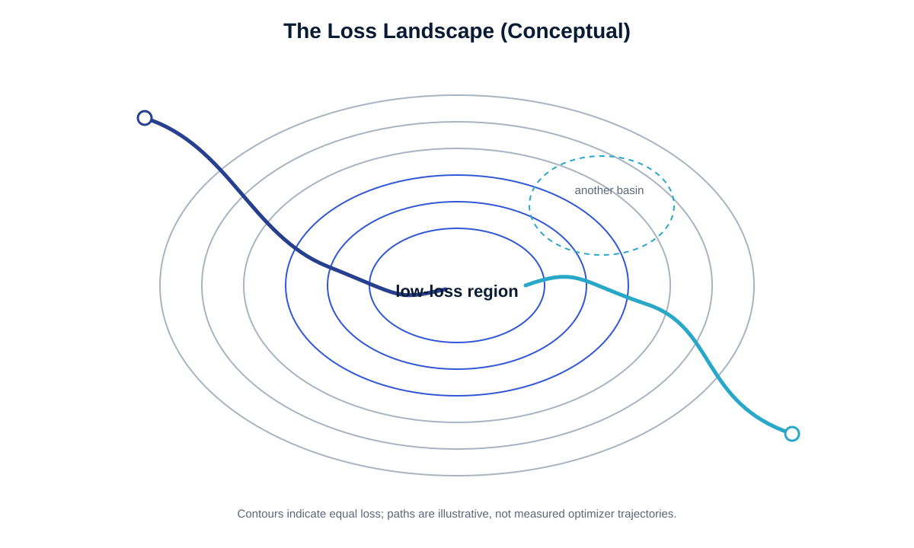
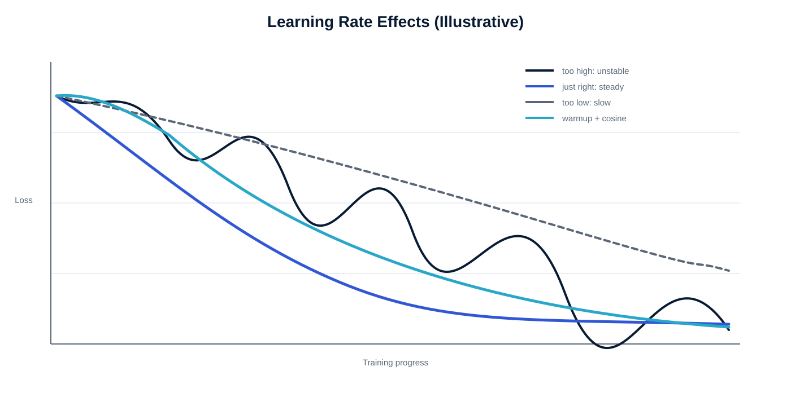
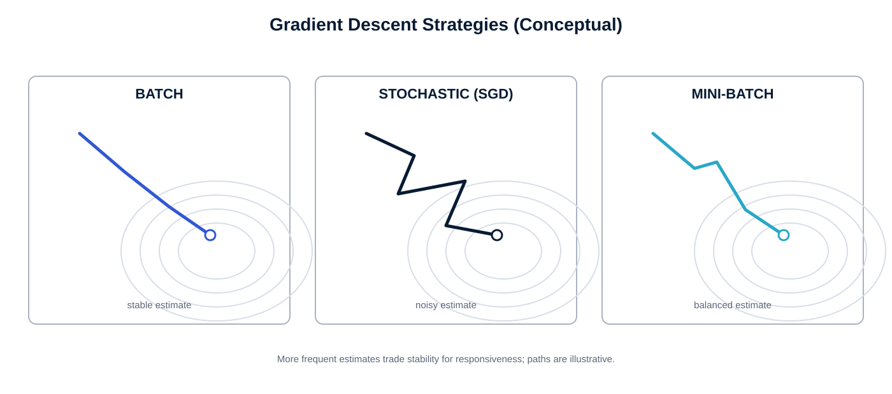
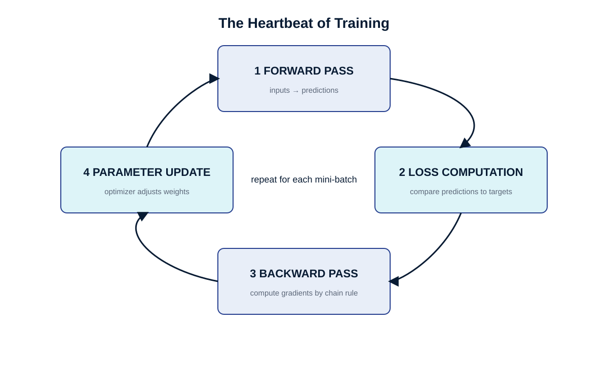
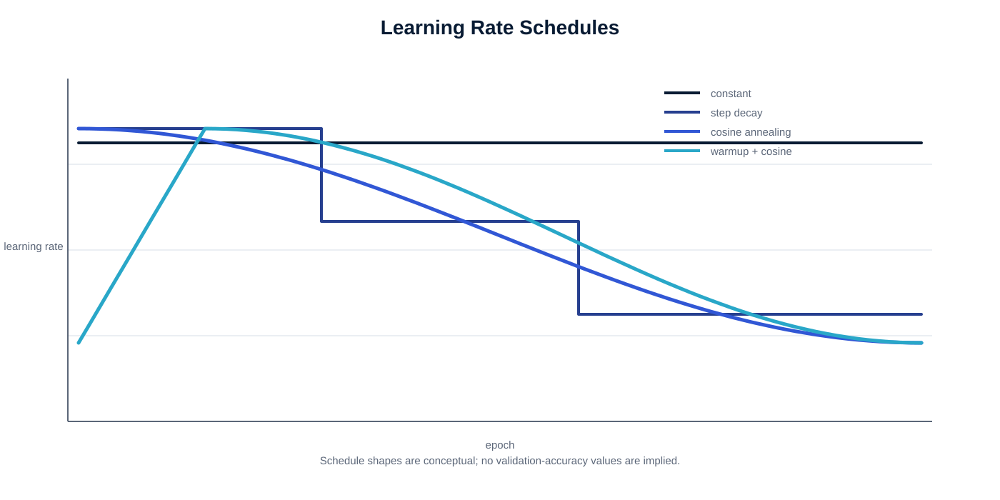
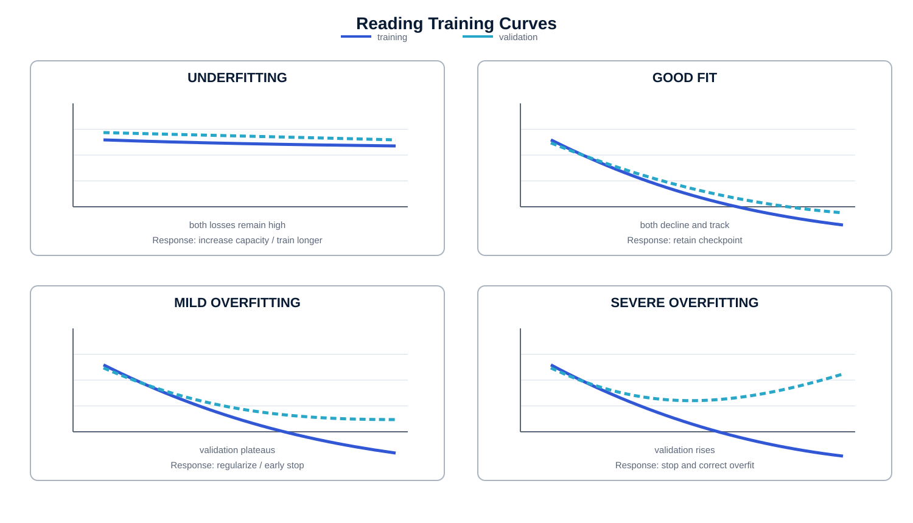
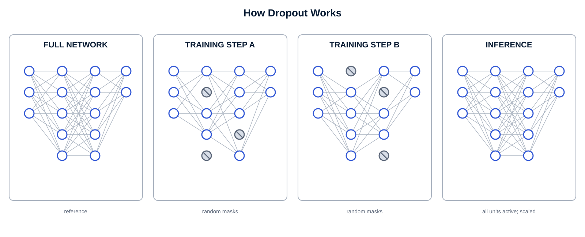
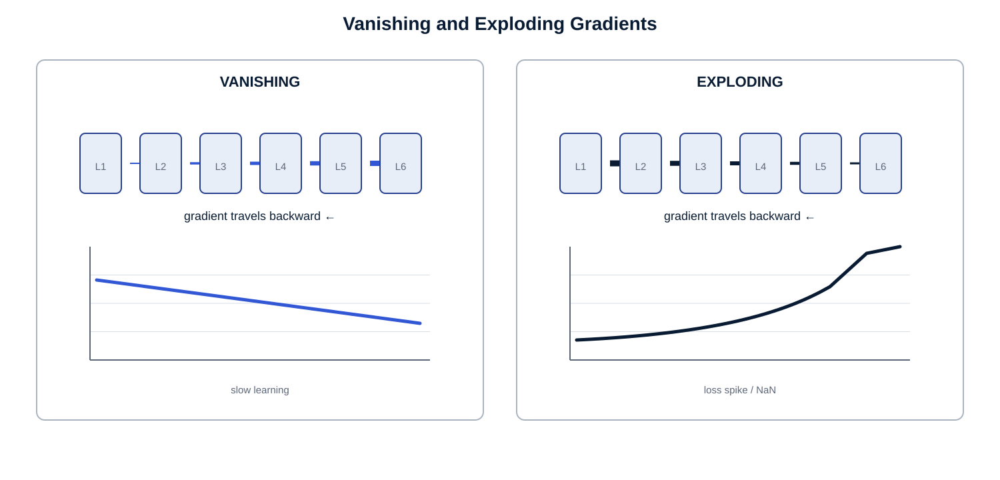
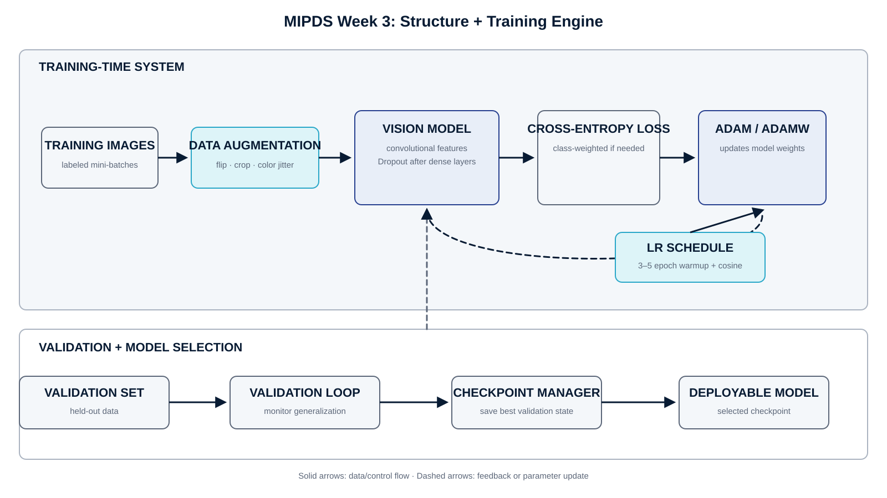

Part I · Foundations of Deep Learning

+------------------------------------------------------------------------------------------------------------------------------------------------------------------------------------------------------------------------------------------------------+
| **📹 Chapter Introduction Video**                                                                                                                                                                                                                    |
|                                                                                                                                                                                                                                                      |
| \"Training a Neural Network Explained\" --- a visual walkthrough of what it means to train a deep learning model. Covers loss functions, gradient descent, and the training loop. Recommended viewing before or alongside Section 1 of this chapter. |
|                                                                                                                                                                                                                                                      |
| Watch: https://www.youtube.com/watch?v=sZAlS3_dnk0                                                                                                                                                                                                   |
+------------------------------------------------------------------------------------------------------------------------------------------------------------------------------------------------------------------------------------------------------+

## Opening Narrative

### The Night the Algorithm Said Nothing Was Wrong

It is 2:00 a.m. in a hospital in Nairobi. The overnight radiology system --- an AI trained to triage chest X-rays for emergency review --- has processed its forty-seventh image of the night. A fifty-two-year-old patient, admitted two hours ago with fatigue and a mild cough, waits in a corridor. The system returns its verdict in under a second: No acute findings. Normal. The attending physician, stretched across four wards, accepts the result and moves on. The patient is sent home with instructions to rest and hydrate.

Three days later, the patient returns by ambulance. The pneumonia that was present on that first X-ray --- subtle, early-stage, visible to a trained eye in the lower right lobe --- has progressed. The patient will recover, but just barely.

When the hospital\'s clinical engineering team reviews the case, they are puzzled. The architecture of the AI system is sophisticated --- a deep convolutional network, carefully designed, with many layers of filters trained to detect exactly these kinds of abnormalities. The model had scored well on its validation set. It had been certified for clinical use. How could it have missed something a radiologist would have caught?

The answer, when they find it, is not in the architecture. It is in the training.

The dataset used to train the model came from a single large hospital system. Of the 200,000 chest X-rays in that dataset, only 3,400 --- fewer than two percent --- were labeled as positive for pneumonia. The team had used standard cross-entropy loss, without adjusting for this imbalance. The model had learned something technically accurate but clinically useless: that the safest bet, almost every time, was to predict \"no finding.\" That prediction was correct 98 percent of the time. The training loss had decreased beautifully. The validation accuracy had been high. And the model had quietly learned to be almost completely blind to the disease it was supposed to detect.

The architecture was fine. The training was broken.

This story carries the central lesson of this chapter. In the previous chapter, you learned to design neural network architectures --- the structures through which data flows, the layers that transform raw inputs into meaningful representations, the activation functions that allow networks to express complex, non-linear relationships. Architecture creates potential. But potential, without the right training process, produces nothing useful. A network that has never been properly trained is like a brain that has never encountered the world: fully formed, structurally ready, and completely inexperienced.

Training is where a neural network becomes intelligent. And training, as the Nairobi case illustrates, involves decisions that are not merely technical. Choosing a loss function is choosing what the model considers success. Choosing a regularization strategy is choosing how the model handles uncertainty. Choosing when to stop training is choosing how much the model should trust its own experience. These decisions shape what the model learns --- and what it fails to learn --- in ways that can matter enormously.

This chapter is the story of how neural networks learn. We begin with the feedback signal: the loss function, which converts the gap between prediction and reality into a number the network can act on. We then trace the mathematical mechanism by which that signal propagates through the network and causes each of its millions of parameters to adjust, a process called gradient descent. We study the training loop --- the four-phase rhythm that repeats, potentially millions of times, until the network has learned what we want it to know. And we confront the most common ways this process goes wrong --- networks that memorize instead of understand, gradients that vanish or explode, learning rates that are too ambitious or too timid.

By the time you finish this chapter, you will understand not just the mechanics of training but its logic --- why each component exists, what failure mode it prevents, and what it means to make training decisions responsibly.

You will also take a concrete step forward in building MIPDS: this week, you will design the training engine for the vision component you architected last chapter. Structure becomes intelligent only when it is taught. Let us begin that lesson.

## Learning Objectives

### What You Will Be Able to Do

After completing this chapter, you will be able to:

-   Explain the role of a loss function as the feedback signal that drives learning, and distinguish between the major loss functions for regression and classification tasks.

-   Describe gradient descent conceptually --- as a navigation problem in a high-dimensional landscape --- and explain what the gradient tells us and why following it downhill causes a network to improve.

-   Articulate the intuition behind backpropagation as a credit-assignment mechanism: how a single error at the output propagates backward through every layer to indicate how each weight contributed to the mistake.

-   Compare the three gradient descent strategies --- batch, stochastic, and mini-batch --- and explain why mini-batch has become the standard in modern deep learning practice.

-   Identify and diagnose the four canonical training failure modes: overfitting, underfitting, vanishing gradients, and exploding gradients.

-   Describe the major regularization techniques --- Dropout, L2 weight decay, data augmentation, and early stopping --- and explain the conceptual motivation behind each one.

-   Interpret a learning curve, reading the relationship between training and validation loss over time to diagnose model health and prescribe interventions.

-   Explain how learning rate schedules --- step decay, cosine annealing, and warmup --- improve training dynamics, and connect this to the loss-landscape intuition.

-   Design the training engine for the MIPDS vision component, selecting appropriate loss functions, optimizer, and regularization strategies and justifying each choice.

-   Reason about the ethical dimensions of training decisions --- particularly how loss function design, data imbalance, and evaluation protocol affect what a model learns to value.

## Key Terms and Concepts

### The Language of Training

The terms below appear throughout this chapter. Their full explanations unfold in context; these concise definitions serve as a reference to return to when you need a quick anchor.

  -------------------------- ------------------------------------------------------------------------------------------------------------------------------------------------------------------------------------------------------------------------------------------------------------------- ----------------------
  **Term**                   **Plain-Language Definition**                                                                                                                                                                                                                                       **Where It Matters**

  Loss Function              A mathematical function that measures how badly the network\'s current predictions miss the ground truth. It converts error into a single number --- and that number is the signal that drives all learning. Also called the objective function or cost function.   Sections 1--2

  Gradient                   The multi-dimensional slope of the loss function at a given point in weight space. It indicates both the direction and steepness of the loss surface --- pointing toward the steepest uphill direction, which means the opposite direction is how we improve.       Section 2

  Gradient Descent           An iterative optimization algorithm that adjusts network weights by taking small steps in the direction that reduces the loss --- downhill on the loss landscape.                                                                                                   Section 2

  Learning Rate              A scalar that controls how large each step in gradient descent is. Too large and the optimizer overshoots; too small and training progresses impractically slowly.                                                                                                  Sections 2--3

  Backpropagation            The algorithm that efficiently computes the gradient of the loss with respect to every parameter in the network, using the chain rule of calculus to trace responsibility for error backward through each layer.                                                    Section 2

  Batch Size                 The number of training examples used to compute a single gradient update. Mini-batch gradient descent, using batches of 32--256 examples, is the standard approach.                                                                                                 Section 2

  Epoch                      One complete pass through the entire training dataset. Training typically requires many epochs before the network converges to a useful set of weights.                                                                                                             Section 3

  Overfitting                The failure mode in which a model performs well on training data but poorly on new data --- it has memorized specific training examples rather than learning generalizable patterns.                                                                                Section 4

  Underfitting               The failure mode in which a model is too simple or undertrained to capture the meaningful patterns in the data. Both training and validation performance are poor.                                                                                                  Section 4

  Regularization             Any technique that constrains the model during training to reduce overfitting, by preventing the network from fitting the training data too precisely.                                                                                                              Section 4

  Dropout                    A regularization technique that randomly deactivates a fraction of neurons during each training step, forcing the network to develop distributed, redundant representations.                                                                                        Section 4

  L2 Regularization          Adds a penalty proportional to the squared magnitude of each weight to the loss, discouraging large weights and encouraging simpler, smoother solutions. Also called weight decay.                                                                                  Section 4

  Data Augmentation          Artificially expands the training set by applying label-preserving transformations --- flipping, rotating, cropping, color jittering --- so the model sees more diverse variations of each example.                                                                 Section 4

  Early Stopping             Halts training when validation performance stops improving, preventing the model from memorizing training data during the late stages of training.                                                                                                                  Section 4

  Learning Rate Schedule     A strategy for varying the learning rate across training --- typically starting higher and decreasing over time --- to improve convergence and final model quality.                                                                                                 Section 3

  Vanishing Gradient         A pathology in deep networks where gradient signals shrink as they travel backward through layers, causing early layers to learn extremely slowly or not at all.                                                                                                    Section 5

  Exploding Gradient         The opposite pathology: gradient signals grow uncontrollably large as they propagate backward, causing catastrophic, unstable weight updates.                                                                                                                       Section 5

  Validation Set             A held-out portion of the data used to monitor generalization during training. Never used for gradient updates --- only for evaluation.                                                                                                                             Sections 3--4

  Checkpoint                 A saved snapshot of a model\'s weights and training state at a particular point during training, enabling recovery of the best version.                                                                                                                             Section 3

  Batch Normalization        A technique that normalizes the activations within each layer during training, stabilizing learning and allowing higher learning rates.                                                                                                                             Sections 3--5

  Mean Squared Error (MSE)   A loss function for regression tasks that measures the average squared difference between predictions and true values. Penalizes large errors disproportionately.                                                                                                   Section 1

  Cross-Entropy Loss         A loss function for classification tasks that measures the divergence between the model\'s predicted probability distribution and the true class distribution. Heavily penalizes confident wrong predictions.                                                       Section 1

  Adam Optimizer             An adaptive optimization algorithm that maintains per-parameter learning rates adjusted by a running average of recent gradients and their squares. A robust default for many tasks.                                                                                Section 2

  Warmup Period              An initial phase in which the learning rate increases gradually from near zero to its target value, preventing instability from large gradient steps early in training.                                                                                             Section 3

  Cosine Annealing           A learning rate schedule in which the rate decreases following a smooth cosine curve, providing graceful deceleration as training progresses.                                                                                                                       Section 3
  -------------------------- ------------------------------------------------------------------------------------------------------------------------------------------------------------------------------------------------------------------------------------------------------------------- ----------------------

## The Feedback Signal --- What Is a Loss Function?

Consider how a child learns to throw a basketball. On the first attempt, the ball sails three feet to the left of the hoop. A coach standing nearby says: \"Too far left. Adjust your angle.\" The child adjusts. The next throw clips the rim. \"Closer. A little more arc.\" Try after try, the child receives specific, directional feedback --- not just \"wrong\" or \"right,\" but how wrong, and in which direction to improve. Without this feedback, no amount of throwing practice would produce a skilled player.

A neural network faces exactly the same challenge. Its weights begin randomly initialized --- pointing in arbitrary directions, producing arbitrary outputs. For the network to improve, it needs feedback: a precise, numerical measure of how wrong its current predictions are, and implicit guidance about which direction to adjust. The loss function provides this feedback.

A loss function is a mathematical function that takes two inputs --- the network\'s prediction and the ground truth --- and returns a single number representing the cost of that prediction. A perfect prediction produces a loss of zero. A terrible prediction produces a high loss. The goal of training is to find weights that minimize this number across the entire training dataset.

But loss functions are more than technical tools. They are, in the most literal sense, value systems. When you choose a loss function, you are formally specifying what the model considers success. As we saw in the Nairobi story, a carelessly chosen loss function can produce a model that achieves high numerical performance while being entirely useless --- or actively dangerous --- in practice. Choosing a loss function is not a footnote in the training process. It is one of the most consequential design decisions you will make.

### What Makes a Good Loss Function?

A loss function must satisfy two requirements. First, it must be differentiable --- meaning that small changes in the network\'s weights produce smooth, calculable changes in the loss. This differentiability is what makes gradient descent possible, as we will see in Section 2. A loss function with sharp discontinuities or flat regions provides no information about which direction to adjust.

Second, a good loss function must be aligned with what you actually care about. This sounds obvious, but it is surprisingly easy to violate. If you train a spam filter with a loss function that treats false positives and false negatives equally, you will get a model that is evenhanded in its errors --- but in practice, sending a legitimate email to spam is very different from missing a phishing attack. The loss function should encode this asymmetry.

### Mean Squared Error: The Language of Numbers

When the problem requires predicting a continuous numerical value --- a house price, tomorrow\'s temperature, the dosage of a medication --- the most natural loss function is Mean Squared Error, or MSE. It computes the average of the squared differences between each prediction and its true value:

$$
\operatorname{MSE} = \frac{1}{n}\sum_{i=1}^{n}\left(\hat{y}_i-y_i\right)^2
$$

Two features of this formula deserve attention. First, squaring the differences makes all errors positive --- a prediction that is \$10,000 too high and one that is \$10,000 too low both contribute equally to the loss, which is the right behavior. Second, squaring penalizes large errors disproportionately. Being off by \$50,000 is not just five times worse than being off by \$10,000 --- it is twenty-five times worse. This is desirable in many applications: a self-driving car that misjudges a pedestrian\'s position by two meters is far more dangerous than one that misjudges by twenty centimeters, and MSE\'s quadratic penalty reflects that priority.

When extreme outliers should not dominate the training signal --- for example, in a dataset with occasional wildly anomalous measurements --- Mean Absolute Error (MAE) is an alternative. MAE takes the average of the absolute differences rather than squared differences. It is more forgiving of outliers, because a prediction that is ten times worse only contributes ten times more loss rather than one hundred times more.

### Cross-Entropy Loss: The Language of Probabilities

Classification problems --- \"Is this email spam?\" \"Which of these ten species is this bird?\" \"Does this X-ray show pneumonia?\" --- require a different kind of loss function. Here, the network\'s output is not a single number but a probability distribution: a vector of confidence scores across all possible classes, each between zero and one, summing to one. Cross-entropy loss measures how well this predicted distribution matches the true distribution (where the correct class has probability one and all others have probability zero).

The formula for cross-entropy has an important property: it does not just reward correct predictions. It rewards confident correct predictions and severely penalizes confident wrong predictions. A model that says \"I\'m 60% sure this is pneumonia\" when it is pneumonia incurs only modest loss. A model that says \"I\'m 98% sure this is not pneumonia\" when it is pneumonia incurs enormous loss. This asymmetry is exactly what we want: we want models to be both accurate and appropriately confident.

+----------------------------------------------------------------------------------------------------------------------------------------------------------------------------------------------------------------------------------------------------------------------------------------------------------------------------------------------------------------------------------------------------------------------------------------------------------------------------------------------------------------------------------------------------------------------------------------------------------------------------------------------+
| **🔍 The Nairobi Problem, Revisited**                                                                                                                                                                                                                                                                                                                                                                                                                                                                                                                                                                                                        |
|                                                                                                                                                                                                                                                                                                                                                                                                                                                                                                                                                                                                                                              |
| The hospital\'s training set contained 98% negative cases. With standard cross-entropy loss, the model discovered that confidently predicting \'no finding\' on almost every image kept the loss low --- because it was almost always right. The solution was class-weighted cross-entropy: multiplying the loss contribution from positive cases by a factor of 30 or more, explicitly telling the model that false negatives (missing pneumonia) are far more costly than false positives (unnecessary alerts). The architecture did not change. The loss function changed. And the model learned to see what it had been blind to before. |
|                                                                                                                                                                                                                                                                                                                                                                                                                                                                                                                                                                                                                                              |
| This is the ethical weight of loss function design. In high-stakes applications, the loss function encodes whose errors matter more. Designing it carelessly is not a technical oversight --- it is a values choice made by default.                                                                                                                                                                                                                                                                                                                                                                                                         |
+----------------------------------------------------------------------------------------------------------------------------------------------------------------------------------------------------------------------------------------------------------------------------------------------------------------------------------------------------------------------------------------------------------------------------------------------------------------------------------------------------------------------------------------------------------------------------------------------------------------------------------------------+

### Beyond Classification and Regression: Task-Specific Losses

MSE and cross-entropy cover the vast majority of standard deep learning tasks. But as problems grow more complex, more specialized loss functions become necessary. Three are worth understanding at this stage, because you will encounter them as MIPDS grows.

### Dice Loss: When Precision at Every Pixel Matters

Image segmentation --- the task of labeling every pixel in an image according to what it represents --- is central to medical imaging, autonomous driving, and satellite analysis. Standard cross-entropy applied pixel-by-pixel struggles here, particularly when the object of interest is small relative to the image (a tumor in a chest scan, a pedestrian at distance). Dice loss measures the overlap between the predicted mask and the true mask as a fraction of their combined area. It gives proportionally more attention to getting small objects right --- precisely the objects that matter most in medical applications.

### Triplet Loss: Learning to Measure Similarity

Some problems require the model to learn not just categories but meaningful distances. Face verification, for example, needs a model that can say \"these two photographs are the same person\" --- regardless of lighting, angle, or expression. Triplet loss trains this by presenting three images simultaneously: an anchor (one face), a positive (another photo of the same person), and a negative (a different person). The loss penalizes the model unless the distance between anchor and positive is smaller than the distance between anchor and negative by at least a fixed margin. Over thousands of such triplets, the model learns a rich space in which similarity has geometric meaning. This approach --- metric learning --- will become directly relevant when we build MIPDS\'s multimodal alignment component in Week 10.

### Multi-Task Loss: When One Model Must Serve Many Masters

Real systems often need to solve multiple problems simultaneously. A surveillance camera might need to detect faces, recognize identities, and estimate emotional states --- all at once, from the same image stream. Multi-task loss combines several individual losses, each weighted by importance, into a single training signal. The weighting is not just a technical parameter: it encodes how much the system prioritizes each subtask. Getting the weights wrong can cause the model to excel at one task while failing catastrophically at another. Designing multi-task losses requires both technical judgment and explicit consideration of priorities.

### Choosing the Right Loss Function

The choice of loss function flows from a clear-eyed answer to a simple question: what should the model\'s output be, and what do errors cost? If the output is a number and large errors are especially bad, MSE. If the output is a category and confident wrong answers are especially bad, cross-entropy. If the output is a pixel mask for a small object, Dice loss. If the output is a similarity embedding, triplet or contrastive loss.

  --------------------------------------------------------- -------------------------------------------------------
  **Problem Type**                                          **Recommended Loss Function**

  Predict a continuous value (price, temperature, dosage)   Mean Squared Error (MSE) or Mean Absolute Error (MAE)

  Classify into categories (dog/cat/bird, spam/not spam)    Cross-Entropy Loss (multi-class or binary)

  Classify with severe class imbalance                      Class-weighted cross-entropy or focal loss

  Segment an image pixel by pixel                           Dice Loss or IoU Loss

  Learn a meaningful similarity metric                      Triplet Loss or Contrastive Loss

  Solve multiple tasks simultaneously                       Weighted sum of task-specific losses
  --------------------------------------------------------- -------------------------------------------------------

One additional consideration: the loss function you optimize during training does not have to be identical to the metric you report to stakeholders. A hospital administrator cares about sensitivity (fraction of actual pneumonia cases detected) and specificity (fraction of healthy patients correctly cleared) --- not cross-entropy loss. You train on cross-entropy because it is differentiable; you evaluate on sensitivity and specificity because they are meaningful. The gap between training loss and business metric is another place where naive optimization can produce systems that look good on paper and fail in the world.

## Navigating the Error Landscape --- Gradient Descent and Optimization

You now have a feedback signal: the loss function translates prediction errors into a number. But knowing how badly the network is performing does not, by itself, tell you how to improve. You need a strategy for adjusting the millions of weights in the network in the direction that reduces the loss. That strategy is gradient descent.

### The Loss Landscape: A Map of All Possible Networks

Every set of weight values in a neural network produces a particular loss on the training data. Imagine, for a moment, that the network had only two weights rather than millions. We could then draw a three-dimensional surface: the two weights form the x and y axes, and the resulting loss forms the z axis (height). This surface is called the loss landscape --- and navigating it is the central task of training.

The loss landscape looks something like a mountain range, full of peaks (high loss), valleys (low loss), saddle points (low in one direction, high in another), and plateaus (flat regions where the loss barely changes). The best possible network --- the one with the lowest loss --- sits somewhere in a valley on this surface. Training is the process of finding that valley, starting from wherever random initialization placed us on the map.

This landscape analogy is more than just a metaphor. It directly informs almost every major training decision: learning rate, optimizer choice, regularization strategy, batch size. Understanding the landscape helps you understand why each of these decisions matters.

::: {#figure-3-1 .technical-figure}
{fig-alt="Contour representation of a conceptual loss landscape with multiple low-loss basins and two illustrative descent paths approaching a central low-loss region from different starting points." width="100%"}

**Figure 3.1:** The Loss Landscape. *The loss function defines a surface in weight space. Training is navigation toward a valley. The shape of the terrain determines which strategies work.*
:::

### The Gradient: Reading the Slope of the Terrain

The gradient of the loss function is the mathematical equivalent of reading the slope of the terrain at your current location. If you are standing on a hillside and want to walk downhill as efficiently as possible, you look at the slope in every direction and choose the direction that descends most steeply. The gradient tells you exactly that: for each weight in the network, it tells you how much the loss would change if you increased that weight slightly. A large positive gradient value means \"increasing this weight would significantly increase the loss\" --- which means decreasing it slightly will decrease the loss.

The update rule is elegantly simple. At each step, we compute the gradient and move a small amount in the opposite direction --- downhill:

$$
w_{t+1} = w_t - \eta\,\nabla_w L(w_t)
$$

This single equation, applied to millions of weights simultaneously, is the beating heart of all neural network training. Every training step is a small, coordinated downhill nudge of the entire weight space. Over thousands of iterations, these nudges compound --- and the network improves.

### The Learning Rate Dilemma: How Big Should Each Step Be?

The learning rate --- the scalar that controls how much we adjust the weights at each step --- is one of the most consequential hyperparameters in training. The analogy to step size on a hillside is almost perfect:

If your steps are too large, you will overshoot the valley. You might approach a minimum, then step directly over it to the other side, then overshoot back --- bouncing endlessly across the bottom without ever settling in. In extreme cases, the steps are so large that the network diverges entirely: the loss explodes rather than decreases.

If your steps are too small, you will eventually reach the valley, but it will take an impractical amount of time. In practice, with millions of weights and billions of training examples, \"too slow\" means \"too expensive\" --- days or weeks of computation time instead of hours.

A just-right learning rate descends steadily --- fast enough to make progress, small enough to settle accurately into a minimum. Finding this balance is part art, part systematic exploration. The loss curves in Figure 3.4 illustrate what each scenario looks like in practice: a key skill this chapter develops.

::: {#figure-3-4 .technical-figure}
{fig-alt="Four conceptual training-loss curves: an unstable high learning rate, a steadily descending appropriate rate, a slowly descending low rate, and warmup followed by cosine annealing." width="100%"}

**Figure 3.4:** Learning Rate Effects. *The learning rate is arguably the single most important hyperparameter. Learn to read its signature in the training curve.*
:::

### Backpropagation: Tracing Responsibility Backward

Computing the gradient of the loss with respect to a single weight seems straightforward: nudge the weight, see how the loss changes. But a deep network might have millions of weights. Computing the gradient by nudging each weight individually would require millions of forward passes per training step --- completely impractical.

Backpropagation is the algorithm that computes all these gradients simultaneously in a single efficient backward pass through the network. The key insight is the chain rule of calculus: the gradient of the loss with respect to any weight can be decomposed into a chain of local gradients --- how much did this weight affect this layer\'s output? How much did that output affect the next layer\'s output? How much did the final layer\'s output affect the loss?

Think of it as a chain of accountability. When the network makes an error, backpropagation answers the question: \"How much was each weight responsible for this mistake?\" A weight that was heavily involved in producing the wrong answer receives a large gradient --- a strong signal to change. A weight that played a minor role receives a small gradient --- a gentle nudge, if any.

This credit-assignment mechanism is why deep networks can learn at all. Without backpropagation, there would be no principled way to tell the network which of its millions of parameters caused the error. With it, every weight in every layer receives exactly the feedback it is responsible for.

+------------------------------------------------------------------------------------------------------------------------------------------------------------------------------------------------------------------------------------------------------------------------------------------------------------------------------------------------------------------------------------------------------------------------------------------------------------------------------------------------------------------------------------------------------------------------------------------------------------------------------------------------------------------------------------------------------------------------------------------------+
| **🔗 Connection to Chapter 2**                                                                                                                                                                                                                                                                                                                                                                                                                                                                                                                                                                                                                                                                                                                 |
|                                                                                                                                                                                                                                                                                                                                                                                                                                                                                                                                                                                                                                                                                                                                                |
| Recall from Chapter 2 that Sigmoid activation functions produce outputs between 0 and 1 --- and that their derivatives are near zero at both extremes. This property becomes critically important during backpropagation: when the gradient passes through a Sigmoid activation in saturation, it is multiplied by a near-zero value. Over many layers, these near-zero multiplications accumulate, and the gradient shrinks toward nothing. This is the vanishing gradient problem, and it is why ReLU activations --- which have a gradient of either 0 or 1 --- were such an important innovation. The architectural choices you learned in Chapter 2 were not arbitrary: they were solutions to the training problems we are studying now. |
+------------------------------------------------------------------------------------------------------------------------------------------------------------------------------------------------------------------------------------------------------------------------------------------------------------------------------------------------------------------------------------------------------------------------------------------------------------------------------------------------------------------------------------------------------------------------------------------------------------------------------------------------------------------------------------------------------------------------------------------------+

### Batch Strategies: How Much Data Per Update?

Every gradient update requires us to compute the loss over some number of training examples. How many examples should we use per update? This choice --- the batch size --- involves a fundamental tradeoff between gradient accuracy and computational speed.

### Batch Gradient Descent: The Careful Surveyor

Use every training example to compute each gradient update. The gradient estimate is maximally accurate --- it reflects the true slope of the loss landscape over the full dataset. But with millions of training examples, computing one update requires a full pass through all of them. Training is impractically slow. This approach is rarely used in practice.

### Stochastic Gradient Descent: The Impulsive Explorer

Use a single randomly chosen training example per update. Training is extremely fast --- the network updates with every example. But the gradient estimate is highly noisy: a single example might be atypical, and the resulting update might send the weights in the wrong direction. Training is erratic, bouncing around the loss landscape rather than descending smoothly. The noise is not always bad --- it can help the optimizer escape shallow local minima --- but it makes convergence unpredictable.

### Mini-Batch Gradient Descent: The Focus Group

Use a small batch of examples --- typically 32 to 256 --- per update. Think of it as conducting a focus group before making a product decision. One customer\'s opinion is too noisy to act on. Surveying all customers before making any decision is too slow. Twelve to thirty-two people in a room gives you a representative, actionable signal efficiently.

Mini-batch is the dominant approach in modern deep learning. It is fast enough to train on enormous datasets, accurate enough to converge reliably, and just noisy enough to provide the regularizing effect that helps networks generalize. GPU hardware is also designed to process batches of examples in parallel --- making mini-batch training dramatically faster than stochastic updates on modern hardware.

::: {#figure-3-5 .technical-figure}
{fig-alt="Three matched contour panels showing a stable batch-gradient path, a noisy stochastic-gradient path, and a moderately noisy mini-batch path toward a low-loss region." width="100%"}

**Figure 3.5:** Batch Strategies. *Noisier gradient estimates produce more erratic paths --- but sometimes a little noise helps escape shallow traps.*
:::

### Modern Optimizers: Smarter Ways to Descend

Basic gradient descent uses the same step size for every weight at every moment. But different weights deserve different treatment. A weight that has been oscillating rapidly should perhaps receive smaller updates --- its gradient is unstable and large steps will worsen the oscillation. A weight whose gradient has been consistently pointing in one direction can perhaps afford a larger step --- momentum is building, and the landscape is clearly sloping in a consistent direction.

Modern optimizers incorporate these intuitions automatically:

  ----------------------------------- ------------------------------------------------------------------------------------------------------------------------------------------------------------------------------------------------------------------------------------------------------------------------------------------------------------------------------------------------------------------------------
  **Optimizer**                       **How It Works and When to Use It**

  SGD with Momentum                   Adds a velocity term that accumulates in directions where gradients have been consistent. Like a ball rolling downhill, momentum carries the optimizer forward through flat regions and prevents oscillation in steep ones. Often produces the best final performance on well-tuned computer vision problems.

  Adam (Adaptive Moment Estimation)   Maintains per-parameter learning rates that adapt based on a running average of recent gradient magnitudes. Weights with small, consistent gradients get a relatively large effective step; weights with large, erratic gradients get a relatively small step. Converges quickly with little tuning. The most widely-used optimizer for new problems and Transformer models.

  AdamW                               Adam with decoupled weight decay (L2 regularization applied to weights directly rather than through the gradient). Improves generalization compared to standard Adam, and is now the preferred variant in most Transformer training pipelines.

  RMSprop                             Similar to Adam but simpler. Adapts learning rates based on recent gradient magnitudes alone, without the momentum term. Works well for RNNs and recurrent architectures.
  ----------------------------------- ------------------------------------------------------------------------------------------------------------------------------------------------------------------------------------------------------------------------------------------------------------------------------------------------------------------------------------------------------------------------------

No optimizer is universally best. Adam is an excellent starting point because it requires minimal tuning and often converges quickly. SGD with momentum sometimes produces better final generalization when carefully tuned --- it is the dominant choice in state-of-the-art computer vision training. As you build MIPDS, you will experiment with both.

## The Training Loop --- How Learning Actually Happens

We now have all the components we need to describe a complete training run. The training loop is the process that ties everything together: data, loss function, optimizer, and the model\'s weights --- all coordinated into a repeating rhythm that gradually transforms a randomly initialized network into a useful one.

### Before Training Begins: Preparing the Data

Good training requires careful data preparation. Two practices are non-negotiable and one common pitfall must be actively avoided.

### The Three-Way Split: Training, Validation, and Test

Every dataset used for training must be divided into three distinct, non-overlapping portions:

-   The training set (typically 70--80% of data) is the material the model learns from. Gradients are computed on this data, and weights are updated based on it.

-   The validation set (10--15%) is used to monitor generalization during training. After each epoch, we evaluate the model on the validation set --- not to update weights, but to check whether learning is transferring to data the model has not seen. This is how we detect overfitting early.

-   The test set (10--15%) is kept completely sealed until the end. It is used exactly once --- after all training, validation, and hyperparameter tuning is complete --- to produce an honest estimate of how the model will perform on truly new data. If the test set is consulted during development, it is contaminated: it becomes, in effect, another validation set, and the reported test performance is optimistically inflated.

### Normalization: Speaking the Same Language

Neural networks learn by comparing --- how different are these weights from last step? How different is this prediction from the truth? These comparisons work best when all input features are on similar numerical scales. Raw image pixels range from 0 to 255; raw financial data might range from 0.01 to 10 million. Training with these values directly would cause weights corresponding to large-valued features to dominate the gradient signal. Normalization converts inputs to a common range --- typically zero mean and unit variance --- so that every feature has equal standing in the learning process.

### The Four-Phase Rhythm: One Training Iteration

A single training iteration --- processing one mini-batch and updating the weights once --- follows a strict four-phase sequence. This sequence will repeat millions of times over the course of a full training run. Understanding it deeply is the key to diagnosing problems when things go wrong.

::: {#figure-3-3 .technical-figure}
{fig-alt="Circular four-phase training loop: forward pass produces predictions, loss computation compares them with targets, backpropagation computes gradients, and the optimizer updates parameters before the loop repeats." width="100%"}

**Figure 3.3:** The Heartbeat of Training. *This four-phase loop repeats for every mini-batch in every epoch. Learn to describe each phase fluently.*
:::

### Phase 1: The Forward Pass

Feed a mini-batch of inputs through the network, layer by layer, from input to output. Each layer applies its learned transformation --- matrix multiplication, activation function, normalization --- until the final layer produces predictions. This is the network doing what it currently knows how to do, which at the start of training means producing essentially random outputs.

### Phase 2: Loss Computation

Compare the batch\'s predictions to the ground truth labels using the loss function. Produce a single scalar value: the current loss. This number is the entire signal the optimizer will receive about how the network performed on this batch. High loss means the predictions were badly wrong. Low loss means they were close.

### Phase 3: The Backward Pass (Backpropagation)

Propagate the loss signal backward through every layer, computing the gradient of the loss with respect to every parameter in the network. At the end of the backward pass, each weight in the network has an associated gradient value telling us: \"If you increased this weight, the loss on this batch would change by this much.\" Gradients that are large in magnitude indicate weights that had an outsized effect on the error. Gradients near zero indicate weights that barely mattered.

### Phase 4: The Parameter Update

Apply the optimizer to update every weight using its gradient. The optimizer determines exactly how the gradient translates into a weight change --- accounting for momentum, adaptive learning rates, or weight decay, depending on which optimizer is chosen. After this step, every weight has been nudged slightly in the direction that reduces loss. The optimizer\'s state is also updated (e.g., momentum buffers for Adam) for the next iteration.

### Epochs, Iterations, and the Shape of a Training Run

One pass through all the training data --- shuffled and processed batch by batch --- is called an epoch. Training typically requires many epochs: the same data is visited repeatedly, each time refining the weights a little further. Early epochs produce large, rapid improvements. Later epochs produce smaller, more careful adjustments.

How many epochs does training require? There is no universal answer --- it depends on dataset size, model complexity, learning rate, and the problem\'s difficulty. This is one reason why monitoring training curves is essential: rather than training for a predetermined number of epochs and hoping for the best, good practitioners watch the learning curves and stop when validation performance plateaus or begins to worsen.

### Learning Rate Schedules: Adjusting the Pace Over Time

A fixed learning rate throughout training is rarely optimal. Early in training, the network\'s weights are far from their ideal values, and large steps help cover ground quickly. Later in training, as weights approach a good solution, large steps will cause the optimizer to overshoot and oscillate rather than settle. The ideal learning rate changes across training --- and learning rate schedules formalize this intuition.

::: {#figure-3-9 .technical-figure}
{fig-alt="Conceptual graph comparing constant, step-decay, cosine-annealing, and warmup-plus-cosine learning-rate schedules over training epochs." width="100%"}

**Figure 3.9:** Schedule Comparison. *Different learning-rate schedules produce distinct optimization trajectories. Their effectiveness depends on model architecture, dataset, optimizer, and training conditions.*
:::

### Step Decay

The simplest schedule: reduce the learning rate by a fixed factor at predetermined points in training. For example, start at 0.1, divide by 10 at epoch 30, and again at epoch 60. Training makes rapid early progress and then consolidates gains at lower rates. The abrupt steps can sometimes cause instability around the transition points.

### Cosine Annealing

Rather than sharp steps, cosine annealing decreases the learning rate smoothly following a cosine curve --- from its maximum value to near zero across the training run. Its smooth deceleration avoids abrupt schedule transitions, although its effectiveness depends on the model, data, optimizer, and training conditions. Cosine annealing can also be combined with warm restarts: periodically resetting the learning rate back to its maximum value, allowing the optimizer to leave shallow local minima and explore different regions of the loss landscape before decelerating again.

### Warmup: Easing Into Learning

Starting training with the full target learning rate can be destabilizing, particularly for large networks with large batch sizes. Weight initialization produces diverse activations, and large initial gradient steps can push the network to a poor starting configuration from which it struggles to recover. A warmup period addresses this by beginning training with a very small learning rate --- sometimes as low as 1e-8 --- and gradually increasing it to the target value over the first few epochs.

Warmup is especially important for Transformer models, which are sensitive to early training instability. You will encounter it again prominently in Week 8, when we add the language understanding component to MIPDS. Designing the warmup schedule now is one reason the MIPDS training infrastructure is built to be modular and extensible.

### Model Checkpointing: Never Losing Progress

Deep learning training runs can take hours, days, or even weeks. Hardware failures, power interruptions, or simply realizing midway through that validation performance was best twenty epochs ago --- all of these create a need to save progress periodically and recover specific past states.

A checkpoint is a saved snapshot of the network\'s weights (and optionally the optimizer\'s state) at a specific moment. Most training pipelines save checkpoints at regular intervals --- every epoch, or whenever the validation loss reaches a new best. The checkpoint at peak validation performance is typically the version deployed, even if training continued afterward, since later epochs may overfit the training data.

## Keeping the Model Honest --- Generalization and Regularization

The most common failure mode in deep learning is not that a model fails to learn. It is that a model learns the wrong thing: the specific details and quirks of its training data rather than the general patterns that make predictions valuable.

This failure is called overfitting, and understanding it --- together with the complementary failure of underfitting --- is one of the most important intuitions you will develop in this course. The techniques designed to prevent overfitting are collectively called regularization.

### The Generalization Problem

Consider the difference between a student who truly understands calculus and one who has memorized every problem in the textbook. On exam questions drawn from the textbook, both students will do well. On a novel problem that requires applying the same underlying principles --- slightly differently presented, in an unfamiliar context --- the genuine understander thrives and the memorizer struggles.

A neural network faces exactly this challenge. Its training data is a finite sample from the infinite real world. The patterns in that sample are part genuine signal (the features that actually distinguish cats from dogs) and part noise (the specific lighting of the photographer\'s studio, the particular background in which this dog was photographed, the compression artifacts in this image). A model with sufficient capacity can learn both. The goal is to learn the signal and discard the noise.

Generalization is the ability to apply what was learned from training data to new, unseen data. Validating on a held-out set during training is how we measure it continuously. The gap between training performance and validation performance is the primary diagnostic for whether a model has generalized.

### Overfitting: When Your Model Becomes a Memorizer

Overfitting occurs when the model learns the training data too precisely --- including its noise and idiosyncrasies --- at the expense of learning general patterns. On a learning curve, overfitting has a characteristic signature: training loss continues to decrease smoothly over epochs, while validation loss plateaus and then begins to increase. The two curves diverge.

The underlying cause is almost always a mismatch between model capacity and data size or diversity. A very deep, highly parameterized network applied to a small dataset has the capacity to memorize every training example --- and it will, if given enough epochs. This is not a sign of intelligence; it is a sign of overpowered memorization.

::: {#figure-3-6 .technical-figure}
{fig-alt="Four paired training and validation loss panels showing underfitting, a good fit, mild overfitting with validation plateau, and severe overfitting with rising validation loss." width="100%"}

**Figure 3.6:** Reading Training Curves. *Learn to recognize these four patterns instantly. Each represents a distinct failure mode with a distinct remedy.*
:::

### Dropout: Training a Team, Not a Star

Imagine a study group preparing for a demanding exam. If the group always relies on the same two members to answer the hard questions, the rest of the team stops engaging seriously --- they can coast on the stars. But if, before each study session, you randomly designated that some members must sit out --- so that everyone, at some point, must know the material independently --- the whole group develops real competence.

Dropout is the neural network equivalent of this arrangement. During each training step, a randomly selected fraction of neurons --- typically 20 to 50 percent --- are set to zero. They do not contribute to the forward pass; they do not receive gradient updates in the backward pass. The network must solve each training example using a different random subset of its neurons.

The consequence is powerful: no single neuron can become indispensable. The network cannot learn \"whenever I see this specific pixel pattern in this specific neuron, predict cat\" --- because that neuron will often be absent. Instead, it must distribute knowledge across many pathways, each capable of detecting the relevant features independently. The result is a more robust, redundant representation that generalizes better to new examples.

At test time, all neurons are active --- but their outputs are scaled down by the dropout probability to maintain the correct expected magnitude. No randomness at inference; only robust representations built during training.

::: {#figure-3-7 .technical-figure}
{fig-alt="Four network panels showing the full network, two training steps with different neurons crossed out by dropout, and inference with all neurons active and outputs scaled." width="100%"}

**Figure 3.7:** Dropout. *By randomly silencing neurons during training, Dropout prevents over-reliance on any single pathway and forces distributed learning.*
:::

### L2 Regularization: Occam\'s Razor for Neural Networks

The medieval philosopher William of Ockham argued that, among competing explanations for a phenomenon, the simplest one consistent with the evidence should be preferred. This principle --- now called Occam\'s Razor --- turns out to be deeply relevant to machine learning.

A network with very large weights can express very complex, sharply-curved decision boundaries. Large-weight solutions can fit training data extremely precisely --- including its noise. But simpler solutions, with smaller weights, tend to produce smoother, more generalizable boundaries.

L2 regularization --- also called weight decay --- encodes Occam\'s Razor directly into the training process. It adds a penalty term to the loss function that is proportional to the sum of squared weights:

$$
L_{\text{total}} = L_{\text{task}} + \lambda\sum_j w_j^2
$$

The parameter λ (lambda) controls how strongly we enforce simplicity. A higher λ means a stronger preference for small weights. The optimizer now has two objectives simultaneously: minimize prediction error, and keep weights small. This competition produces models that explain the training data as well as necessary, but no more elaborately than needed.

L1 regularization is a closely related alternative, using the absolute value of weights rather than the square. Where L2 encourages weights to be small, L1 encourages many weights to become exactly zero --- producing sparse networks in which most connections have been effectively eliminated. L1 is useful when interpretability or computational efficiency is a priority.

### Data Augmentation: More Data Without More Data

One of the most robust solutions to overfitting is also the most intuitive: more diverse training data. If the model sees enough variation in its training examples, it cannot memorize individual quirks --- there are too many variants of each pattern. But collecting and labeling new data is expensive.

Data augmentation synthetically expands the training set by applying label-preserving transformations to existing examples. If you are training an image classifier, a cat photographed from slightly to the left is still a cat. A horizontally flipped cat is still a cat. A cat with the brightness reduced by 20% is still a cat. By randomly applying these transformations during training, we present the model with a vast, continuously varying set of examples --- all generated from the original data at negligible cost.

Standard augmentation operations for images include random horizontal flips, rotations, crops, zoom, brightness and contrast adjustment, and color jitter. For specialized domains --- medical imaging, satellite imagery, audio --- domain-specific augmentations are critical. In chest X-ray training, for instance, modest random rotations reflect real-world variation in patient positioning, while aggressive flips (a mirrored lung is anatomically wrong) are counterproductive.

More recently, advanced augmentation techniques such as Mixup (blending two training images and their labels smoothly) and CutMix (replacing a rectangular region of one image with a patch from another) have been shown to produce strong regularization, forcing the network to attend to the full image rather than relying on any single distinctive region.

### Early Stopping: Knowing When to Stop Learning

The simplest regularization technique is also the most elegant: stop training when the model stops improving on the validation set.

In the later stages of a long training run, training loss continues to decrease --- the model is still fitting the training data more precisely. But validation loss has plateaued or is rising. The model has already learned the best generalizable representation it is going to find; it is now beginning to memorize training-specific noise. Continuing to train is actively counterproductive.

Early stopping monitors the validation loss after each epoch and terminates training if it has not improved after a specified number of epochs --- the patience parameter. Combined with checkpointing (saving the model at the best validation performance), early stopping ensures that the final deployed model is the best-generalizing version seen during training, not the most overtrained.

### Underfitting: When the Model Isn\'t Trying Hard Enough

The opposite failure mode is underfitting: the model is too simple, or too undertrained, to capture the meaningful patterns in the data. Both training and validation performance are poor. No amount of regularization will fix an underfitting model --- regularization makes models simpler, but an already-too-simple model needs the opposite.

Underfitting typically signals one of three problems: the model lacks the capacity to represent the relevant patterns (too few layers, too few neurons), training has not run long enough for the model to converge, or the learning rate is so small that progress has effectively stalled. The fix is straightforward in principle: increase capacity, train longer, or increase the learning rate.

  --------------------------- -------------------------------------------------
  **Failure Mode**            **Learning Curve Pattern**

  Overfitting: Too Specific   Training ↓, Validation ↑

  Underfitting: Too Simple    Training ↑, Validation ↑

  Good Fit: Just Right        Training ↓, Validation ↓ (tracking)
  --------------------------- -------------------------------------------------

## Monitoring and Debugging --- Reading the Training Story

A training run without monitoring is like flying without instruments. The aircraft might be performing beautifully, or it might be silently descending toward a mountain range --- and without instruments, there is no way to know until it is too late. Monitoring training is how we stay in control of a process that we cannot directly observe.

### Learning Curves: Your Model\'s Vital Signs

The primary monitoring tool is the learning curve: a graph of training loss and validation loss (or accuracy) over training epochs. Plotted together, these two curves tell a remarkably complete story about what is happening inside the model.

A healthy training run shows both curves decreasing together, with the training loss slightly below the validation loss. The gap between them --- the generalization gap --- indicates how much performance is lost when moving from seen to unseen data. A small gap is ideal. A widening gap is the primary signal of overfitting. A large gap that does not close suggests either insufficient training data or insufficient regularization.

Validation loss that plateaus early while training loss continues to decrease may indicate that the model has already extracted all the generalizable information available in the dataset --- additional training is overfitting, not learning. Noisy, erratic training curves often point to a learning rate that is too high, or batches that are too small to produce stable gradient estimates.

### The Gradient Pathologies: When the Learning Signal Breaks

Recall the telephone game: a message is whispered from person to person down a long line. Two things can go wrong. Each person might whisper a little more softly than the one before --- by the end of the line, the message is inaudible. Or each person might speak a little louder --- by the end, the message has become a shout, then a roar, then unintelligible noise.

During backpropagation, the gradient signal travels backward through layers in exactly this manner, being multiplied at each layer by local derivatives. And the same two failure modes can occur.

::: {#figure-3-8 .technical-figure}
{fig-alt="Two deep-network chains compare backward gradients that shrink toward early layers with gradients that grow toward early layers; paired loss curves indicate slow learning and a loss spike or NaN." width="100%"}

**Figure 3.8:** Vanishing and Exploding Gradients. *These pathologies were among the central technical failures behind the second AI Winter. Modern architectures and initialization methods largely solved them --- but they still occur in poorly designed networks.*
:::

### Vanishing Gradients: When Early Layers Stop Learning

When gradients shrink as they travel backward --- due to many multiplications by small numbers, such as the near-zero derivatives of saturating activations --- early layers receive an almost imperceptible signal. Their weights barely change. The network is effectively only training its later layers. In a very deep network, this means that the rich, complex hierarchical representations the depth was supposed to provide are never learned.

The signature of vanishing gradients is subtle: training loss decreases, but very slowly, and the network fails to reach the performance expected from its capacity. Early-layer weights show minimal change across epochs. This was the primary technical obstacle that prevented deep networks from working before the ReLU revolution and the development of careful weight initialization strategies.

Fixes include: using ReLU activations (or variants like Leaky ReLU and GELU) that pass gradients through cleanly; residual connections (which we will study in depth in Week 4) that provide gradient \"shortcuts\" from output directly to early layers; careful weight initialization using methods like He initialization; and Batch Normalization, which rescales activations at each layer to maintain a healthy gradient magnitude.

### Exploding Gradients: When the Learning Signal Goes Haywire

When gradients grow as they travel backward --- each layer amplifying rather than shrinking the signal --- the optimizer receives weight updates that are orders of magnitude too large. Weights may jump to extreme values in a single step. The loss may produce NaN (Not a Number) values, indicating that numerical overflow has occurred. Training collapses.

The signature is unmistakable: the training loss, which may have been decreasing normally, suddenly becomes NaN or spikes to an enormous value. Gradient clipping --- capping the gradient\'s magnitude at a maximum value before applying it --- is the standard fix. If the gradient exceeds the clip threshold, it is rescaled to the threshold rather than applied at full magnitude. Weight initialization and lower learning rates also help.

+-------------------------------------------------------------------------------------------------------------------------------------------------------------------------------------------------------------------------------------------------------------------------------------------------------------------------------------------------------------------------------------------------------------------------------------------------------------------------------------------------------------------------------------------------------------------------------------------------------------------------------------------------------------------------------------------------------------------+
| **🔗 Historical Connection**                                                                                                                                                                                                                                                                                                                                                                                                                                                                                                                                                                                                                                                                                      |
|                                                                                                                                                                                                                                                                                                                                                                                                                                                                                                                                                                                                                                                                                                                   |
| Vanishing and exploding gradients were central technical failures behind the second AI Winter of the 1990s and early 2000s. Researchers knew deep networks were theoretically powerful, but they could not train them: the gradients either vanished or exploded before useful representations formed in the early layers. The combination of ReLU activations, careful initialization (He and Glorot initializations), Batch Normalization, and residual connections --- developed between approximately 2012 and 2016 --- solved these problems and opened the door to the modern era of deep learning. The training principles you are studying in this chapter are the direct descendants of those solutions. |
+-------------------------------------------------------------------------------------------------------------------------------------------------------------------------------------------------------------------------------------------------------------------------------------------------------------------------------------------------------------------------------------------------------------------------------------------------------------------------------------------------------------------------------------------------------------------------------------------------------------------------------------------------------------------------------------------------------------------+

### Common Training Issues: A Diagnostic Guide

  ------------------------------------- ------------------------------------------------------------------------------------------------------------- -----------------------------------------------------------------------------------------------------------------
  **Symptom**                           **Likely Cause**                                                                                              **Recommended Fix**

  Loss not decreasing at all            Learning rate too low; weights not initializing; data preprocessing error (NaN values, wrong normalization)   Verify data pipeline; increase learning rate; check weight initialization

  Loss decreasing, then NaN             Exploding gradients; learning rate too high                                                                   Implement gradient clipping; reduce learning rate; check for extreme values in data

  Training loss ↓, Validation loss ↑    Overfitting                                                                                                   Add Dropout; increase L2 weight decay; apply data augmentation; try early stopping; consider more training data

  Both losses high and plateau          Underfitting: model too simple or undertrained                                                                Increase model depth or width; train longer; reduce regularization; check learning rate is high enough

  Erratic, unstable training curve      Learning rate too high; batch too small; problematic outliers in data                                         Reduce learning rate; increase batch size; check data for anomalies; add gradient clipping

  Validation loss plateaus very early   Model capacity larger than data can support; possible data leakage                                            Reduce model size; verify validation set is not contaminated; increase dataset diversity

  Training slow but stable              Learning rate too low; batch too small; insufficient hardware utilization                                     Increase learning rate with warmup; increase batch size; verify GPU utilization
  ------------------------------------- ------------------------------------------------------------------------------------------------------------- -----------------------------------------------------------------------------------------------------------------

## Applying the Principles --- The MIPDS Training Engine

For the past two weeks, you have been building MIPDS --- the Multimodal Intelligent Perception and Decision System --- from the ground up. In Week 1, you articulated its design philosophy: what it should do, what values should guide its construction, what problems it should solve. In Week 2, you designed its first structural component: the vision architecture, with convolutional layers and activation functions shaped to extract meaningful features from images.

But an architecture without a training engine is inert. This week, you complete the foundation: the mechanisms by which the MIPDS vision component will actually learn to see.

::: {#figure-3-10 .technical-figure}
{fig-alt="MIPDS training-time pipeline from labeled images through augmentation, the vision model, cross-entropy loss, and Adam or AdamW updates, with a warmup-plus-cosine schedule and a separate validation and checkpoint-selection path." width="100%"}

**Figure 3.10:** MIPDS Week 3: Structure + Training Engine. *Every labeled component in this diagram corresponds to a concept from this chapter. You should be able to explain each one, justify its presence, and describe what failure mode it prevents.*
:::

### Designing the Training Engine: Key Decisions

### Loss Function

The immediate task for the MIPDS vision module is multi-class classification: identifying what objects or scenes are present in an image. Cross-entropy loss is the appropriate choice. If your initial dataset has significant class imbalance --- which is common in real-world data --- class-weighted cross-entropy should be considered from the outset, not retrofitted after you observe poor performance on minority classes.

Looking ahead: as MIPDS grows to include image segmentation capabilities (for precise object localization), the loss will need to expand to include Dice or IoU loss. And when the multimodal alignment module is added in Week 10, contrastive loss will become relevant. Designing your training infrastructure to be modular --- so that loss functions can be composed without rebuilding the training loop --- is good forward planning.

### Optimizer and Learning Rate

Adam (or AdamW) is the recommended starting optimizer for MIPDS. It requires minimal tuning, converges reliably, and is robust to the learning rate choices made by new practitioners. For your initial experiments, a learning rate of 3e-4 to 1e-3 is a reasonable starting range.

For the learning rate schedule, a warmup period of 3--5 epochs followed by cosine annealing is recommended. This two-part schedule will serve you throughout the course: the warmup prevents early instability, and cosine annealing provides graceful convergence. When you add Transformer components in Week 8, you will find that this exact schedule is standard practice for large language models --- designing it well now pays dividends later.

### Regularization Plan

Apply Dropout with a rate of 0.3--0.5 after the dense layers (not after the convolutional layers --- convolutional features should be allowed to develop fully before regularization). Apply L2 weight decay through AdamW rather than implementing it separately. Apply standard data augmentation: horizontal flips, random crops, and moderate color jitter. This combination is conservative and broadly effective; if validation performance reveals persistent overfitting, increase Dropout rate before increasing L2.

### Validation Protocol

Reserve 15% of your dataset as a validation set, split before any preprocessing decisions are made. Monitor validation loss after every epoch. Set early stopping patience to 10 epochs --- meaning training continues for up to 10 epochs after the best validation loss, in case the model is still in a temporary plateau rather than a permanent one. Save a checkpoint at every epoch; deploy the checkpoint with the best validation loss.

+----------------------------------------------------------------------------------------------------------------------------------------------------------------------------------------------------------------------------------------------------------------------------------------------------------------------------------------------------------------------------------------------------------------------------------------------------------------------------------------------------------------------------------------------------------------------------------------------------------------------------------------------------------+
| **⚖️ An Ethical Checkpoint**                                                                                                                                                                                                                                                                                                                                                                                                                                                                                                                                                                                                                             |
|                                                                                                                                                                                                                                                                                                                                                                                                                                                                                                                                                                                                                                                          |
| Before finalizing your training setup, ask: what does my validation set actually represent? If your training data came from one demographic, hospital, geography, or camera type, your validation set --- drawn from the same distribution --- may look artificially good. A model that generalizes well within a population may fail badly when deployed beyond it. The training loop has no mechanism to detect this kind of distributional shift. It is a design-time responsibility, not a training-time one. The most important question you can ask about your validation set is: is it representative of the world the model will be deployed in? |
+----------------------------------------------------------------------------------------------------------------------------------------------------------------------------------------------------------------------------------------------------------------------------------------------------------------------------------------------------------------------------------------------------------------------------------------------------------------------------------------------------------------------------------------------------------------------------------------------------------------------------------------------------------+

## Hands-On Exploration

### Seeing Training Dynamics in Action

This activity is designed to build intuition through observation. You will not write a network from scratch. Instead, you will change a small number of training parameters and carefully observe the effect on learning curves. The goal is to develop a personal vocabulary for reading training behavior --- the same way a doctor learns to read vital signs, not by memorizing what each pattern means, but by observing them in context until recognition becomes instinctive.

+--------------------------------------------------------------------------------------------------------------------------------------------------------------------------------------------------------------------------------------------------------------------------------------+
| **🛠️ Setup**                                                                                                                                                                                                                                                                         |
|                                                                                                                                                                                                                                                                                      |
| Platform: Google Colab (free tier is sufficient). A starter notebook is provided that trains a small CNN on CIFAR-10 --- 50,000 images across 10 classes. The architecture is fixed and provided. All you need to change are the training configuration parameters identified below. |
|                                                                                                                                                                                                                                                                                      |
| Estimated time: 45--60 minutes. Each experiment takes 5--8 minutes to run. Read the prompts before running --- knowing what to look for before the curve appears is part of the skill.                                                                                               |
+--------------------------------------------------------------------------------------------------------------------------------------------------------------------------------------------------------------------------------------------------------------------------------------+

### Experiment 1: Establish a Baseline

Run the default configuration: Adam optimizer, learning rate 0.001, no Dropout, no data augmentation, 25 epochs.

Record and reflect:

-   At what epoch do training and validation accuracy visibly diverge?

-   What is the approximate final gap between training accuracy and validation accuracy?

-   Does validation accuracy appear to be still improving at epoch 25, or has it plateaued?

-   What word would you use to describe this model\'s training state --- overfitting, underfitting, or well-fit?

### Experiment 2: Activate Regularization

Enable Dropout (rate=0.4) and data augmentation (horizontal flip + random crop). Keep all other settings identical to Experiment 1.

Observe the change:

-   Training accuracy is almost certainly lower than in Experiment 1. Why? What does this tell you about what Dropout is doing?

-   Is validation accuracy higher or lower than in Experiment 1? By how much?

-   Has the training-validation gap changed? What does this tell you about generalization?

-   Write one sentence describing what regularization did to this model\'s behavior, in plain language.

### Experiment 3: Learning Rate Stress Test

Return to the Experiment 1 configuration. Now run two additional training runs: one with learning rate 0.01 (10× higher), and one with learning rate 0.1 (100× higher).

For each:

-   Describe what the training loss curve looks like in the first 5 epochs. Is it descending smoothly? Erratically? Not at all?

-   Does the training run succeed (produce a model significantly better than chance) or fail?

-   Sketch a description of what you would expect the curve to look like at 0.0001 (100× lower than baseline), without running it --- based on the pattern you have observed.

### Write-Up

In 400--600 words, describe what you observed across all three experiments. Use the vocabulary from this chapter --- overfitting, validation loss, learning rate, regularization, generalization gap --- but write in your own voice, describing what you actually saw and what you think it means. Attach your three learning curve images. There are no wrong answers; the quality of reasoning matters more than the specific numbers.

## Case Study

### CheXNet: When Training Decisions Saved Lives --- and Concealed Limits

### The Problem

Pneumonia kills more than 2.5 million people per year globally, the majority in low-income settings where access to experienced radiologists is scarce. Even in well-resourced hospitals, radiology departments are chronically understaffed, and chest X-ray backlogs mean patients wait hours or days for interpretations that could guide urgent treatment. The question driving the CheXNet project at Stanford in 2017 was simple and audacious: could a deep learning model read chest X-rays at the level of a practicing radiologist?

### The Architecture

CheXNet was built on DenseNet-121, a convolutional architecture that we will study in depth in Week 5. It processed chest X-rays as images and produced probability scores for 14 different thoracic conditions --- pneumonia, atelectasis, effusion, and eleven others --- simultaneously. The architecture itself was not novel for 2017. What distinguished CheXNet was a series of training decisions, each directly illustrating principles from this chapter.

### Training Decision 1: Transfer Learning as Initialization

CheXNet began its training not with random weights but with weights pretrained on ImageNet --- a dataset of over a million natural photographs: cats, cars, fire hydrants, grocery items. At first glance, this seems strange. What does a fire hydrant have to do with a pneumonia lesion?

But consider what the early layers of an ImageNet-trained network have learned: edges, textures, gradients, local patterns of light and dark. These low-level features are not specific to photographs of consumer goods. They are present in chest X-rays as well --- the gradual density transitions at a lung boundary, the sharp edge of a rib, the subtle texture difference between healthy and consolidating tissue. Initializing with ImageNet weights gave the network a rich vocabulary of low-level visual features, rather than starting from the random babbling of random initialization. Training from the pretrained initialization required far fewer epochs and produced substantially better performance than training from scratch on the medical dataset alone.

This is the principle of transfer learning: weights learned for one task often provide a productive starting point for a related task. It is one of the most important practical tools in modern deep learning, and we will explore it systematically in later weeks.

### Training Decision 2: Class-Weighted Loss for Imbalanced Data

The NIH ChestX-ray14 dataset contains over 112,000 images. Of these, fewer than 2% are labeled positive for pneumonia. A naive model trained with standard cross-entropy loss quickly discovers the path of least resistance: predict \"no pneumonia\" for almost every image. This strategy achieves 98% accuracy while being completely useless as a clinical tool.

The CheXNet team addressed this through class-weighted loss: the contribution of positive (pneumonia) examples to the total loss was multiplied by a factor inversely proportional to their frequency. Each pneumonia image contributed 50 times more to the loss than each non-pneumonia image, forcing the model to attend to the rare positive cases rather than ignoring them to achieve high average accuracy.

This choice is a microcosm of the ethical dimension of loss function design. Unweighted loss, in this context, does not mean neutral --- it means the interests of the majority class dominate. Weighting the loss is not a technical bias correction; it is an explicit value statement: misclassifying a sick patient is far more costly than misclassifying a healthy one.

### Training Decision 3: Data Augmentation for Distribution Robustness

Chest X-ray images vary enormously in the real world: different radiography equipment produces different image characteristics; different technicians position patients differently; different institutions use different imaging protocols. A model trained on images from one institution may fail at another because the image statistics shift in ways that the model, trained only on one distribution, cannot handle.

The team applied horizontal flipping, random rotation within ±10 degrees, and brightness and contrast perturbation during training. These augmentations simulated the kind of variation the model would encounter in deployment. Horizontal flipping is noteworthy: in most medical contexts, it would be anatomically incorrect (a mirrored lung is pathologically significant). The team used it anyway, reasoning that the augmentation benefit outweighed the anatomical inconsistency for the pneumonia detection task. This is the kind of domain-specific judgment that augmentation strategies require.

### The Results --- and Their Limits

CheXNet achieved a ROC-AUC of 0.768 on pneumonia detection in the validation set, compared to a mean of 0.633 for four radiologists evaluated on the same subset of 420 images. The result was extraordinary by the metrics used --- and was heavily publicized as evidence that AI could outperform physicians in radiology.

But honest evaluation reveals important limitations that training metrics alone cannot capture:

-   The radiologist comparison used only 420 images --- a tiny subset evaluated under unusual, time-pressured conditions. Subsequent studies found inconsistent results when the comparison was replicated under more realistic conditions.

-   All 112,000 training images came from a single institution --- the National Institutes of Health. Models trained on single-site data routinely fail to generalize to other hospital systems, where imaging equipment, patient demographics, and annotation practices differ. This is distribution shift, and it cannot be corrected by better training without more diverse data.

-   The labels were extracted from radiology reports using natural language processing, not verified by radiologists reviewing each image. A significant fraction of labels may be incorrect. The model learned from imperfect supervision --- common in practice, and honestly important to acknowledge.

-   Performance varied substantially across the 14 diseases --- strong on some conditions, weak on others. Aggregate metrics like AUC can mask failures on specific, important categories.

+---------------------------------------------------------------------------------------------------------------------------------------------------------------------------------------------------------------------------------------------------------------------------------------------------------------------------------------------------------------------------------------------------------------------------------------+
| **📌 What CheXNet Teaches Us About Training**                                                                                                                                                                                                                                                                                                                                                                                         |
|                                                                                                                                                                                                                                                                                                                                                                                                                                       |
| CheXNet is not primarily a story about a brilliant architecture. It is a story about training choices: which loss function captures what clinicians care about; how initialization enables learning from limited data; how augmentation builds robustness to real-world variation. Each of these decisions was grounded in the principles this chapter covers. Each could have been made differently --- with different consequences. |
|                                                                                                                                                                                                                                                                                                                                                                                                                                       |
| It is also a story about the limits of metrics. High validation performance does not guarantee real-world utility. The gap between what a loss function measures and what a deployment context requires is a persistent challenge in applied machine learning --- and bridging it requires both technical rigor and genuine engagement with the users and contexts the system is designed to serve.                                   |
+---------------------------------------------------------------------------------------------------------------------------------------------------------------------------------------------------------------------------------------------------------------------------------------------------------------------------------------------------------------------------------------------------------------------------------------+

## Chapter Summary

### What We Have Learned

This chapter crossed the threshold between architecture and intelligence. The network you designed in Chapter 2 had structure, organization, and theoretical capacity. What it lacked was experience --- the millions of small adjustments that convert a randomly initialized weight matrix into a system that can genuinely perceive and understand.

We began with the loss function --- not as a technical formality but as a value system. The loss function formally specifies what the model considers success. Choosing it carelessly produces systems that optimize beautifully for the wrong objective. We studied the two most important loss functions --- MSE for regression, cross-entropy for classification --- and explored the specialized forms that more complex tasks require. The Nairobi hospital story, which opened this chapter, was always a story about this: a loss function designed without consideration of clinical priorities produced a model that learned to be confidently blind.

From loss, we moved to optimization. Gradient descent is the navigational strategy: given a loss landscape, follow the downhill direction, one small step at a time. The learning rate determines step size --- too large and we overshoot, too small and we never arrive. Backpropagation is the efficient algorithm that computes, in a single backward pass, how much every weight in the network contributed to the current error. Modern optimizers like Adam and SGD with momentum extend gradient descent with adaptive mechanisms that make training more reliable across a wider range of problems.

We studied the training loop --- the four-phase rhythm of forward pass, loss computation, backward pass, and parameter update that repeats, epoch after epoch, until the network has learned what we want it to know. We introduced learning rate schedules as a way to adjust ambition over time, and checkpointing as a way to preserve the best version of a training run.

We then confronted the central challenge of training: generalization. A model that memorizes training data is not intelligent --- it is a sophisticated lookup table. Overfitting is the pathology; Dropout, L2 regularization, data augmentation, and early stopping are the treatments, each grounded in a clear conceptual motivation rather than arbitrary configuration choices. We saw that underfitting is the opposite problem, less dramatic but equally real, requiring opposite interventions.

We learned to read learning curves as diagnostic instruments, and to recognize the gradient pathologies --- vanishing gradients and exploding gradients --- that can silently undermine training in deep networks. And through the CheXNet case study, we saw all of these principles operating together in a real system, including the honest acknowledgment of where training metrics diverge from deployment realities.

Finally, you applied these principles to MIPDS: designing the training engine for the vision component, making principled decisions about loss function, optimizer, regularization strategy, and validation protocol. Structure has met learning. The system has begun to become real.

+--------------------------------------------------------------------------------------------------------------------------------------------------------------------------------------------------------------------------------------------------------------------------------------------------------------------------------------------------------------------------------------------------------------------------------------------------------------------------------------------------------------------------------------------------------------------------------------------------------------------------------------------------------------------------------------------------------------------------------------------------------+
| **🔭 Looking Ahead: Chapter 4**                                                                                                                                                                                                                                                                                                                                                                                                                                                                                                                                                                                                                                                                                                                        |
|                                                                                                                                                                                                                                                                                                                                                                                                                                                                                                                                                                                                                                                                                                                                                        |
| In the next chapter, we return to architecture --- but now as practitioners who understand training. We will study the great CNN architectures of the modern era: VGG, ResNet, Inception, DenseNet. We will see that residual connections were not just an architectural innovation --- they were a training innovation, specifically designed to solve the vanishing gradient problem we encountered in Section 5 of this chapter. Batch Normalization, which we introduced briefly here as a training stabilizer, will emerge as a structural component that changed what architectures could be built. The training principles of Chapter 3 are not behind us; they are the foundation on which every architectural advance in Chapter 4 was built. |
+--------------------------------------------------------------------------------------------------------------------------------------------------------------------------------------------------------------------------------------------------------------------------------------------------------------------------------------------------------------------------------------------------------------------------------------------------------------------------------------------------------------------------------------------------------------------------------------------------------------------------------------------------------------------------------------------------------------------------------------------------------+

## Review Questions

The questions below are designed for discussion and debate, not for definitive answers. Strong responses will acknowledge multiple perspectives, engage with complexity, and draw on specific concepts from the chapter. Consider them as starting points, not endpoints.

### 1. The Loss Function as Ethics

The loss function formally specifies what a model considers success. In the Nairobi hospital scenario, unweighted cross-entropy on an imbalanced dataset taught the model that missing pneumonia was acceptable. Class-weighted loss changed what the model valued. If loss functions are, in effect, value systems encoded in mathematics, who should design them --- engineers, clinicians, patients, regulators, or some combination? Can technical expertise substitute for stakeholder input in making these choices? What structures would help ensure that loss function design reflects the priorities of the people affected by the system?

### 2. Generalization and the Limits of Validation

CheXNet achieved strong performance on a validation set drawn from the same hospital that produced the training data. When deployed at other institutions, performance varied. The validation set gave an honest signal about generalization within the training distribution, but not about generalization across distributions. Is this a problem with the training process, or with how validation sets are designed? What would a validation protocol look like that actually measured the kind of generalization that matters for deployment? Is such a protocol even achievable without testing in the real world?

### 3. Occam\'s Razor and Model Simplicity

L2 regularization encodes a preference for simple models with small weights. This preference is philosophically motivated --- simpler explanations generalize better --- but it is also an assumption. Are there domains where complex, high-weight solutions are genuinely optimal? What happens when the signal in the training data is subtle and irregular, and the simple solution genuinely misses something important? Does the preference for simplicity encode any deeper epistemological commitment --- and is that commitment always warranted?

### 4. The Overfitting Economy

Overfitting --- the memorization of training specifics at the expense of general patterns --- is presented here as a technical failure mode in neural networks. But consider whether the same pattern appears in human organizations. An executive team that optimizes for quarterly metrics may be \"overfitting\" to a short-term evaluation signal at the expense of long-term resilience. A teacher who teaches to the test may be producing students who have overfit the exam. What does this analogy illuminate about the technical problem? And what does it obscure?

### 5. Transfer Learning and Borrowed Understanding

CheXNet started from ImageNet weights --- features learned from photographs of consumer goods --- and used them as the foundation for detecting disease in chest X-rays. Does a model that begins its understanding of medical images by looking at fire hydrants and food items have something meaningfully in common with a radiologist who learned to read X-rays by studying anatomy? Or is \"transfer learning\" a purely statistical phenomenon with no deeper cognitive significance? Does your answer change depending on what question you are asking the system to answer?

### 6. Learning Rate and Patience

Learning rate warmup --- starting training very slowly and gradually accelerating --- is a training technique with a striking pedagogical analogy: we often introduce new students to ideas gently, at low intensity, before demanding rigorous application. Yet warmup in neural networks is motivated by numerical stability, not by any theory of learning readiness. Is this analogy genuinely illuminating, or does it mislead us about how neural networks learn? Are there aspects of human learning that have no neural network equivalent, and vice versa?

### 7. The Debugging Mindset

Debugging a training failure requires systematic reasoning under uncertainty: forming hypotheses, designing experiments, interpreting ambiguous evidence. This is fundamentally the same skill as medical diagnosis, engineering troubleshooting, or scientific investigation. Yet it is rarely taught explicitly in technical curricula --- students are usually given architectures that work, datasets that are clean, and loss functions that are standard. What are the costs of not teaching debugging as a first-class skill? How would you design a course --- or this course --- to build genuine debugging fluency in students?

### 8. Ethical Responsibility in Training Pipelines

When a deployed AI system causes harm --- a medical AI that misses a diagnosis, a hiring algorithm that discriminates, a content moderation system that suppresses legitimate speech --- responsibility is typically distributed across many people: those who collected the training data, those who designed the loss function, those who configured the training pipeline, those who validated the model, and those who deployed it. Does this distribution of responsibility make accountability harder to assign? Is diffused responsibility a feature or a bug of complex sociotechnical systems? What institutional structures might help?

## Further Reading

### On Optimization and Training Fundamentals

-   Goodfellow, I., Bengio, Y., & Courville, A. (2016). Deep Learning. MIT Press. Chapter 8 (Optimization for Training Deep Models) is the definitive technical treatment of gradient descent and its variants. Available free at deeplearningbook.org.

-   Ruder, S. (2016). An overview of gradient descent optimization algorithms. arXiv:1609.04747. An accessible survey of modern optimizers, clearly explaining Adam, RMSprop, Adagrad, and their relationships.

-   Smith, L. N. (2017). Cyclical learning rates for training neural networks. IEEE Winter Conference on Applications of Computer Vision. The paper that popularized learning rate range tests and cyclical schedules --- practical tools every practitioner should know.

### On Regularization and Generalization

-   Srivastava, N., Hinton, G., Krizhevsky, A., Sutskever, I., & Salakhutdinov, R. (2014). Dropout: A simple way to prevent neural networks from overfitting. Journal of Machine Learning Research, 15, 1929--1958. The original Dropout paper --- readable and foundational.

-   Zhang, C., Bengio, S., Hardt, M., Recht, B., & Vinyals, O. (2017). Understanding deep learning requires rethinking generalization. ICLR. A surprising and important paper demonstrating that deep networks can memorize random labels --- prompting a rethinking of what regularization actually does.

-   Loshchilov, I., & Hutter, F. (2019). Decoupled weight decay regularization. ICLR. The paper introducing AdamW --- essential reading if you use Adam in practice.

### On the Historical Significance of Training Advances

-   Glorot, X., & Bengio, Y. (2010). Understanding the difficulty of training deep feedforward neural networks. AISTATS. The paper that identified the vanishing gradient problem precisely and introduced careful weight initialization as a solution.

-   Ioffe, S., & Szegedy, C. (2015). Batch normalization: Accelerating deep network training by reducing internal covariate shift. ICML. Batch Normalization changed what deep networks could be trained --- foundational for every modern architecture.

### On the CheXNet Case Study

-   Rajpurkar, P., Irvin, J., Ball, R. L., Zhu, K., Yang, B., Mehta, H., \... & Ng, A. Y. (2017). CheXNet: Radiologist-level pneumonia detection on chest X-rays with deep learning. arXiv:1711.05225. The original paper, clearly written and accessible.

-   Oakden-Rayner, L. (2018). CheXNet: An in-depth review. Blog post at lukeoakdenrayner.wordpress.com. A careful and important critical analysis of the CheXNet claims --- essential reading for understanding the gap between benchmark performance and clinical utility.

### On Ethics and Societal Impact

-   Obermeyer, Z., Powers, B., Vogeli, C., & Mullainathan, S. (2019). Dissecting racial bias in an algorithm used to manage the health of populations. Science, 366(6464), 447--453. A landmark study showing how an apparently neutral loss function (cost of care, as a proxy for need) embedded systematic racial bias.

-   Caruana, R., Lou, Y., Gehrke, J., Koch, P., Sturm, M., & Elhadad, N. (2015). Intelligible models for healthcare: Predicting pneumonia risk and hospital 30-day readmission. Proceedings of KDD. A sobering case study in which a complex model learned that asthma was protective against pneumonia mortality --- because asthmatic patients received more aggressive care.

### Interactive Tools

-   TensorFlow Playground (https://playground.tensorflow.org) --- Visual neural network exploration. Particularly useful for building intuition about overfitting, regularization, and the effect of learning rate.

-   Weights & Biases (https://wandb.ai) --- Professional experiment tracking and visualization. Free for academic use. The industry-standard tool for monitoring training runs and comparing experiments.

-   fast.ai Practical Deep Learning for Coders (https://course.fast.ai) --- A practice-first deep learning course whose training section is particularly strong on learning rate finding, warmup schedules, and transfer learning.

⬡ ⬡ ⬡

*End of Chapter 3 --- Second Edition*
