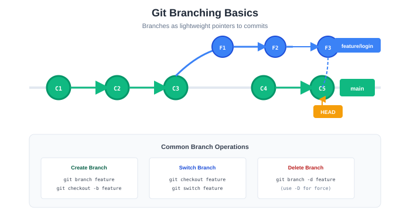
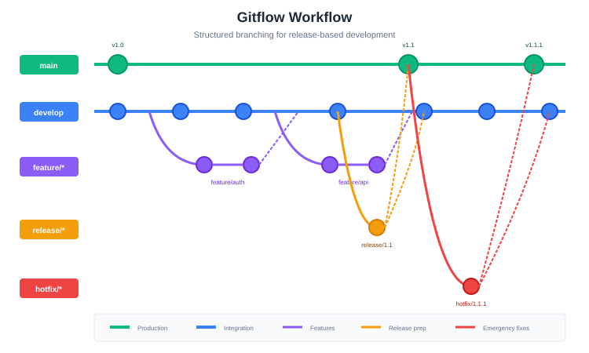
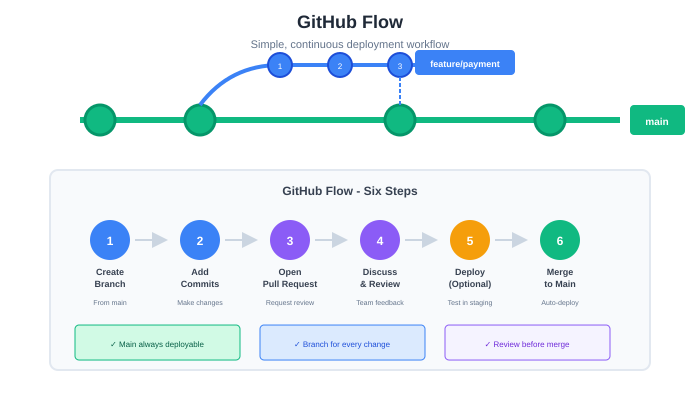

# Version Control Workflows

## Learning Objectives

By the end of this chapter, you will be able to:

-   Explain the importance of structured version control workflows in team environments
-   Compare and contrast major branching strategies including Gitflow, GitHub Flow, and trunk-based development
-   Create, manage, and merge branches effectively using Git
-   Write meaningful pull requests that facilitate effective code review
-   Conduct thorough, constructive code reviews
-   Resolve merge conflicts confidently and correctly
-   Maintain repository hygiene through proper documentation and conventions
-   Choose appropriate branching strategies for different project contexts

------------------------------------------------------------------------

## Why Version Control Workflows Matter

In Chapter 1, we introduced Git and GitHub as tools for tracking changes and collaborating on code. But knowing Git commands is only the beginning. When multiple developers work on the same codebase simultaneously, chaos can ensue without agreed-upon workflows. Who can commit to which branch? How do changes get reviewed? What happens when two people modify the same file?

A **version control workflow** is a set of conventions and practices that define how a team uses version control. It answers questions like:

-   How do we organize our branches?
-   How do changes move from development to production?
-   Who reviews code, and when?
-   How do we handle releases and hotfixes?

### The Cost of Poor Version Control

Without structured workflows, teams encounter predictable problems:

**Integration nightmares**: Developers work in isolation for weeks, then try to merge everything at once. Massive conflicts result, and subtle bugs slip through as incompatible changes collide.

**Unstable main branch**: Without protection, broken code gets committed directly to main. The build fails. Nobody can deploy. Everyone's blocked.

**Lost work**: Without proper branching, experimental changes get mixed with stable code. Rolling back becomes impossible without losing good work too.

**No accountability**: Without code review, bugs slip into production. Nobody catches security vulnerabilities, performance problems, or architectural violations until they cause real damage.

**Release chaos**: Without clear release processes, teams don't know what's deployed where. Hotfixes go to the wrong version. Customers get inconsistent experiences.

### What Good Workflows Provide

Structured workflows address these problems:

**Isolation**: Developers work on separate branches, insulated from each other's in-progress changes. Integration happens deliberately, not accidentally.

**Stability**: The main branch stays deployable. Broken code never reaches it because changes must pass tests and review first.

**Traceability**: Every change is linked to a purpose—a feature, a bug fix, a task. History tells the story of why the code evolved.

**Quality**: Code review catches bugs, shares knowledge, and maintains standards. Multiple eyes improve quality.

**Confidence**: Clear processes mean everyone knows what to do. Deployments become routine, not risky adventures.

------------------------------------------------------------------------

## Understanding Git Branching

Before exploring workflows, let's deepen our understanding of Git branching—the foundation on which all workflows build.

### What Is a Branch?

A **branch** in Git is simply a lightweight movable pointer to a commit. When you create a branch, Git creates a new pointer; it doesn't copy any files. This makes branching fast and cheap.

{#fig-git-branching-basics width=78%}

In this diagram:

-   Each `●` is a commit
-   `main` points to the latest commit on the main line
-   `feature` points to the latest commit on the feature branch
-   The branches share history up to where they diverged

### HEAD: Where You Are

**HEAD** is a special pointer that indicates your current position—which branch (and commit) you're working on.

{#fig-git-head width=82%}

When you checkout a different branch, HEAD moves:

{#fig-git-checkout-feature width=82%}

### Branch Operations

**Creating a Branch:**

``` bash
# Create a new branch
git branch feature-login

# Create and switch to a new branch
git checkout -b feature-login

# Modern alternative (Git 2.23+)
git switch -c feature-login
```

**Switching Branches:**

``` bash
# Traditional
git checkout main

# Modern alternative
git switch main
```

**Listing Branches:**

``` bash
# List local branches
git branch

# List all branches (including remote)
git branch -a

# List with last commit info
git branch -v
```

**Deleting Branches:**

``` bash
# Delete a merged branch
git branch -d feature-login

# Force delete an unmerged branch
git branch -D experimental-feature
```

### Merging Branches

**Merging** combines the changes from one branch into another. Git supports several merge strategies.

**Fast-Forward Merge:**

When the target branch hasn't diverged, Git simply moves the pointer forward:

{#fig-fast-forward-merge width=92%}

No merge commit is created; history stays linear.

**Three-Way Merge:**

When branches have diverged, Git creates a merge commit with two parents:

{#fig-three-way-merge width=88%}


**Merge Commands:**

``` bash
# Merge feature into current branch (main)
git checkout main
git merge feature-login

# Merge with a commit message
git merge feature-login -m "Merge feature-login into main"

# Abort a merge in progress
git merge --abort
```

### Rebasing

**Rebasing** rewrites history by moving commits to a new base. Instead of a merge commit, rebase creates a linear history.

{#fig-git-rebase width=92%}

The commits on feature are recreated (●' indicates new commits with same changes but different hashes).

**Rebase Commands:**

``` bash
# Rebase current branch onto main
git rebase main

# Interactive rebase (edit, squash, reorder commits)
git rebase -i main

# Abort a rebase in progress
git rebase --abort

# Continue after resolving conflicts
git rebase --continue
```

**Merge vs. Rebase:**

| Aspect              | Merge                      | Rebase                       |     |
| ------------------- | -------------------------- | ---------------------------- | --- |
| History             | Preserves true history     | Creates linear history       |     |
| Merge commits       | Creates merge commits      | No merge commits             |     |
| Conflict resolution | Once per merge             | Once per rebased commit      |     |
| Safety              | Safe for shared branches   | Don't rebase shared branches |     |
| Traceability        | Shows when branches joined | Hides branch structure       |     |


**The Golden Rule of Rebasing:**

> Never rebase commits that have been pushed to a public/shared branch.

Rebasing rewrites history. If others have based work on commits you rebase, their history diverges from yours, causing major problems.

------------------------------------------------------------------------

## Branching Strategies

A **branching strategy** defines how teams organize and use branches. Different strategies suit different team sizes, release cycles, and risk tolerances.

### Gitflow

**Gitflow**, introduced by Vincent Driessen in 2010, is a comprehensive branching model designed for projects with scheduled releases.

**Branch Types:**

```         
┌─────────────────────────────────────────────────────────────────────────┐
│                          GITFLOW BRANCHES                               │
├─────────────────────────────────────────────────────────────────────────┤
│                                                                         │
│  MAIN (main/master)                                                     │
│  • Production-ready code                                                │
│  • Tagged with version numbers                                          │
│  • Only receives merges from release and hotfix branches                │
│                                                                         │
│  DEVELOP (develop)                                                      │
│  • Integration branch for features                                      │
│  • Contains latest delivered development changes                        │
│  • Features branch from and merge back to develop                       │
│                                                                         │
│  FEATURE (feature/*)                                                    │
│  • New features and non-emergency fixes                                 │
│  • Branch from: develop                                                 │
│  • Merge to: develop                                                    │
│  • Naming: feature/user-authentication, feature/payment-gateway         │
│                                                                         │
│  RELEASE (release/*)                                                    │
│  • Preparation for production release                                   │
│  • Branch from: develop                                                 │
│  • Merge to: main AND develop                                           │
│  • Naming: release/1.2.0, release/2.0.0                                 │
│                                                                         │
│  HOTFIX (hotfix/*)                                                      │
│  • Emergency fixes for production                                       │
│  • Branch from: main                                                    │
│  • Merge to: main AND develop                                           │
│  • Naming: hotfix/critical-security-fix, hotfix/payment-bug             │
│                                                                         │
└─────────────────────────────────────────────────────────────────────────┘
```

**Visual Representation:**



**Gitflow Workflow:**

**Starting a new feature:**

``` bash
# Create feature branch from develop
git checkout develop
git checkout -b feature/user-authentication

# Work on feature...
git add .
git commit -m "Add login form"

# Continue working...
git commit -m "Add authentication API"

# Finish feature
git checkout develop
git merge feature/user-authentication
git branch -d feature/user-authentication
```

**Creating a release:**

``` bash
# Create release branch from develop
git checkout develop
git checkout -b release/1.2.0

# Bump version numbers, final testing, documentation
git commit -m "Bump version to 1.2.0"

# Finish release
git checkout main
git merge release/1.2.0
git tag -a v1.2.0 -m "Release version 1.2.0"

git checkout develop
git merge release/1.2.0

git branch -d release/1.2.0
```

**Creating a hotfix:**

``` bash
# Create hotfix branch from main
git checkout main
git checkout -b hotfix/critical-security-fix

# Fix the issue
git commit -m "Fix SQL injection vulnerability"

# Finish hotfix
git checkout main
git merge hotfix/critical-security-fix
git tag -a v1.2.1 -m "Hotfix release 1.2.1"

git checkout develop
git merge hotfix/critical-security-fix

git branch -d hotfix/critical-security-fix
```

**Gitflow Pros and Cons:**

| Pros | Cons |
|------------------------------------|------------------------------------|
| Clear structure for releases | Complex with many branch types |
| Parallel development and release | Slow for continuous deployment |
| Hotfix path separate from features | Merge conflicts between long-lived branches |
| Good for versioned software | Overhead for small teams |
| Well-documented, widely understood | develop can become stale |

**When to Use Gitflow:**

-   Software with explicit version releases
-   Multiple versions in production
-   Teams with dedicated release management
-   Products requiring extensive release testing
-   Compliance environments requiring audit trails

### GitHub Flow

**GitHub Flow** is a simpler workflow designed for continuous deployment. Created at GitHub, it has only one rule: anything in `main` is deployable.

**Branch Types:**

```         
┌─────────────────────────────────────────────────────────────────────────┐
│                        GITHUB FLOW BRANCHES                             │
├─────────────────────────────────────────────────────────────────────────┤
│                                                                         │
│  MAIN (main)                                                            │
│  • Always deployable                                                    │
│  • Protected—no direct commits                                          │
│  • All changes come through pull requests                               │
│                                                                         │
│  FEATURE BRANCHES (descriptive names)                                   │
│  • All work happens in feature branches                                 │
│  • Branch from: main                                                    │
│  • Merge to: main (via pull request)                                    │
│  • Naming: descriptive (add-user-auth, fix-payment-bug)                 │
│                                                                         │
└─────────────────────────────────────────────────────────────────────────┘
```

**Visual Representation:**



**GitHub Flow Process:**

```         
┌─────────────────────────────────────────────────────────────────────────┐
│                        GITHUB FLOW PROCESS                              │
├─────────────────────────────────────────────────────────────────────────┤
│                                                                         │
│  1. CREATE A BRANCH                                                     │
│     • Branch from main                                                  │
│     • Use descriptive name                                              │
│                                                                         │
│  2. ADD COMMITS                                                         │
│     • Make changes                                                      │
│     • Commit frequently with clear messages                             │
│     • Push to remote regularly                                          │
│                                                                         │
│  3. OPEN A PULL REQUEST                                                 │
│     • Start discussion about changes                                    │
│     • Request review from teammates                                     │
│     • CI runs tests automatically                                       │
│                                                                         │
│  4. DISCUSS AND REVIEW                                                  │
│     • Reviewers leave comments                                          │
│     • Author addresses feedback                                         │
│     • More commits as needed                                            │
│                                                                         │
│  5. DEPLOY (optional)                                                   │
│     • Deploy branch to test environment                                 │
│     • Verify in production-like setting                                 │
│                                                                         │
│  6. MERGE                                                               │
│     • Merge to main after approval                                      │
│     • Delete the feature branch                                         │
│     • Main is deployed to production                                    │
│                                                                         │
└─────────────────────────────────────────────────────────────────────────┘
```

**GitHub Flow Commands:**

``` bash
# 1. Create a branch
git checkout main
git pull origin main
git checkout -b add-password-reset

# 2. Make changes and commit
git add .
git commit -m "Add password reset request form"
git commit -m "Add password reset email functionality"
git commit -m "Add password reset confirmation page"

# Push to remote (enables PR and backup)
git push -u origin add-password-reset

# 3. Open Pull Request (on GitHub)
# - Write description
# - Request reviewers
# - Link to issue

# 4. Address review feedback
git add .
git commit -m "Address review feedback: add rate limiting"
git push

# 5. After approval, merge via GitHub UI

# 6. Clean up locally
git checkout main
git pull origin main
git branch -d add-password-reset
```

**GitHub Flow Pros and Cons:**

| Pros | Cons |
|------------------------------------|------------------------------------|
| Simple—only two branch types | No explicit release management |
| Fast—optimized for continuous deployment | Requires robust CI/CD |
| Pull requests enable code review | Less structure for versioned releases |
| Works great for web applications | Hotfixes indistinguishable from features |
| Low overhead | May need extensions for complex projects |

**When to Use GitHub Flow:**

-   Web applications with continuous deployment
-   Small to medium teams
-   Products without versioned releases
-   Teams practicing continuous integration
-   Projects prioritizing simplicity

### Trunk-Based Development

**Trunk-based development** (TBD) takes simplicity further: all developers commit to a single branch (the "trunk," typically `main`), either directly or through very short-lived feature branches.

**Core Principles:**

```         
┌─────────────────────────────────────────────────────────────────────────┐
│                    TRUNK-BASED DEVELOPMENT                              │
├─────────────────────────────────────────────────────────────────────────┤
│                                                                         │
│  1. SINGLE SOURCE OF TRUTH                                              │
│     • All code integrates to main/trunk                                 │
│     • No long-lived branches                                            │
│                                                                         │
│  2. FREQUENT INTEGRATION                                                │
│     • Integrate at least daily                                          │
│     • Small, incremental changes                                        │
│                                                                         │
│  3. FEATURE FLAGS                                                       │
│     • Hide incomplete features in production                            │
│     • Deploy code before features are complete                          │
│                                                                         │
│  4. RELEASE FROM TRUNK                                                  │
│     • Create release branches only if needed                            │
│     • Tag releases on trunk                                             │
│                                                                         │
└─────────────────────────────────────────────────────────────────────────┘
```

**Visual Representation:**

{#fig-trunk-based-development width=90%}

**Feature Flags:**

Since incomplete features merge to main, feature flags hide them from users:

``` python
# Feature flag example
if feature_flags.is_enabled('new_checkout_flow', user):
    return render_new_checkout(cart)
else:
    return render_old_checkout(cart)
```

Feature flags allow:

-   Deploying incomplete code safely
-   Gradual rollouts (1% → 10% → 50% → 100% of users)
-   Quick rollback without code changes
-   A/B testing

**Trunk-Based Development Commands:**

``` bash
# Option 1: Direct to main (with pair programming/mob programming)
git checkout main
git pull
# Make small change
git add .
git commit -m "Add email validation to signup form"
git pull --rebase  # Get others' changes
git push

# Option 2: Short-lived branch (< 1 day)
git checkout main
git pull
git checkout -b small-fix
# Make changes
git add .
git commit -m "Fix typo in error message"
git checkout main
git pull
git merge small-fix
git push
git branch -d small-fix
```

**Trunk-Based Development Pros and Cons:**

| Pros | Cons |
|------------------------------------|------------------------------------|
| Continuous integration by definition | Requires strong testing discipline |
| No merge hell from long-lived branches | Feature flags add complexity |
| Faster feedback on integration issues | Direct commits require senior team |
| Simpler mental model | Incomplete features visible in codebase |
| Enables continuous deployment | Less isolation for experimental work |

**When to Use Trunk-Based Development:**

-   Teams with excellent test coverage
-   Strong CI/CD pipeline
-   Senior, disciplined developers
-   Products requiring very fast iteration
-   Organizations practicing DevOps/continuous deployment

### Comparing Branching Strategies

| Aspect | Gitflow | GitHub Flow | Trunk-Based |
|------------------|------------------|------------------|------------------|
| Branch types | 5 (main, develop, feature, release, hotfix) | 2 (main, feature) | 1-2 (main, optional short-lived) |
| Complexity | High | Low | Very low |
| Release style | Scheduled releases | Continuous | Continuous |
| Integration frequency | When feature complete | At PR merge | Multiple times daily |
| Best for | Versioned products | Web apps | High-velocity teams |
| Feature isolation | High | Medium | Low (use feature flags) |
| CI/CD requirement | Helpful | Important | Essential |

### Choosing a Strategy

Consider these factors when choosing:

**Team size and experience:**

-   Small/senior team → Trunk-based or GitHub Flow
-   Large/mixed experience → Gitflow or GitHub Flow

**Release cadence:**

-   Continuous deployment → GitHub Flow or Trunk-based
-   Scheduled releases → Gitflow
-   Multiple versions in production → Gitflow

**Product type:**

-   Web application → GitHub Flow or Trunk-based
-   Mobile app (app store releases) → Gitflow
-   Packaged software → Gitflow
-   Internal tools → GitHub Flow

**Risk tolerance:**

-   High risk tolerance, fast iteration → Trunk-based
-   Low risk tolerance, careful releases → Gitflow
-   Balanced → GitHub Flow

**For your course project**, GitHub Flow is recommended—it's simple enough to learn quickly while teaching important practices like pull requests and code review.

------------------------------------------------------------------------

## Pull Requests

A **pull request** (PR) is a request to merge changes from one branch into another. More than just a merge mechanism, pull requests are collaboration tools that enable discussion, review, and quality control.

### Anatomy of a Good Pull Request

```         
┌─────────────────────────────────────────────────────────────────────────┐
│  Add user authentication system                            #142         │
├─────────────────────────────────────────────────────────────────────────┤
│                                                                         │
│  alice wants to merge 5 commits into main from feature/user-auth        │
│                                                                         │
│  ┌───────────────────────────────────────────────────────────────────┐  │
│  │                                                                   │  │
│  │  ## Summary                                                       │  │
│  │                                                                   │  │
│  │  This PR adds a complete user authentication system including:    │  │
│  │  - User registration with email verification                      │  │
│  │  - Login/logout functionality                                     │  │
│  │  - Password reset via email                                       │  │
│  │  - Session management with JWT tokens                             │  │
│  │                                                                   │  │
│  │  ## Related Issues                                                │  │
│  │                                                                   │  │
│  │  Closes #98                                                       │  │
│  │  Relates to #95, #96                                              │  │
│  │                                                                   │  │
│  │  ## Changes                                                       │  │
│  │                                                                   │  │
│  │  - Added User model with email, password hash, and verification   │  │
│  │  - Implemented AuthService with register, login, logout methods   │  │
│  │  - Created auth API endpoints (/register, /login, /logout, etc.)  │  │
│  │  - Added JWT middleware for protected routes                      │  │
│  │  - Integrated SendGrid for verification and reset emails          │  │
│  │  - Added rate limiting to prevent brute force attacks             │  │
│  │                                                                   │  │
│  │  ## Testing                                                       │  │
│  │                                                                   │  │
│  │  - Added 45 unit tests for AuthService (100% coverage)            │  │
│  │  - Added 12 integration tests for auth endpoints                  │  │
│  │  - Manual testing checklist completed (see below)                 │  │
│  │                                                                   │  │
│  │  ## Screenshots                                                   │  │
│  │                                                                   │  │
│  │  [Login Form Screenshot]                                          │  │
│  │  [Registration Flow GIF]                                          │  │
│  │                                                                   │  │
│  │  ## Checklist                                                     │  │
│  │                                                                   │  │
│  │  - [x] Code follows project style guide                           │  │
│  │  - [x] Tests added/updated                                        │  │
│  │  - [x] Documentation updated                                      │  │
│  │  - [x] No console.log or debug code                               │  │
│  │  - [x] Tested on Chrome, Firefox, Safari                          │  │
│  │                                                                   │  │
│  └───────────────────────────────────────────────────────────────────┘  │
│                                                                         │
│  Reviewers: @bob @carol                    Labels: feature, auth        │
│  Assignees: @alice                         Milestone: MVP               │
│                                                                         │
└─────────────────────────────────────────────────────────────────────────┘
```

### Writing Effective PR Descriptions

**Title:**

-   Clear and concise
-   Describes what the PR does (not how)
-   Often starts with a verb: "Add...", "Fix...", "Update...", "Remove..."

**Description Template:**

``` markdown
## Summary
Brief description of what this PR does and why.

## Related Issues
- Closes #123
- Relates to #456

## Changes
- Bullet points describing specific changes
- Focus on the "what" and "why"
- Group related changes together

## Testing
- How was this tested?
- Any specific testing instructions for reviewers?
- Test coverage information

## Screenshots/GIFs (if applicable)
Visual demonstration of UI changes

## Checklist
- [ ] Code follows style guide
- [ ] Tests added/updated
- [ ] Documentation updated
- [ ] Self-review completed
- [ ] Ready for review

## Notes for Reviewers
Any specific areas you'd like extra attention on?
Any known issues or trade-offs?
```

### Pull Request Best Practices

**Keep PRs Small:**

Small PRs are easier to review, faster to merge, and less risky. Aim for:

-   Under 400 lines of changes
-   One logical change per PR
-   Completable in 1-2 days

```         
PR Size Guidelines:

< 100 lines    → Easy to review, quick turnaround
100-300 lines  → Reasonable, standard PR
300-500 lines  → Large, may need splitting
> 500 lines    → Too large, definitely split

Exceptions:
- Generated code
- Data migrations
- Dependency updates
```

**Splitting Large PRs:**

```         
Instead of one giant PR:
"Add complete user management system" (2000+ lines)

Split into:
1. "Add User model and database migration" (~150 lines)
2. "Add user registration endpoint" (~200 lines)
3. "Add user login endpoint" (~200 lines)
4. "Add user profile endpoints" (~250 lines)
5. "Add user management UI" (~300 lines)

Each PR is reviewable and independently mergeable.
```

**Self-Review Before Requesting Review:**

Before requesting review:

1.  Read through all your changes in the GitHub diff
2.  Check for debugging code, console.logs, TODOs
3.  Verify tests pass locally
4.  Ensure documentation is updated
5.  Add comments explaining non-obvious code

**Respond to Feedback Promptly:**

-   Acknowledge comments even if you need time to address them
-   Explain your reasoning if you disagree (respectfully)
-   Push new commits to address feedback
-   Re-request review when ready

### Draft Pull Requests

**Draft PRs** indicate work-in-progress that isn't ready for review. Use them to:

-   Get early feedback on approach
-   Show progress to teammates
-   Run CI before formal review
-   Discuss design decisions

```         
┌─────────────────────────────────────────────────────────────────────────┐
│  🚧 [DRAFT] Add user authentication system                  #142        │
├─────────────────────────────────────────────────────────────────────────┤
│                                                                         │
│  This pull request is still a work in progress.                         │
│                                                                         │
│  ## Current Status                                                      │
│  - [x] User model                                                       │
│  - [x] Registration endpoint                                            │
│  - [ ] Login endpoint (in progress)                                     │
│  - [ ] Password reset                                                   │
│  - [ ] Tests                                                            │
│                                                                         │
│  ## Questions for Team                                                  │
│  - Should we use JWT or session cookies?                                │
│  - What's our password policy?                                          │
│                                                                         │
│  Not ready for formal review yet, but feedback on approach welcome!     │
│                                                                         │
└─────────────────────────────────────────────────────────────────────────┘
```

Convert to a regular PR when ready for review.

------------------------------------------------------------------------

## Code Review

**Code review** is the practice of having team members examine code changes before they're merged. It's one of the most valuable practices in software engineering, improving code quality, spreading knowledge, and catching bugs early.

### Why Code Review Matters

**Quality Improvement:**

-   Catches bugs before production
-   Identifies security vulnerabilities
-   Ensures code meets standards
-   Improves design and architecture

**Knowledge Sharing:**

-   Spreads knowledge across the team
-   New team members learn the codebase
-   Senior developers mentor juniors
-   No single point of failure

**Accountability and Ownership:**

-   Multiple people understand each change
-   Shared responsibility for quality
-   Documentation through review comments

### The Reviewer's Mindset

Good reviewers approach code with:

**Empathy**: Someone worked hard on this. Be kind and constructive.

**Curiosity**: Why was this approach chosen? What am I missing?

**Rigor**: Don't rubber-stamp. Actually read and think about the code.

**Humility**: The author may know something you don't. Ask questions rather than assuming bugs.

**Efficiency**: Don't make the author wait. Review promptly.

### What to Look For

**Functionality:**

-   Does the code do what it's supposed to do?
-   Are edge cases handled?
-   What happens with unexpected input?

**Code Quality:**

-   Is the code readable and maintainable?
-   Are names clear and meaningful?
-   Is there unnecessary complexity?
-   Is there duplicated code?

**Design:**

-   Does the approach make sense?
-   Does it fit with existing architecture?
-   Are there better alternatives?
-   Is it extensible for future needs?

**Testing:**

-   Are there sufficient tests?
-   Do tests cover edge cases?
-   Are tests readable and maintainable?

**Security:**

-   Are inputs validated?
-   Is sensitive data protected?
-   Are there injection vulnerabilities?
-   Is authentication/authorization correct?

**Performance:**

-   Are there obvious performance issues?
-   Database queries efficient?
-   Memory leaks possible?

**Documentation:**

-   Is complex code explained?
-   Are public APIs documented?
-   Is README updated if needed?

### Review Checklist

```         
CODE REVIEW CHECKLIST
═══════════════════════════════════════════════════════════════

UNDERSTANDING
☐ I understand what this PR is supposed to do
☐ The PR description explains the changes clearly
☐ Related issues are linked

FUNCTIONALITY
☐ Code achieves the stated goal
☐ Edge cases are handled
☐ Error handling is appropriate
☐ No obvious bugs

DESIGN
☐ Approach is reasonable
☐ Consistent with existing patterns
☐ No unnecessary complexity
☐ Changes are in appropriate locations

CODE QUALITY
☐ Code is readable
☐ Names are clear and meaningful
☐ No dead/commented code
☐ No debugging code (console.log, etc.)
☐ Follows project style guide

TESTING
☐ Tests exist for new functionality
☐ Tests cover important cases
☐ Tests are readable
☐ All tests pass

SECURITY
☐ No obvious security issues
☐ Inputs are validated
☐ Sensitive data is handled properly

DOCUMENTATION
☐ Complex code is commented
☐ API documentation updated
☐ README updated if needed
```

### Giving Feedback

**Be Specific:**

```         
❌ "This code is confusing."

✓ "I found the logic in processOrder() hard to follow. Consider 
   extracting the discount calculation into a separate function 
   like calculateDiscount(order)."
```

**Explain Why:**

```         
❌ "Use const instead of let here."

✓ "Use const instead of let here since items isn't reassigned. 
   Using const signals intent and prevents accidental reassignment."
```

**Ask Questions:**

```         
❌ "This is wrong."

✓ "I'm not sure I understand the logic here. What happens if 
   the user has no orders? Wouldn't orders.length be 0, making 
   the average calculation divide by zero?"
```

**Offer Suggestions:**

```         
❌ "This could be better."

✓ "Consider using array.find() instead of the for loop:
   
   const user = users.find(u => u.id === targetId);
   
   This is more concise and expresses intent more clearly."
```

**Distinguish Importance:**

Use prefixes to indicate severity:

```         
[blocking] - Must be fixed before merge
[suggestion] - Optional improvement
[question] - Seeking understanding
[nit] - Minor/stylistic, very optional
[praise] - Positive feedback!
```

**Examples:**

```         
[blocking] This SQL query is vulnerable to injection. Please use 
parameterized queries.

[suggestion] Consider extracting this into a helper function. It 
would improve readability and allow reuse.

[question] Why did you choose to load all users into memory? With 
large datasets this could be slow—was that considered?

[nit] Extra blank line here.

[praise] Great test coverage! The edge case tests are especially 
thorough.
```

### Receiving Feedback

**Don't Take It Personally:**

-   Review is about the code, not you
-   Feedback is a gift that improves your work
-   Everyone's code can be improved

**Understand Before Responding:**

-   Re-read comments to make sure you understand
-   Ask for clarification if needed
-   Consider the reviewer's perspective

**Engage Constructively:**

-   Thank reviewers for their feedback
-   Explain your reasoning if you disagree
-   Accept valid criticism gracefully

**Response Examples:**

```         
Reviewer: "This function is doing too much. Consider splitting it."

Response Options:

✓ "Good point! I've split it into validateInput() and 
   processRequest(). Much cleaner now."

✓ "I considered splitting it, but keeping it together lets us 
   do X more efficiently. Here's my reasoning... What do you think?"

✓ "Could you clarify what you mean? Are you suggesting splitting 
   by responsibility or by... something else?"

❌ "It's fine how it is."
❌ "I don't have time to refactor this."
```

### Review Etiquette

**For Reviewers:**

-   Review within 24 hours (ideally same day)
-   Be thorough but not pedantic
-   Approve when it's good enough (not perfect)
-   Follow up on addressed comments
-   Thank authors for good code

**For Authors:**

-   Respond to all comments
-   Don't argue every point
-   Make requested changes promptly
-   Re-request review when ready
-   Thank reviewers for their time

### Automated Checks

Automated tools complement human review:

**CI/CD Checks:**

-   Tests pass
-   Build succeeds
-   Code coverage maintained

**Linting:**

-   Code style consistency
-   Potential bugs (unused variables, etc.)
-   Formatting

**Security Scanning:**

-   Dependency vulnerabilities
-   Code security issues

**Configuring Required Checks:**

``` yaml
# .github/workflows/ci.yml
name: CI
on: [pull_request]

jobs:
  test:
    runs-on: ubuntu-latest
    steps:
      - uses: actions/checkout@v3
      - name: Install dependencies
        run: npm install
      - name: Run linter
        run: npm run lint
      - name: Run tests
        run: npm test
      - name: Check coverage
        run: npm run coverage
```

------------------------------------------------------------------------

## Handling Merge Conflicts

**Merge conflicts** occur when Git can't automatically combine changes—usually because two branches modified the same lines of code. Conflicts are normal and manageable with the right approach.

### Why Conflicts Happen

```         
Scenario: Two developers modify the same file

Initial state (main):
┌─────────────────────────────────────────┐
│ function greet(name) {                  │
│   return "Hello, " + name;              │
│ }                                       │
└─────────────────────────────────────────┘

Alice's branch:
┌─────────────────────────────────────────┐
│ function greet(name) {                  │
│   return `Hello, ${name}!`;             │  ← Changed to template literal
│ }                                       │
└─────────────────────────────────────────┘

Bob's branch:
┌─────────────────────────────────────────┐
│ function greet(name) {                  │
│   return "Hi, " + name;                 │  ← Changed "Hello" to "Hi"
│ }                                       │
└─────────────────────────────────────────┘

Alice merges first. Now when Bob tries to merge:
CONFLICT! Git doesn't know which change to keep.
```

### Anatomy of a Conflict

When a conflict occurs, Git marks the conflicting sections:

``` javascript
function greet(name) {
<<<<<<< HEAD
  return `Hello, ${name}!`;
=======
  return "Hi, " + name;
>>>>>>> feature/bobs-greeting
}
```

**Understanding the markers:**

-   `<<<<<<< HEAD`: Start of current branch's version
-   `=======`: Divider between versions
-   `>>>>>>> feature/bobs-greeting`: End, with other branch name

### Resolving Conflicts

**Step 1: Identify conflicting files**

``` bash
git status

# Output:
# On branch main
# You have unmerged paths.
#   (fix conflicts and run "git commit")
#
# Unmerged paths:
#   (use "git add <file>..." to mark resolution)
#       both modified:   src/greet.js
```

**Step 2: Open and edit conflicting files**

Remove the conflict markers and create the correct merged version:

``` javascript
// Before (conflicted):
function greet(name) {
<<<<<<< HEAD
  return `Hello, ${name}!`;
=======
  return "Hi, " + name;
>>>>>>> feature/bobs-greeting
}

// After (resolved—combining both changes):
function greet(name) {
  return `Hi, ${name}!`;  // Template literal + "Hi"
}
```

**Step 3: Mark as resolved and commit**

``` bash
# Stage the resolved file
git add src/greet.js

# Complete the merge
git commit -m "Merge feature/bobs-greeting, combine greeting changes"
```

### Conflict Resolution Strategies

**Keep Current (Ours):** Discard incoming changes, keep current branch's version:

``` bash
git checkout --ours src/greet.js
git add src/greet.js
```

**Keep Incoming (Theirs):** Discard current branch's changes, keep incoming version:

``` bash
git checkout --theirs src/greet.js
git add src/greet.js
```

**Manual Merge:** Edit the file to combine changes appropriately (most common).

**Use a Merge Tool:**

``` bash
git mergetool
```

Opens a visual merge tool (configure with `git config merge.tool`).

### Preventing Conflicts

While conflicts can't be entirely prevented, you can minimize them:

**Integrate Frequently:**

``` bash
# Before starting work each day:
git checkout main
git pull
git checkout my-feature
git merge main  # Or: git rebase main
```

**Keep Branches Short-Lived:** Branches that live for weeks accumulate conflicts. Merge frequently.

**Communicate:** If you know you're working on the same area as someone else, coordinate.

**Structure Code to Reduce Conflicts:**

-   Small, focused files
-   Clear module boundaries
-   Avoid monolithic files everyone edits

### Conflict Resolution Example

**Scenario**: You're working on a feature branch and need to merge in changes from main.

``` bash
# Your branch has been open for a few days
git checkout feature/user-profile
git status
# On branch feature/user-profile
# Your branch is ahead of 'origin/feature/user-profile' by 3 commits.

# Bring in latest main
git fetch origin
git merge origin/main

# Conflict!
# Auto-merging src/components/Header.jsx
# CONFLICT (content): Merge conflict in src/components/Header.jsx
# Automatic merge failed; fix conflicts and then commit the result.
```

**Open the conflicted file:**

``` jsx
// src/components/Header.jsx
import React from 'react';

function Header({ user }) {
  return (
    <header>
<<<<<<< HEAD
      <Logo size="large" />
      <nav>
        <NavLink to="/home">Home</NavLink>
        <NavLink to="/profile">Profile</NavLink>
        <NavLink to="/settings">Settings</NavLink>
      </nav>
      {user && <UserMenu user={user} />}
=======
      <Logo />
      <nav>
        <NavLink to="/home">Home</NavLink>
        <NavLink to="/dashboard">Dashboard</NavLink>
      </nav>
      {user && <Avatar user={user} />}
>>>>>>> origin/main
    </header>
  );
}
```

**Analyze the conflict:**

-   Your branch: Added `size="large"` to Logo, added Profile/Settings links, uses UserMenu
-   Main branch: Added Dashboard link, uses Avatar component

**Resolve by combining:**

``` jsx
// src/components/Header.jsx
import React from 'react';

function Header({ user }) {
  return (
    <header>
      <Logo size="large" />
      <nav>
        <NavLink to="/home">Home</NavLink>
        <NavLink to="/dashboard">Dashboard</NavLink>
        <NavLink to="/profile">Profile</NavLink>
        <NavLink to="/settings">Settings</NavLink>
      </nav>
      {user && <UserMenu user={user} />}
    </header>
  );
}
```

**Complete the merge:**

``` bash
git add src/components/Header.jsx
git commit -m "Merge origin/main into feature/user-profile

- Combined navigation links from both branches
- Kept Logo size='large' from feature branch
- Kept UserMenu from feature branch (preferred over Avatar)"

git push
```

### Handling Complex Conflicts

For complex conflicts, consider:

**Talk to the other developer:** "Hey, I see we both modified Header.jsx. Can we sync up on the intended behavior?"

**Review both versions carefully:**

``` bash
# See what main changed
git diff main...origin/main -- src/components/Header.jsx

# See what your branch changed
git diff main...feature/user-profile -- src/components/Header.jsx
```

**Run tests after resolving:**

``` bash
git add .
npm test  # Make sure nothing broke
git commit -m "Merge origin/main, resolve Header.jsx conflict"
```

**When in doubt, ask for help:** A second pair of eyes can catch mistakes in conflict resolution.

------------------------------------------------------------------------

## Repository Hygiene

A well-maintained repository is easier to navigate, understand, and contribute to. **Repository hygiene** encompasses conventions, documentation, and practices that keep repositories clean and professional.

### Branch Naming Conventions

Consistent branch names communicate purpose and improve organization.

**Common Patterns:**

```         
TYPE/DESCRIPTION

Types:
• feature/    - New features
• bugfix/     - Bug fixes
• hotfix/     - Urgent production fixes
• release/    - Release preparation
• docs/       - Documentation only
• refactor/   - Code refactoring
• test/       - Test additions/fixes
• chore/      - Maintenance tasks

Examples:
feature/user-authentication
feature/shopping-cart
bugfix/login-timeout
bugfix/date-format-error
hotfix/security-patch
release/2.1.0
docs/api-documentation
refactor/database-queries
test/payment-integration
chore/update-dependencies
```

**Including Issue Numbers:**

```         
feature/123-user-authentication
bugfix/456-login-timeout
```

**Naming Guidelines:**

-   Use lowercase
-   Use hyphens, not underscores or spaces
-   Keep names concise but descriptive
-   Include ticket/issue number if available

### Commit Message Conventions

Good commit messages explain what changed and why. They're documentation for the future.

**The Seven Rules of Great Commit Messages:**

1.  Separate subject from body with a blank line
2.  Limit the subject line to 50 characters
3.  Capitalize the subject line
4.  Do not end the subject line with a period
5.  Use the imperative mood in the subject line
6.  Wrap the body at 72 characters
7.  Use the body to explain what and why vs. how

**Commit Message Template:**

```         
<type>(<scope>): <subject>

<body>

<footer>
```

**Types (Conventional Commits):**

-   `feat`: New feature
-   `fix`: Bug fix
-   `docs`: Documentation changes
-   `style`: Formatting, missing semicolons, etc.
-   `refactor`: Code change that neither fixes a bug nor adds a feature
-   `test`: Adding or correcting tests
-   `chore`: Maintenance tasks

**Examples:**

```         
feat(auth): Add password reset functionality

Users can now reset their password via email. When a user clicks
"Forgot Password" on the login page, they receive an email with
a reset link valid for 24 hours.

- Add PasswordResetService with request and confirm methods
- Add /api/password-reset endpoints
- Add email templates for reset notification
- Add rate limiting (3 requests per hour)

Closes #234
```

```         
fix(cart): Prevent negative quantities in shopping cart

Previously, users could enter negative numbers in the quantity
field, resulting in negative order totals. This commit adds
validation to ensure quantities are always >= 1.

Fixes #567
```

```         
docs: Update API documentation for v2 endpoints

- Add examples for all new v2 endpoints
- Document breaking changes from v1
- Add authentication section with JWT examples
```

**Short Form (for small changes):**

```         
fix: Correct typo in error message
style: Format code with Prettier
chore: Update dependencies
```

### Essential Repository Files

**README.md:**

The README is often the first thing visitors see. It should include:

``` markdown
# Project Name

Brief description of what the project does.

## Features

- Feature 1
- Feature 2
- Feature 3

## Getting Started

### Prerequisites

- Node.js 18+
- PostgreSQL 14+

### Installation

```bash
git clone https://github.com/username/project.git
cd project
npm install
cp .env.example .env
# Edit .env with your configuration
npm run setup
```

### Running the Application

``` bash
npm run dev      # Development mode
npm run build    # Production build
npm start        # Start production server
```

## Documentation

-   [API Documentation](https://claude.ai/chat/docs/api.md)
-   [Architecture Overview](https://claude.ai/chat/docs/architecture.md)
-   [Contributing Guide](https://claude.ai/chat/CONTRIBUTING.md)

## Contributing

Please read [CONTRIBUTING.md](https://claude.ai/chat/CONTRIBUTING.md) for details on our code of conduct and the process for submitting pull requests.

## License

This project is licensed under the MIT License - see the [LICENSE](https://claude.ai/chat/LICENSE) file for details.

```         

**CONTRIBUTING.md:**

```markdown
# Contributing to Project Name

Thank you for considering contributing!

## Development Setup

1. Fork the repository
2. Clone your fork
3. Create a branch: `git checkout -b feature/your-feature`
4. Make your changes
5. Run tests: `npm test`
6. Commit: `git commit -m "feat: add your feature"`
7. Push: `git push origin feature/your-feature`
8. Open a Pull Request

## Code Style

- We use ESLint and Prettier
- Run `npm run lint` before committing
- Follow the existing code style

## Commit Messages

We follow [Conventional Commits](https://conventionalcommits.org/):
- `feat:` for new features
- `fix:` for bug fixes
- `docs:` for documentation
- See COMMIT_CONVENTION.md for details

## Pull Request Process

1. Update documentation as needed
2. Add tests for new functionality
3. Ensure all tests pass
4. Get approval from at least one maintainer
5. Squash and merge

## Code of Conduct

Please be respectful and inclusive. See CODE_OF_CONDUCT.md.
```

**LICENSE:**

Always include a license. Common choices:

-   MIT: Permissive, simple
-   Apache 2.0: Permissive with patent protection
-   GPL: Copyleft, requires derivatives to be GPL

**.gitignore:**

``` gitignore
# Dependencies
node_modules/
vendor/

# Build outputs
dist/
build/
*.pyc
__pycache__/

# Environment files
.env
.env.local
.env.*.local

# IDE files
.vscode/
.idea/
*.swp
*.swo

# OS files
.DS_Store
Thumbs.db

# Logs
*.log
logs/

# Test coverage
coverage/

# Temporary files
tmp/
temp/
```

**CHANGELOG.md:**

``` markdown
# Changelog

All notable changes to this project will be documented in this file.

The format is based on [Keep a Changelog](https://keepachangelog.com/),
and this project adheres to [Semantic Versioning](https://semver.org/).

## [Unreleased]

### Added
- User profile page

### Changed
- Updated dashboard layout

## [1.2.0] - 2024-03-15

### Added
- User authentication system
- Password reset functionality
- Email notifications

### Fixed
- Date formatting bug in reports
- Memory leak in image processor

### Security
- Updated dependencies to fix CVE-2024-XXXX

## [1.1.0] - 2024-02-01

### Added
- Initial release
```

### Branch Protection

**Branch protection rules** prevent accidental or unauthorized changes to important branches.

**GitHub Branch Protection Settings:**

```         
┌─────────────────────────────────────────────────────────────────────────┐
│  Branch protection rule: main                                           │
├─────────────────────────────────────────────────────────────────────────┤
│                                                                         │
│  ☑ Require a pull request before merging                               │
│    ☑ Require approvals: 1                                              │
│    ☑ Dismiss stale PR approvals when new commits are pushed            │
│    ☑ Require review from code owners                                   │
│                                                                         │
│  ☑ Require status checks to pass before merging                        │
│    ☑ Require branches to be up to date before merging                  │
│    Status checks:                                                       │
│      ☑ ci/test                                                         │
│      ☑ ci/lint                                                         │
│                                                                         │
│  ☑ Require conversation resolution before merging                      │
│                                                                         │
│  ☐ Require signed commits                                              │
│                                                                         │
│  ☑ Do not allow bypassing the above settings                           │
│                                                                         │
│  ☐ Restrict who can push to matching branches                          │
│                                                                         │
│  ☑ Allow force pushes: Nobody                                          │
│                                                                         │
│  ☑ Allow deletions: ☐                                                  │
│                                                                         │
└─────────────────────────────────────────────────────────────────────────┘
```

**CODEOWNERS File:**

Automatically request reviews from specific people for specific paths:

```         
# .github/CODEOWNERS

# Default owners for everything
* @team-lead

# Frontend owners
/src/components/ @frontend-team
/src/pages/ @frontend-team

# Backend owners
/src/api/ @backend-team
/src/services/ @backend-team

# Database changes need DBA review
/migrations/ @dba-team

# Security-sensitive files need security review
/src/auth/ @security-team
/src/crypto/ @security-team
```

### Cleaning Up Branches

Stale branches clutter the repository. Clean them up regularly.

**Deleting Merged Branches Locally:**

``` bash
# Delete a merged branch
git branch -d feature/completed-feature

# Delete multiple merged branches
git branch --merged main | grep -v main | xargs git branch -d
```

**Deleting Remote Branches:**

``` bash
# Delete a remote branch
git push origin --delete feature/completed-feature

# Prune deleted remote branches locally
git fetch --prune
```

**GitHub Auto-Delete:**

Enable "Automatically delete head branches" in repository settings to auto-delete branches after PR merge.

### Git Hooks

**Git hooks** run scripts at specific points in the Git workflow. Use them for automation and enforcement.

**Common Hooks:**

```         
pre-commit     → Before commit is created
commit-msg     → Validate commit message
pre-push       → Before push to remote
post-merge     → After merge completes
```

**Example: Pre-commit Hook for Linting:**

``` bash
#!/bin/sh
# .git/hooks/pre-commit

echo "Running linter..."
npm run lint

if [ $? -ne 0 ]; then
  echo "Lint failed. Please fix errors before committing."
  exit 1
fi

echo "Running tests..."
npm test

if [ $? -ne 0 ]; then
  echo "Tests failed. Please fix before committing."
  exit 1
fi

exit 0
```

**Using Husky (Recommended):**

Husky manages Git hooks in a way that's shareable with the team:

``` bash
# Install Husky
npm install husky --save-dev
npx husky install

# Add to package.json
"scripts": {
  "prepare": "husky install"
}

# Add hooks
npx husky add .husky/pre-commit "npm run lint"
npx husky add .husky/pre-push "npm test"
```

**.husky/pre-commit:**

``` bash
#!/usr/bin/env sh
. "$(dirname -- "$0")/_/husky.sh"

npm run lint-staged
```

**Lint-Staged (Run linters only on staged files):**

``` json
// package.json
{
  "lint-staged": {
    "*.{js,jsx,ts,tsx}": [
      "eslint --fix",
      "prettier --write"
    ],
    "*.{json,md}": [
      "prettier --write"
    ]
  }
}
```

------------------------------------------------------------------------

## Advanced Git Techniques

### Interactive Rebase

**Interactive rebase** lets you edit, reorder, combine, or delete commits before sharing them.

``` bash
# Rebase last 4 commits interactively
git rebase -i HEAD~4
```

This opens an editor:

```         
pick abc1234 Add user model
pick def5678 Add user service
pick ghi9012 Fix typo in user model
pick jkl3456 Add user controller

# Commands:
# p, pick = use commit
# r, reword = use commit, but edit the commit message
# e, edit = use commit, but stop for amending
# s, squash = use commit, but meld into previous commit
# f, fixup = like "squash", but discard this commit's message
# d, drop = remove commit
```

**Common Operations:**

**Squash related commits:**

```         
pick abc1234 Add user model
squash ghi9012 Fix typo in user model    # Combine with previous
pick def5678 Add user service
pick jkl3456 Add user controller
```

**Reword a commit message:**

```         
reword abc1234 Add user model            # Will prompt for new message
pick def5678 Add user service
```

**Reorder commits:**

```         
pick def5678 Add user service            # Moved up
pick abc1234 Add user model              # Moved down
pick jkl3456 Add user controller
```

**Delete a commit:**

```         
pick abc1234 Add user model
drop def5678 Add user service            # Remove this commit
pick jkl3456 Add user controller
```

### Cherry-Pick

**Cherry-pick** applies a specific commit from one branch to another.

``` bash
# Apply a specific commit to current branch
git cherry-pick abc1234

# Apply multiple commits
git cherry-pick abc1234 def5678

# Cherry-pick without committing (stage changes only)
git cherry-pick --no-commit abc1234
```

**Use Cases:**

-   Apply a bug fix from one branch to another
-   Port specific features between branches
-   Recover commits from deleted branches

### Stashing

**Stash** temporarily saves uncommitted changes so you can switch contexts.

``` bash
# Stash current changes
git stash

# Stash with a message
git stash save "WIP: working on login form"

# List stashes
git stash list

# Apply most recent stash (keeps stash)
git stash apply

# Apply and remove most recent stash
git stash pop

# Apply a specific stash
git stash apply stash@{2}

# Drop a stash
git stash drop stash@{0}

# Clear all stashes
git stash clear
```

**Stash Workflow:**

``` bash
# You're working on feature-a but need to fix a bug
git stash save "WIP: feature-a progress"

git checkout main
git checkout -b hotfix/urgent-bug
# Fix the bug
git commit -m "fix: resolve urgent bug"
git checkout main
git merge hotfix/urgent-bug
git push

# Return to feature work
git checkout feature-a
git stash pop  # Restore your work
```

### Bisect

**Git bisect** helps find which commit introduced a bug using binary search.

``` bash
# Start bisect
git bisect start

# Mark current (broken) commit as bad
git bisect bad

# Mark a known good commit
git bisect good abc1234

# Git checks out a commit in the middle
# Test it, then mark:
git bisect good  # If this commit is okay
# or
git bisect bad   # If this commit has the bug

# Repeat until Git identifies the culprit

# When done, reset to original state
git bisect reset
```

**Automated Bisect:**

``` bash
# Run a script to test each commit automatically
git bisect start HEAD abc1234
git bisect run npm test
```

### Reflog

The **reflog** records every change to HEAD—even ones not in branch history. It's a safety net for recovering "lost" work.

``` bash
# View reflog
git reflog

# Output:
# abc1234 HEAD@{0}: commit: Add new feature
# def5678 HEAD@{1}: checkout: moving from main to feature
# ghi9012 HEAD@{2}: merge feature-x: Fast-forward
# jkl3456 HEAD@{3}: reset: moving to HEAD~1
# mno7890 HEAD@{4}: commit: This commit was "lost"
```

**Recovering "Lost" Commits:**

``` bash
# Oops, I hard reset and lost a commit!
git reset --hard HEAD~1

# Find it in reflog
git reflog
# mno7890 HEAD@{1}: commit: Important work

# Recover it
git checkout mno7890
# or
git cherry-pick mno7890
```

------------------------------------------------------------------------

## Workflow for Your Project

For your course project, here's a recommended workflow combining best practices.

### Project Setup

``` bash
# 1. Clone the repository
git clone https://github.com/your-team/project.git
cd project

# 2. Set up your identity
git config user.name "Your Name"
git config user.email "your.email@example.com"

# 3. Set up branch protection on GitHub
#    - Require PR before merging to main
#    - Require at least 1 approval
#    - Require status checks to pass
```

### Daily Workflow

``` bash
# Morning: Start fresh
git checkout main
git pull origin main

# Create feature branch
git checkout -b feature/task-assignment

# Work on feature, commit frequently
git add .
git commit -m "feat(tasks): add assignee field to task model"

git add .
git commit -m "feat(tasks): add assignment dropdown component"

# Push to remote (backup + enable PR)
git push -u origin feature/task-assignment

# If main has changed, integrate
git fetch origin
git merge origin/main
# Resolve any conflicts
git push
```

### Pull Request Process

``` markdown
## Summary
Implements task assignment functionality, allowing users to assign
tasks to team members.

## Related Issues
Closes #45

## Changes
- Added `assigneeId` field to Task model
- Created UserDropdown component for assignment UI
- Added PATCH /tasks/:id/assign endpoint
- Added notification when task is assigned

## Testing
- Unit tests for Task model changes
- Integration tests for assignment endpoint
- Manually tested assignment flow

## Checklist
- [x] Code follows style guide
- [x] Tests added
- [x] Documentation updated
```

### Code Review Process

**As Author:**

1.  Open PR with detailed description
2.  Request review from teammates
3.  Respond to feedback promptly
4.  Make requested changes
5.  Re-request review when ready
6.  Merge after approval

**As Reviewer:**

1.  Review within 24 hours
2.  Check functionality, design, tests
3.  Leave constructive feedback
4.  Approve when satisfied
5.  Follow up on addressed comments

### Branch Cleanup

``` bash
# After PR is merged, clean up
git checkout main
git pull origin main
git branch -d feature/task-assignment

# Clean up remote tracking branches
git fetch --prune
```

------------------------------------------------------------------------

## Chapter Summary

Version control workflows are essential for team collaboration. The right workflow depends on your team size, release cadence, and project needs, but all good workflows share common elements: isolation through branching, quality through review, and stability through protection.

Key takeaways from this chapter:

-   **Branching** enables parallel development. Git branches are lightweight pointers that allow developers to work in isolation.

-   **Merging** combines work from different branches. Fast-forward merges keep linear history; three-way merges create merge commits.

-   **Rebasing** rewrites history for a cleaner timeline but should never be used on shared branches.

-   **Gitflow** provides structured branches for releases but adds complexity. Best for versioned software with scheduled releases.

-   **GitHub Flow** simplifies to just main and feature branches with pull requests. Ideal for continuous deployment.

-   **Trunk-based development** minimizes branching, with all developers integrating to main frequently. Requires excellent CI/CD and team discipline.

-   **Pull requests** enable code review and discussion before merging. Good PRs are small, well-described, and focused.

-   **Code review** improves quality, shares knowledge, and catches bugs. Good reviewers are specific, constructive, and empathetic.

-   **Merge conflicts** are normal and manageable. Integrate frequently and communicate with teammates to minimize conflicts.

-   **Repository hygiene** keeps codebases maintainable through conventions, documentation, branch protection, and cleanup.

------------------------------------------------------------------------

## Key Terms

| Term | Definition |
|------------------------------------|------------------------------------|
| **Branch** | A lightweight movable pointer to a commit |
| **HEAD** | Special pointer indicating current branch and commit |
| **Merge** | Combining changes from one branch into another |
| **Fast-forward merge** | Moving branch pointer forward when no divergence exists |
| **Three-way merge** | Creating a merge commit when branches have diverged |
| **Rebase** | Rewriting history by moving commits to a new base |
| **Pull Request (PR)** | Request to merge changes, enabling review and discussion |
| **Code Review** | Examination of code changes by teammates |
| **Merge Conflict** | Situation where Git can't automatically combine changes |
| **Gitflow** | Branching model with main, develop, feature, release, and hotfix branches |
| **GitHub Flow** | Simple workflow with main and feature branches |
| **Trunk-based Development** | Workflow where all developers commit to main frequently |
| **Feature Flag** | Toggle to hide incomplete features in production |
| **Branch Protection** | Rules preventing unauthorized changes to branches |
| **Git Hook** | Script that runs at specific points in Git workflow |

------------------------------------------------------------------------

## Review Questions

1.  Explain the difference between merge and rebase. When would you use each?

2.  Describe the Gitflow branching model. What are the five branch types, and what is each used for?

3.  Compare GitHub Flow and trunk-based development. What are the key differences, and when would you choose each?

4.  What makes a good pull request? List at least five characteristics.

5.  Describe the code review process. What should reviewers look for, and how should they give feedback?

6.  Explain what causes merge conflicts and how to resolve them.

7.  What is branch protection, and why is it important? List three protection rules you might enable.

8.  Describe the Conventional Commits specification. Why are consistent commit messages valuable?

9.  What are Git hooks? Give two examples of how they can improve workflow.

10. You're joining a new team that doesn't have a defined Git workflow. What questions would you ask, and what workflow might you recommend?

------------------------------------------------------------------------

## Hands-On Exercises

### Exercise 7.1: Branching Practice

Practice the Git branching basics:

1.  Create a new repository or use your project
2.  Create three feature branches from main
3.  Make different changes in each branch
4.  Merge each branch back to main using different strategies:
    -   Fast-forward merge (if possible)
    -   Three-way merge with merge commit
    -   Squash merge
5.  Examine the history with `git log --oneline --graph`

### Exercise 7.2: Conflict Resolution

Practice resolving conflicts:

1.  Create a branch `feature-a` and modify line 10 of a file
2.  Return to main, create `feature-b`, and modify the same line differently
3.  Merge `feature-a` into main
4.  Attempt to merge `feature-b` into main (conflict!)
5.  Resolve the conflict by combining both changes appropriately
6.  Complete the merge and verify the result

### Exercise 7.3: Interactive Rebase

Practice cleaning up history:

1.  Make 5 commits on a feature branch, including:
    -   A commit with a typo in the message
    -   Two commits that should be squashed
    -   One commit that should be removed
2.  Use interactive rebase to:
    -   Fix the typo (reword)
    -   Squash the related commits
    -   Remove the unnecessary commit
3.  Verify the cleaned-up history

### Exercise 7.4: Pull Request

Create a full pull request:

1.  Create a feature branch in your project
2.  Implement a small feature (or improve documentation)
3.  Push the branch to GitHub
4.  Open a pull request with:
    -   Descriptive title
    -   Summary of changes
    -   Related issues (if any)
    -   Testing notes
    -   Checklist
5.  Request review from a teammate

### Exercise 7.5: Code Review

Practice code review:

1.  Find a teammate's open pull request
2.  Review the code using the checklist from this chapter
3.  Leave at least:
    -   One piece of positive feedback
    -   One suggestion for improvement
    -   One question about the implementation
4.  Use appropriate prefixes (\[suggestion\], \[question\], etc.)

### Exercise 7.6: Repository Setup

Set up repository hygiene for your project:

1.  Create or update these files:

    -   README.md (complete with setup instructions)
    -   CONTRIBUTING.md (contribution guidelines)
    -   .gitignore (appropriate for your technology)
    -   CHANGELOG.md (start tracking changes)

2.  Configure branch protection:

    -   Require PR before merging to main
    -   Require at least 1 approval
    -   Require status checks (if CI configured)

3.  Create a CODEOWNERS file assigning reviewers

### Exercise 7.7: Git Hooks

Implement Git hooks for your project:

1.  Install Husky (or set up hooks manually)
2.  Create a pre-commit hook that:
    -   Runs the linter
    -   Runs relevant tests
3.  Create a commit-msg hook that:
    -   Validates commit message format
4.  Test that the hooks work by:
    -   Making a bad commit (should be rejected)
    -   Making a good commit (should succeed)

------------------------------------------------------------------------

## Further Reading

**Books:**

-   Chacon, S., & Straub, B. (2014). *Pro Git* (2nd Edition). Apress. (Free online: https://git-scm.com/book)
-   Loeliger, J., & McCullough, M. (2012). *Version Control with Git* (2nd Edition). O'Reilly Media.

**Articles and Guides:**

-   Driessen, V. (2010). A successful Git branching model. https://nvie.com/posts/a-successful-git-branching-model/
-   GitHub Flow Guide: https://guides.github.com/introduction/flow/
-   Trunk Based Development: https://trunkbaseddevelopment.com/
-   Conventional Commits: https://www.conventionalcommits.org/
-   How to Write a Git Commit Message: https://chris.beams.io/posts/git-commit/

**Tools:**

-   GitHub Documentation: https://docs.github.com/
-   Husky (Git hooks): https://typicode.github.io/husky/
-   Commitlint (Commit message linting): https://commitlint.js.org/

------------------------------------------------------------------------

## References

Chacon, S., & Straub, B. (2014). *Pro Git* (2nd Edition). Apress. Retrieved from https://git-scm.com/book

Driessen, V. (2010). A successful Git branching model. Retrieved from https://nvie.com/posts/a-successful-git-branching-model/

GitHub. (2021). Understanding the GitHub flow. Retrieved from https://guides.github.com/introduction/flow/

Hammant, P. (2017). Trunk Based Development. Retrieved from https://trunkbaseddevelopment.com/

Conventional Commits. (2021). Conventional Commits Specification. Retrieved from https://www.conventionalcommits.org/
