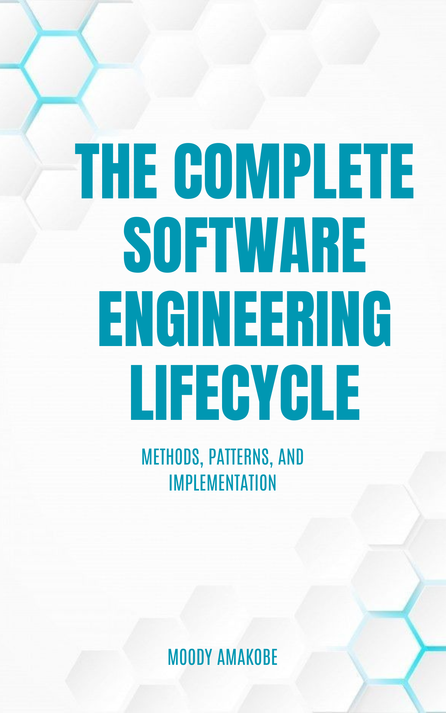

::: {.se-landing-hero}
::: {.se-cover}

{fig-alt="Book cover for The Complete Software Engineering Lifecycle: Methods, Patterns, and Implementation"}

:::

::: {.se-hero-copy}

2026 EDITION · OPEN TEXTBOOK

# The Complete Software Engineering Lifecycle {.unnumbered}

Methods, Patterns, and Implementation

Moody Amakobe Global Data Science Institute

Software engineering is more than writing code. It is a disciplined approach to designing, building, testing, deploying, and evolving complex software systems. This project-driven textbook connects technical foundations, architectural patterns, and hands-on work across the full lifecycle.

::: {.se-actions}
[Start Reading](preface.qmd){.btn .btn-primary .btn-lg}
[Download PDF](The-Complete-Software-Engineering-Lifecycle.pdf){.btn .btn-outline-light .btn-lg}
[Download EPUB](The-Complete-Software-Engineering-Lifecycle.epub){.btn .btn-outline-light .btn-lg}
:::

2026 · Print ISBN 979-8-2957-6070-9 · Ebook ISBN 979-8-2957-6071-6

:::
:::

::: {.se-landing-grid}
::: {.se-panel}
## Who This Book Is For {.unnumbered}

- Graduate students studying software engineering
- Practicing software engineers and technical leads
- Educators seeking a project-centered course text
- Self-directed learners building professional workflows
:::

::: {.se-panel}
## What You Will Learn {.unnumbered}

- Translate stakeholder needs into actionable requirements
- Model systems with UML and architectural principles
- Apply design patterns to modular, extensible systems
- Collaborate effectively with Git and GitHub
- Test, secure, deploy, and maintain production software
:::
:::

## The Lifecycle Journey {.unnumbered}

::: {.se-journey}
RequirementsModelingArchitectureImplementationTestingDeliveryOperationsEvolution
:::

## Inside the Book {.unnumbered}

The 15 chapters move from foundations and requirements through systems modeling, architecture, UI/UX, Agile project management, version control, testing, CI/CD, data and APIs, cloud deployment, security, maintenance, professional ethics, and final project integration. A comprehensive glossary supports review and reference.

Each chapter combines core concepts with examples, review questions, hands-on exercises, and a project milestone so that knowledge is applied to a complete software system as the book progresses.

::: {.se-oer}
## Open, Adaptable, and Free to Reuse {.unnumbered}

This book is an Open Educational Resource published by the Global Data Science Institute and licensed under the [Creative Commons Attribution 4.0 International license](https://creativecommons.org/licenses/by/4.0/). You may share and adapt the material, including commercially, with appropriate attribution.
:::
